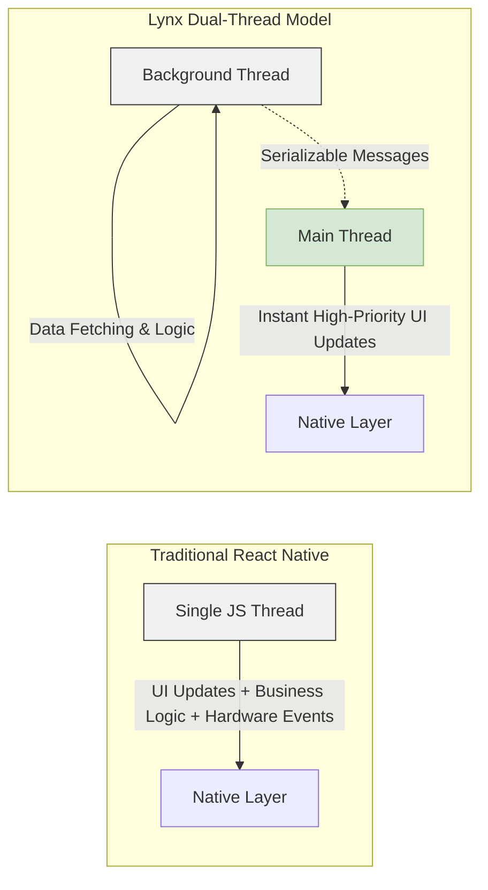
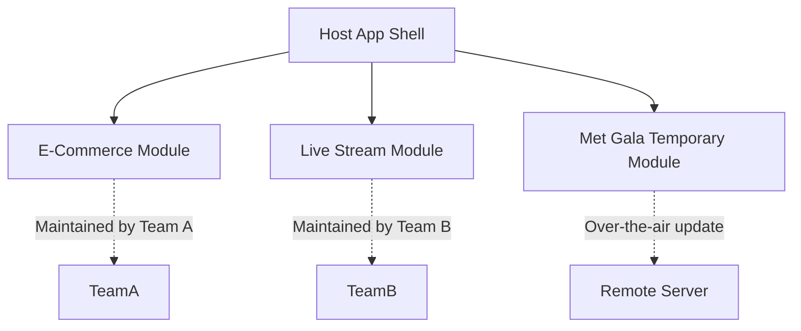

# Lynx: ByteDance's Multi-Threaded React Native Alternative

Theo explores the newly open-sourced Lynx framework released by ByteDance, positioning it as a highly credible alternative to React Native. While initially skeptical of a new cross-platform framework, Theo is deeply impressed by Lynx's architecture, tools, and production-readiness. Built to handle the massive scale and velocity requirements of TikTok, Lynx addresses core performance and distribution bottlenecks that have historically frustrated mobile developers.

### The Architecture: Solving the Single-Thread Bottleneck

Theo argues that while React Native has improved drastically over the years, it still suffers from its reliance on a single-threaded JavaScript queue. In standard React Native, everything from data fetching to processing keyboard inputs must share space in one queue. On older devices, this causes UI lag, such as the dreaded "sticky keys" effect. 

Lynx fundamentally changes this by utilizing a dual-thread model.

*   The Background Thread handles the standard React-like framework code, heavy data processing, component lifecycles, and side effects.
*   The Main Thread is strictly dedicated to UI updates and high-priority native events, ensuring the interface remains smooth and non-blocking at 60 frames per second.
*   Developers must explicitly pass serializable messages between these threads, a paradigm Theo compares to using web workers in the browser. 
*   Because the threads are segmented, developers can create instantaneous, layout-shifting animations by directly mutating element references on the main thread, bypassing standard React state re-renders entirely.

### Native Bindings Versus Flutter

Theo holds a strong, critical opinion of Flutter, which he contrasts directly with Lynx and React Native. He explains that Lynx is a true native application platform. 

*   Flutter avoids using the mobile device's actual native UI components, opting instead to render a game engine canvas that simulates buttons, text, and inputs. 
*   Theo argues this simulation leads to a poor user experience, citing "uncanny valley" scrolling, broken font kerning, and severe accessibility issues.
*   Lynx natively binds its code to the actual user interface kits provided by iOS and Android, meaning a button coded in Lynx renders as a true Apple or Android button on the device.
*   ByteDance originally experimented heavily with Flutter internally but abandoned it for Lynx precisely because native UI primitives are a necessity for high-quality consumer apps.

### App Distribution and Module Federation

One of the largest hurdles in mobile development is the app store review process. Theo points out that pushing a minor bug fix or a temporary feature usually requires submitting the entire app binary to Apple or Google, waiting for approval, and hoping users install the update.

Lynx solves this by utilizing tools like Rspack to treat the mobile app like a micro-frontend architecture through Module Federation. 

*   Different teams can own specific parts of the mobile application entirely separate from the host app, allowing enterprise companies to scale development without stepping on each other's toes.
*   Developers can bypass the app store review process for targeted updates by pushing specific, updated modules over the air directly to the user's device.
*   Temporary features, like a view built specifically for a weekend event, can be downloaded by the app seamlessly and then deleted when the event concludes without leaving dead code in the permanent app bundle.

### Developer Experience and Runtimes

Theo is highly complimentary of the overall developer experience Lynx provides, noting that ByteDance built an entire ecosystem from the ground up rather than relying on legacy JavaScript tools.

*   Lynx uses a custom-built JavaScript engine called PrimJS, which is highly optimized for mobile devices and achieves what Theo calls "instant first frame rendering" by eliminating the usual blank loading screens associated with spinning up a JavaScript runtime.
*   The framework natively supports standard CSS concepts like flexbox, radial gradients, animations, and transitions, which is traditionally very difficult to implement perfectly over native mobile widgets.
*   Debugging mobile apps is a notoriously miserable experience, but Lynx ships with full Chrome DevTools integration and a dedicated desktop inspection app out of the box.
*   The syntax borrows heavily from the mental model of React Server Components, requiring developers to use directives or specific wrappers to dictate whether code runs on the background thread or the main thread.

Theo concludes that Lynx is the strongest competition he has ever seen for React Native. Because it checks every box from native SDK access and over-the-air distribution to modern web developer experience and excellent open-source tooling, he views it as a transformative tool for the mobile development ecosystem.
