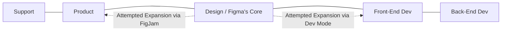

# Analyzing Figma's Aggressive Trademark Tactics

Figma recently sent a cease-and-desist letter to Lovable, a startup that builds an AI-powered developer tool, demanding they stop using the term "Dev Mode." Theo finds this demand completely absurd, noting that "dev" and "mode" are generic industry terms. While he clarifies that Lovable is not sponsoring this video, he is deeply frustrated by Figma's behavior and uses this incident to analyze the bizarre legal and market pressures currently driving the company.

### The Rise and Market Dominance of Figma
To understand Figma's current posture, Theo contextualizes their place in the industry. Historically, developers and designers relied on a mix of tools that were never quite right for building application interfaces. 

Designers once used heavy, image-focused graphic software like Photoshop or Illustrator, while developers tried to use code-heavy visual editors like Dreamweaver. Eventually, specialized UI mockup tools like Sketch and Adobe XD emerged. Figma entered this space and entirely dominated the market because of a few structural advantages. It was browser-based, highly performant on canvas rendering, and offered a generous free tier. Figma won the design software war completely, commanding an overwhelming majority of the market share.

### The Pressure to IPO
Figma's total victory in the design space resulted in a massive valuation. Adobe recognized this and attempted to acquire Figma for billions of dollars. However, antitrust courts blocked the acquisition, citing monopolistic concerns. 

Because Figma can no longer be acquired, their only path to turning their massive valuation into liquid money for founders, investors, and employees is to file for an Initial Public Offering (IPO). This puts immense pressure on the company. To secure a successful IPO, Figma must present a flawless trajectory to investors. Any perceived external risk or loss of market share could cost the company billions in their public valuation. Theodore posits that this intense financial pressure is why Figma is suddenly acting with extreme hostility toward potential competitors.

### Failed Market Expansions
Because Figma already owns the core design market, they can only show growth by expanding outward to adjacent company departments. Theo visualizes the standard flow of tech company roles to illustrate Figma's strategy:

*   **Expanding left toward Product:** Figma launched FigJam, a whiteboard collaboration tool meant to capture product managers who dictate the overall direction of software. FigJam fundamentally combined design space with simple planning tools, but it ultimately struggled to achieve meaningful market dominance.
*   **Expanding right toward Engineering:** Figma launched "Dev Mode" as an add-on to help developers translate Figma mockups into executable code. Theo points out that this integration actually offers a terrible experience, and polls consistently show that developers either use it purely for the measurement tools or ignore it entirely.

Because Figma is struggling to capture these adjacent markets, protecting their core domain has become an existential necessity. 

### The Existential Threat of AI Developer Tools
Figma operates on the assumption that software necessarily requires a manual designer to build mockups before a developer can write the code. Theo explains that AI developer tools like V0, Lovable, and Bolt are fundamentally challenging this premise. 

Theo compares this shift to HTMX. HTMX proved that you don't always need a heavy, complex framework like React to build a dynamic web application; it moved the baseline of when a framework is strictly necessary. Similarly, AI tools have shifted the baseline for design. Developers can now prompt an AI to generate robust, aesthetically pleasing frontend code without ever hiring a designer or opening a dedicated design application. 

Furthermore, these AI tools feature "Import from Figma" functionality. Figma does not want to become a mere stepping stone where users import bulk layouts into AI tools just to finish the actual work elsewhere. They recognize that if developers realize they can build fully functional interfaces purely through AI without initial mocks, the overall footprint of the design industry will shrink, directly threatening Figma's core revenue model. 

### Debating the Trademark Aggression
Theo details the nuances of trademark law to steelman Figma's perspective, though he ultimately rejects their justification. 

*   **The "Use It or Lose It" Argument:** Under trademark law, if a company fails to defend a registered trademark from common use, the term becomes generic, and the company is stripped of its ownership. Theo points out that Nintendo is incredibly strict with their intellectual property because their entire company value stems from characters like Mario. Conversely, Sega is far less litigious with Sonic because their actual massive revenue driver is gambling and pachinko machines in Japan; Sega uses their video game IP purely to generate positive public sentiment. 
*   **Oracle's Dubious JavaScript Trademark:** Theo compares Figma's behavior to Oracle. Oracle technically owns the trademark for "JavaScript," but they do not actively use it to produce a JavaScript engine or tools. They essentially hoard the trademark to threaten competitors, which has resulted in legal challenges attempting to prove the term is generic.
*   **Theo's Conclusion on Figma's Strategy:** Theo argues that "dev" and "mode" are generic industry terms with vast prior art. Because Figma's trademark for "Dev Mode" was only successfully registered late last year, it is highly vulnerable to being classified as generic. Therefore, Figma is acting aggressively to enforce what Theo considers a flimsy, invalid trademark. 

Ultimately, Theo concludes that Figma is experiencing the "Netscape effect." Much like Microsoft built aggressive, anti-competitive roadblocks when they realized the internet threatened desktop software sales, Figma is lashing out with uncharacteristically hostile legal threats. They are a multi-billion dollar company terrified that their core market is shrinking, their expansions are failing, and the AI era is rendering their monopoly increasingly irrelevant.
