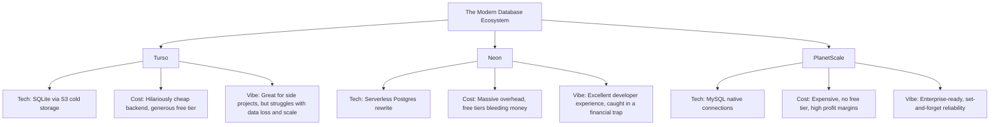

# The Databricks Acquisition of Neon and the End of the Database Startup Era

Theo observes a sharp consolidation happening in the database startup ecosystem. Companies that recently drove immense innovation are either shutting down entirely, killing their free tiers to survive, or being absorbed by massive corporations. He uses Databricks’ recent acquisition of Neon as a primary lens to explain the unstable economics behind modern developer tools and what this signals for the broader industry.

### The Problem With Serverless Postgres

To understand Neon's rise and fall, Theo explains the fundamental friction between traditional Postgres databases and modern serverless platforms like Vercel or AWS Lambda. 

Postgres requires persistent connections, which eat up database resources. Because serverless environments spin up ephemeral instances to handle single requests and then close them, high-traffic applications rapidly exhaust Postgres connection limits, leading to crashes. While developers historically patched this with expensive private connection pooling, Neon stepped in with a better solution. They built a ground-up serverless rewrite of Postgres designed to natively handle ephemeral connections. 

Beyond solving the serverless connection problem, Neon pioneered phenomenal developer experience features. Their implementation of instant database branching allowed developers to spin up secure, isolated preview environments attached to pull requests without the cost or friction of provisioning entirely new database servers. 

### The Economics of Database Startups

Theo maps out the current landscape of database startups to illustrate why Neon ultimately failed to survive independently. 

Theo points out that PlanetScale realized early that relying on continuous venture capital funding was a dangerous game. Their leadership chose to aggressively pivot toward profitability by eliminating their free tier and securing paying enterprise customers, resulting in a highly reliable and financially secure product. Conversely, Turso optimized entirely for cheap infrastructure by using SQLite backed by S3 storage, but Theo notes they have suffered from critical reliability issues, including data loss and exposure bugs.

Neon found itself caught in a fatal middle ground. They provided a highly generous free tier that cost them money every time a user signed up, but they lacked the enterprise penetration necessary to offset those losses. 

### Neon's Financial Trap 

Theo is highly critical of how Neon managed its business, describing their operational strategy as "startup cosplay"—imitating the actions of massive enterprise companies without having the revenue to justify it. 

*   Despite serving a fraction of the enterprise traffic of leaner competitors, Neon massively overhired, retaining roughly 130 employees and burning an estimated $11.7 million annually on base salaries alone.
*   The recent explosion of AI application builders like v0 and Bolt exacerbated Neon's financial drain, as autonomous AI agents began creating free-tier databases at four times the rate of human developers without generating any incoming revenue.
*   Having already raised nearly $130 million at an arguably inflated valuation, Neon trapped itself in a corner where it could not raise more funds without a damaging "down round," yet it could not cut its massive overhead fast enough to achieve profitability.

Facing a rapidly depleted runway and no viable path forward as a standalone company, Neon was forced to find a buyer. Theo notes that Neon’s leadership actively avoided the word "acquisition" in their public communications, likely due to the disappointment of not achieving an independent IPO, but an acquisition is exactly what happened. 

### Why Databricks Stepped In

Databricks, a highly profitable, enterprise-focused data analytics company, was the ideal buyer for Neon. 

Databricks is dominant at the enterprise level, but they have historically struggled to capture grassroots adoption among junior developers, small startups, or agile teams building isolated side-projects within large tech companies. Because large companies are increasingly operating as clusters of small, fast-moving teams, Databricks recognized they needed a way into that ecosystem. Acquiring Neon gives Databricks a beloved, developer-first tool that acts as an entry point. As these small, database-heavy projects mature into profitable enterprise features, Databricks can seamlessly pull those users into their broader, highly lucrative analytics ecosystem.

### The Accidental Symbiosis With AI

Theo concludes by highlighting a broader industry trend where platforms explicitly designed for junior developers and rapid prototyping have accidentally become the perfect infrastructure for AI agents. 

*   Neon's instant database provisioning is a nice convenience for human developers, but it is an absolute necessity for an AI agent trying to autonomously test and validate code in a preview environment without timing out.
*   Convex designed a backend system that operates entirely through local text files to simplify life for frontend engineers, which unintentionally made it the perfect backend for AI bots that excel at reading specific files but fail at navigating cloud provider dashboards.
*   Cloudflare Workers utilize a compute model that charges purely for CPU usage rather than wall-clock time. While this makes them notoriously bad for slow server-side rendering, it makes them the cheapest and most efficient way to sit completely idle while waiting for slow LLM token streams.

Ultimately, Theo views the Neon acquisition as a net positive because it protects user data from disappearing overnight. However, he warns that this event likely symbolizes the end of the experimental 2020s database startup era, signaling a shift where foundational infrastructure is once again consolidating under massive enterprise umbrellas.
