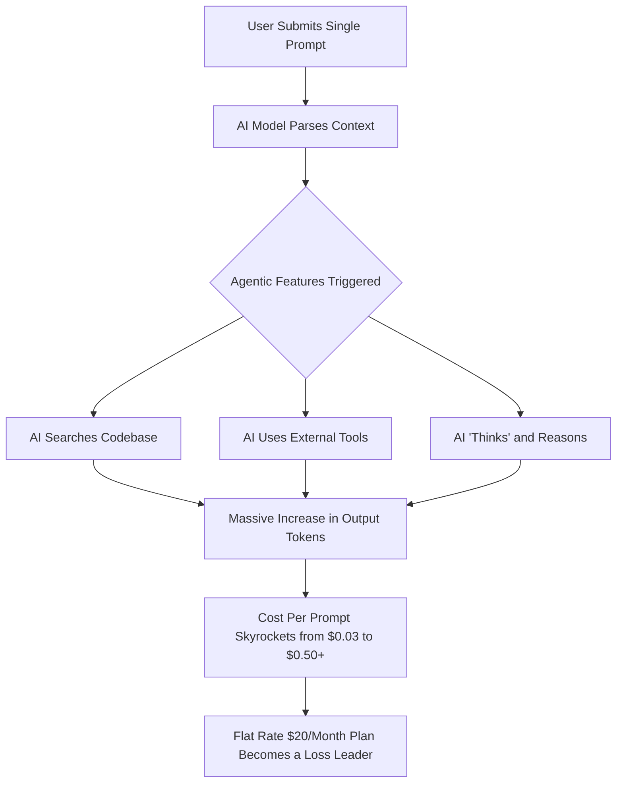

# Theo's Take on the Cursor Pricing Drama and the Economics of AI Coding

Theo recently discussed the major controversy surrounding the AI code editor Cursor. Just days after heavily promoting an "unlimited" $20 per month plan, standard users were suddenly hit with surprise API overage charges. As a daily user and an early investor in Cursor, Theo acknowledges his bias but does not hold back, calling the rollout a massive fumble and attributing it to poor communication, inadequate software design, and a rapidly shifting landscape in the economics of artificial intelligence.

### The Root of the Drama and the Transparency Breakdown

Previously, Cursor charged a flat $20 a month for 500 "fast" AI requests, regardless of how much compute those requests actually required behind the scenes. To better manage their escalating costs, they shifted to a model that gives users $20 of actual API credit, charging based on the raw compute tokens used. 

The core issue was Cursor's careless use of the word "unlimited." They promised unlimited usage on the new tier, but this only applied to their "Auto" mode, where Cursor automatically routes requests to cheaper, less capable models to save money. If users manually selected premium models like Claude 3.5 Sonnet or Opus, they burned through their $20 credit incredibly fast. Cursor failed to communicate this clearly, opting to quietly update a blog post rather than aggressively notifying users, leading to developers receiving completely unexpected bills for over $100 after just a few days of standard work.

Theo's biggest personal critique of Cursor is the complete lack of transparency in the application interface. Users have no intuitive dashboard or visual warning to show how close they are to their usage limit. Because AI generations cost money regardless of whether the output code is actually good or gets deleted, users are now experiencing "prompt anxiety." Theo notes that he is actively hesitating to use the tool because he has no idea when he will cross the threshold from his flat subscription into paying out-of-pocket overage fees.

### The Economics of AI tooling

Theo strongly argues that Cursor *had* to change its pricing model because the flat-rate business model is no longer sustainable for modern AI tooling. He breaks down the shifting economics that forced Cursor's hand:

*   AI models bill companies based on tokens (fragments of words), and while sending an initial prompt to an AI is relatively cheap, the generated output from modern "thinking" or reasoning models requires a massive, expensive explosion of output tokens. 
*   New software features like "agent mode"—where the AI autonomously searches a codebase, runs command-line tools, checks its own work, and loops multiple times—turn a single user prompt into a chain of separate, highly expensive API calls.
*   Because of these compounding features, a single request that used to cost Cursor around three cents to process can now easily cost them up to fifty cents, transforming their 500-request monthly allowance into a massive financial loss per user.
*   There is no "free lunch" left in AI; the era of tech companies and venture capital heavily subsidizing unlimited AI generation is coming to an end, pushing the industry toward charging users for what they actually consume.

### The Big Tech Price War and the Power User Problem

When faced with these new limits, many users threatened to leave Cursor for seemingly cheaper or free alternatives like Anthropic's Claude Code or Google's Gemini CLI. Theo counters this response, pointing out that users are simply falling for temporary pricing warfare. Companies like Anthropic and Google own the foundational AI models and have massive financial war chests. They can afford to absorb staggering API losses—sometimes offering thousands of dollars of compute for $200 a month—just to acquire users and starve out independent competitors. Theo likens this to Amazon historically selling diapers at a massive loss specifically to bankrupt Diapers.com, predicting that once Google and Anthropic capture the market, they will inevitably raise their prices to reflect reality.

However, Theo argues Cursor made a severe strategic business error by alienating their top 1% of power users. While these obsessive "diehard" developers undoubtedly cost the company money in raw compute, they are the vital evangelists who market the product for free and bring in the remaining 99% of highly profitable, low-usage customers. By aggressively capping the power users just to protect short-term profit margins, Cursor risks losing their most important advocates to those heavily subsidized competitors. 

Following the immediate backlash, the Cursor team worked through a holiday weekend to apologize, clarify exactly how the Auto mode and limits work, and offer full refunds to anyone hit with unexpected charges. They also promised to build proper user interfaces for tracking spend. Ultimately, Theo believes two things can be true at once: Cursor is an incredibly valuable tool that equates to having another engineer on your team, but the company's execution of this pricing shift introduced a deep, unforgivable level of anxiety and uncertainty into the developer experience.
