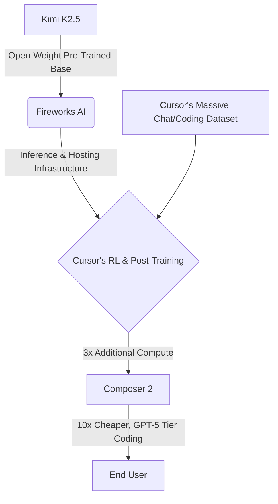

# The Hidden Engine Behind Cursor's Composer 2: Innovation, Licensing, and Open-Weight Drama

Theo recently explored a major controversy surrounding Cursor, a company in which he is an investor. Cursor recently shipped Composer 2, a highly capable and incredibly fast AI model custom-built for coding. However, users inspecting API URLs quickly discovered that Composer 2 was not an entirely new model built from scratch, but rather a heavily modified version of Moonshot AI's open-weight model, Kimi K2.5. 

Theo dives into why Cursor chose this route, how they achieved such impressive technical results, and the licensing drama that has the developer community debating the future of open-source artificial intelligence.

### The Economic Motive for a Custom Model

Cursor operates in a high-stakes environment dominated by frontier labs like Anthropic and OpenAI. Theo explains that these giant labs heavily subsidize their pricing to capture the market. For example, a $200-a-month Claude Code subscription provides users with roughly $5,000 worth of raw compute capability. Anthropic operates at this massive loss to price out competitors. 

Cursor simply cannot afford to subsidize compute at that scale while maintaining a profitable enterprise software business. Because Cursor relies heavily on passing API requests to models like Claude Opus, they are at the mercy of Anthropic's pricing. To survive and improve their profit margins, Cursor needed a "wedge"—a highly capable, incredibly cheap model of their own that could handle coding tasks without triggering expensive API calls to frontier labs.

To achieve this, Cursor leveraged their biggest advantage: user data. Unless a user explicitly turns on privacy mode, Cursor collects vast amounts of chat histories and real-world coding interactions. Theo notes that while Anthropic recently complained that DeepSeek used 150,000 conversational exchanges to train their models, Cursor likely processes hundreds of thousands of exchanges continuously. This gave Cursor the perfect dataset for post-training and reinforcement learning.

### The Technical Feat of Composer 2

Leading the charge for Cursor's new model was Jacob Jackson, the founder of Supermaven—an autocomplete tool Cursor recently acquired. Jacob is uniquely obsessed with narrowing AI focus purely to code generation. 

Instead of undertaking the staggeringly expensive process of pre-training a model from scratch—which imbues a model with its baseline general knowledge—Cursor used Moonshot's Kimi K2.5 as a starting template. From there, they applied aggressive post-training. 

By applying massive amounts of reinforcement learning using their proprietary dataset, Cursor fundamentally transformed the base model. Theo points out that Cursor injected three times the amount of compute into post-training than what originally went into Kimi K2.5. The result is Composer 2, a model that operates in the elusive GPT-5 tier for coding, accurately builds basic UI designs, computes at a lightning-fast 80 to 100 tokens per second, and costs exactly ten times less to run than Claude Opus.

### The Licensing Loophole and Community Backlash

Despite the technical triumph, the rollout of Composer 2 was messy. Moonshot employees were initially caught off guard and confused on social media when they realized their model was powering Cursor's new feature. 

This sparked a debate about licensing, ethics, and model rebranding, which Theo breaks down into several key arguments:

*   Moonshot utilizes a modified MIT license stating that any commercial product generating over two million dollars in revenue or serving over one hundred million users must prominently display the "Kimi K2.5" name in its user interface.
*   Cursor deliberately bypassed this user interface requirement by using an inference partner called Fireworks AI as a middleman.
*   Because Fireworks AI officially licensed Kimi and hosted the reinforcement learning infrastructure, Cursor argued they were following the requirements via their inference partner's terms, legally insulating themselves from having to advertise Kimi in the Cursor interface.
*   Theo views this as the first successful attempt by a tech company to legally skirt these untested open-weight AI licenses via shell or middleman infrastructure.
*   While some community members accused Cursor of simply stealing and rebranding Moonshot's work, Theo pushes back on this, emphasizing that Cursor did not just slap their name on Kimi; they poured immense compute, money, and sophisticated engineering into transforming it into a completely different behavioral model.

### Theo's Takeaways and Concerns for the Future

Theo concludes that both Composer 2 and Kimi K2.5 are fantastic models, but he is deeply disappointed in Cursor's lack of transparency. He argues that Cursor should have used this launch to educate the developer community on the power of post-training, rather than obfuscating the origins of their base model until an eagle-eyed developer leaked the truth.

Most importantly, Theo worries about the chilling effect this drama will have on the open-source community. Small organizations like Moonshot rely on open-weight releases to build traction. If massive companies like Cursor can use those open-weight bases to generate millions in profit without offering any brand attribution or credit to the original creators, smaller labs may simply stop releasing open models. This would be a devastating blow to the industry, as open-weight models are currently the only effective leverage developers have against the pricing monopolies of giants like OpenAI and Anthropic.
