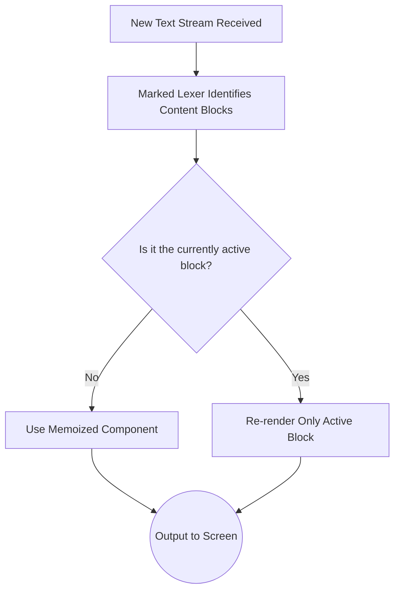

# Building T3 Chat: A Devlog on Creating a Lightning-Fast AI Client in Five Days

Theo alongside his CTO, Mark, recently built and launched "T3 Chat," an AI chat application designed to be the fastest option currently available. Inspired by the impressive speed and cost of the open-source DeepSeek V3 model, Theo set out to build a better user interface than the frustrating web counterparts provided by ChatGPT and Claude. He approached the build entirely as a "local-first" application to maximize responsiveness.

### The Pivot to Local-First and Bypassing Framework Limits
Theo started by generating a basic scaffolding with v0, but he quickly found that standard Next.js paradigms clashed with his goals for a hyper-fast chat app. He wanted the app to feel instantaneous without waiting on server responses for navigation. 

*   He bypassed Next.js server-side routing entirely by implementing a catch-all route and handling client-side navigation using React Router.
*   He initially built a custom data synchronization layer using React context, but the app lost all data upon browser refresh, prompting a search for better storage options.
*   He discarded the client-side state management of the Vercel AI SDK (though he kept it for backend streaming), finding the SDK's message types and ID handling too frustrating and limiting for a complex local-first setup.
*   He instead implemented dexie.js, an older but immensely reliable and highly supported wrapper for IndexedDB, which allowed him to store projects, threads, and messages natively in the user's browser.
*   Using dexie's `useLiveQuery` hook, he successfully wired the local database directly to the user interface so the view would automatically update as messages streamed locally into the database.

### Distractions, Authentication, and Changing Course
Developing the app was not a perfectly clean sprint. Theo lost substantial time to unrelated technical emergencies, framework experiments, and authentication challenges. 

*   He lost nearly five hours fighting a false-positive malware block regarding his other company (UploadThing) on the Malwarebytes support forums.
*   In an attempt to keep all functionality local without server roundtrips, Theo rolled his own custom authentication system using cookies and local storage. He deeply regretted this decision due to the massive time sink, stating he wished he had just used Clerk despite its reliance on Next.js middleware.
*   He briefly migrated the entire application off Next.js to Vite, React, Hono, and Cloudflare. He quickly reverted to Next.js after discovering the severe hacks required to make AI streaming function correctly on Cloudflare. 

### Evaluating Generic Local-First Solutions
To sync his local dexie.js database with the cloud, Theo evaluated popular local-first synchronization frameworks but ultimately concluded that generic local-first solutions often fail to meet the unique needs of specific applications. 

*   He evaluated Zero (by the Replicache team), which uses a server-side websocket cache. While powerful, he rejected it due to a difficult setup, mandatory downtime during upgrades, and a lack of flexibility.
*   He evaluated Jazz, another syncing tool. He clashed fundamentally with its data model, which requires all data to be deeply nested inside a globally authenticated user class instance.
*   He found that Jazz's strict hierarchy blocked the app from rendering at all if a user wasn't fully authenticated first, rendering his desired unauthenticated local experience impossible.
*   Despite praising the responsiveness of the Jazz team—who admitted his complaints were valid and are reworking their systems—he chose to abandon generic sync models and hand-roll his own dexie-to-cloud sync layer perfectly tailored to T3 Chat.

### Optimizing Model Output and UI Performance 
As launch day approached, Theo noticed the DeepSeek V3 model was experiencing heavy load, dropping from 90 tokens per second to much slower speeds. He thoroughly cross-referenced models and pivoted to running OpenAI's `gpt-4o-mini` via Azure, which delivered the lightning-fast output speeds he required without breaking the bank. 

For the final layer of polish, Theo worked with Aiden, a React performance expert and creator of React Scan, to ruthlessly optimize how the UI rendered streaming text. 

Theo and Aiden implemented a markdown chunking strategy to prevent overwhelming the application's performance. By splitting incoming markdown via a lexer and aggressively memoizing those chunks, the app avoids re-rendering the entire chat history with every new AI token. This specific optimization stopped heavy CPU spikes—particularly caused by rendering syntax-highlighted code blocks—and allowed the application to maintain optimal framerates. 

Finally, Theo wrapped his server queries in custom local-cache functions. When a user requests data like subscription status, the application reads the last known state from local storage and displays it instantly, falling back to a background network fetch. For Theo, this entirely eliminated the need for loading states or loading animations. His ultimate conclusion from the five-day build is that React as a framework is not inherently slow; it simply requires developers to rethink how and when data commands a screen update.
