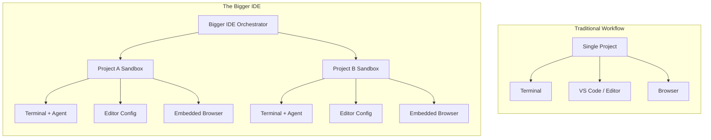

# The Future of Editors: Why We Need a Bigger IDE

The tools we use to write code are undergoing a massive shift, moving rapidly from helpful editor autocomplete to sidebars and AI-driven command-line interfaces. While many assume that the future of coding will compress down to simple terminal interactions with AI, Theo takes the opposite stance. Inspired by a recent post from Andrej Karpathy, Theo argues that we do not need smaller, hyper-focused CLIs. Instead, we need a massive orchestration layer—a "bigger Integrated Developer Environment" (IDE) built specifically to handle the demands of modern, agentic development.

### The Evolution of the Editor
To understand where we are going, Theo explains how we arrived at our current setup. Development originally started with basic text editors like Vim, but as programming grew more complex, teams needed to integrate compilers, linters, and testing tools into massive, unified environments. This birthed bloated legacy IDEs like Eclipse and Visual Studio.

Reacting to that bloat, developers embraced minimalist, highly performant tools like Sublime Text, which focused purely on text editing while allowing community extensions. Eventually, GitHub released Atom, which utilized web technologies to make extending the editor easier, paving the way for Microsoft to release VS Code. 

Theo notes that he stubbornly held onto Sublime Text for years because he disliked non-native electron apps. However, he was finally won over by VS Code while working at Twitch. He saw that by simply opening a project, VS Code could completely shape itself around that specific codebase, embedding unit test runners and tooling seamlessly into the interface. For a long time, the traditional 1-to-1 relationship between an editor and a single project was perfectly balanced. 

### The Agentic Coding Problem
The introduction of AI coding tools like Copilot and Cursor fundamentally broke the traditional IDE workflow. Theo points out that IDE interfaces have become incredibly chaotic, cluttered with shifting sidebars and confusing layouts as they try to bolt AI features onto an architecture built for a different era.

The underlying issue is a breakdown in developer hierarchy. Historically, a developer focused on one project at a time, splitting their workload across three straightforward applications: a terminal, an IDE, and a web browser. Today, AI agents can execute tasks for hours, allowing developers to spin up autonomous processes and work on several completely different codebases simultaneously. 

When you multiply your workload across multiple active projects, the traditional workflow shatters. A developer is left constantly context-switching between detached terminal tabs, VS Code windows, and browser instances, losing their mental map of which git branch connects to which localhost and which GitHub page. OS-level tools like Mac OS workspaces completely fail to manage this level of parallel complexity.

### The Vision for the "Bigger IDE"
Because operating systems fail to link parallel workflows effectively, Theo believes the solution is a completely new application that sits one level higher than the traditional IDE. 

Instead of an IDE shaping itself around a single project, this new environment would shape multiple projects around the orchestrator. Theo envisions a radically redesigned workspace with several key features:
*   **Fully integrated sandboxes:** The application would simultaneously hold the terminal, the Git tree, the text editor, and the web browser for each specific project in a unified view.
*   **Spatial and nested navigation:** Developers will need infinitely nestable, two-dimensional canvases to quickly zoom in and out of different active AI agents, isolated projects, and terminal runtimes without losing context.
*   **Seamless codebase hopping:** Instead of managing scattered application windows, the developer navigates between separate work trees managed entirely within the orchestrator itself. 
*   **Built-in browser functionality:** AI agents work best when they can actually interact with the web, meaning the IDE needs internal, fully featured browsers that can act upon private logins and GitHub repos without throwing you into an external Chrome window.

### Current Experiments and the Path Forward
Theo highlights that the community is already taking the first steps toward this vision. Tools like Semox (built on Ghostty) are experimenting with splitting terminals and embedded browsers into unified spaces. Theo's own team has released T3 Code to attempt managing multiple project terminals simultaneously.

However, Theo acknowledges that none of the current tools, including his own, are the final answer. He compares this era to the long, awkward gap developers faced when trying to figure out full-stack type safety years after TypeScript was released. While AI models can now overhaul entire codebases autonomously, the UI layer we use to interact with them remains stuck in the last generation.

Ultimately, Theo concludes that no one knows the exact shape the next dominant coding environment will take. He strongly encourages developers to seize this rare transitional moment, experiment wildly, and build ambitious new tools that completely reimagine how we interact with code.
