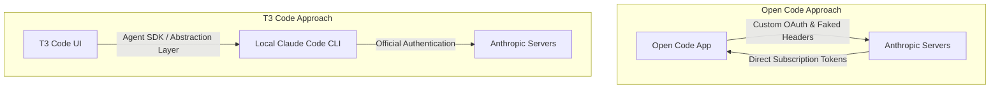

# T3 Code's Integration with Claude: Navigating Anthropic's Restrictions

Theo recently announced that T3 Code, his open-source coding UI, now supports Claude Code subscriptions for free. Users can access this by running a simple terminal command or downloading the app. However, this announcement comes with heavy context: Anthropic recently forced other open-source tools, like Open Code, to remove similar integrations by threatening legal action and user account bans.

Before diving into the technical details, Theo takes a brief pause to highlight Blacksmith, a tool for running GitHub actions. He credits Blacksmith with drastically cutting T3 Code's build times and providing a highly useful analytics dashboard that helped track down continuous integration regressions.

The central question Theo addresses is whether using T3 Code with a Claude subscription violates Anthropic's terms of service. While stating explicitly that he is not providing legal advice and cannot make absolute guarantees, Theo expresses strong confidence that T3 Code users are safe from bans. He even fed his project's code and Anthropic's terms of service into Claude itself, and the AI concluded that the implementation is compliant. 

### Why T3 Code is Different

Anthropic's rules state that third-party developers cannot offer Claude.AI login or rate limits for their products unless previously approved. Theo explains the distinct technical paths taken by different tools, which dictates their standing with Anthropic:

*   **Anthropic's argument against third parties:** Anthropic restricts unauthorized integrations using user subscriptions, claiming that unofficial harnesses might mismanage caching or codebase context, leading to a poor user experience and excessive, unoptimized server load. 
*   **The Open Code method:** Open Code built its own harness, faked headers, and provided an OAuth flow for users to sign in. Because it bypassed the official interface to use subscription tokens directly, Anthropic clamped down on it and threatened user bans.
*   **The T3 Code method:** T3 Code does not manage authentication, OAuth, or API keys. Instead, it uses the official Agent SDK to access the user's locally installed Claude Code CLI. T3 Code simply acts as a display layer on top of the official integration natively sitting on the user's machine.

### The Economics of Subsidized Tokens

A major reason developers want to use their existing Claude subscriptions inside third-party UIs, rather than just paying for raw API usage, is cost subsidization. Theo explains that a $200-a-month Claude Code subscription essentially grants access to about $5,000 worth of compute. 

Anthropic subsidizes these costs to aggressively capture the market and lock users into their ecosystem. Because UIs like T3 Code cannot financially compete with those subsidized margins, integrating the user's existing CLI subscription is the only viable way to provide a unified service without bankrupting the developer or the user.

### Frustration with Anthropic's Silence

A significant portion of Theo's commentary focuses on Anthropic's lack of transparency and communication regarding these developer tools. 

*   Developers, including prominent TypeScript educator Matt Pocock, have repeatedly asked Anthropic for clear guidelines on what is strictly allowed regarding the Agent SDK and local development loops.
*   Despite polite and direct requests, Anthropic representatives have offered only vague responses. They cite rapid company growth and complex, overlapping user archetypes as reasons for the delay in providing policy clarity.
*   Theo expresses deep frustration over this silence, arguing that the community needs basic questions answered to build and release tools safely. 
*   He warns that unpredictable goalposts make it terrifying to invest time into these integrations, noting that Anthropic could change its policies at any moment and force T3 Code to deprecate the Claude feature entirely.

Despite the current uncertainty, Theo is very proud of what his team built. They created a complex abstraction layer to cleanly interface with various CLIs, resulting in a UI that actually uses fewer system resources than the native Claude Code CLI itself. Theo personally uses a multi-model workflow, relying on tools like Codex for heavy coding and switching to Claude closely afterward for UI adjustments and fine-tuning. 

He hopes T3 Code remains a safe, unified home for developers leveraging multiple subsidized AI subscriptions. He challenges Anthropic to finally provide clear, public guidelines for the community, and makes a promise to his viewers: if a user gets banned for using T3 Code and can prove it, Theo will personally cover their subscription cost in exchange for permission to make a video calling Anthropic out.
