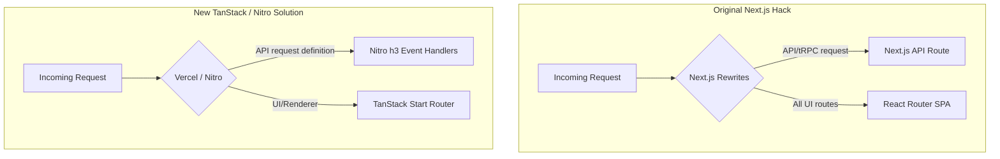

# T3 Chat's Migration from Next.js to TanStack Start

Theo and his engineering team recently moved T3 Chat entirely off Next.js and onto TanStack Start. This massive undertaking, largely driven by team member Julius, spanned a colossal pull request with 14,000 lines added and 10,000 removed. Despite internet speculation, Theo frames this not as a rejection of Next.js or a reaction to recent Vercel exploits, but as a necessary architectural evolution to replace his original, highly customized "hacks." 

The migration reveals what happens when a small team scales complex AI infrastructure, hitting the limits of modern frameworks, edge runtimes, and routing patterns. 

### Why Theo Originally Chose (and Abused) Next.js

When first building T3 Chat, Theo had highly specific requirements. He wanted a snappy, pure client-side application where clicks felt immediate, but he also needed absolute synchronicity between the front-end and back-end.

*   By "in sync," Theo does not mean CDN caching times; he means that the front-end and back-end must always deploy the exact same version simultaneously.
*   If the client and server fell out of sync during a deploy or a rollback, T3 Chat's complex local data-sync engines would corrupt user data. 
*   Next.js offered an easy way to bundle a TypeScript React client and a TypeScript back-end into a single package.json, guaranteeing they would deploy and roll back together safely.

However, Next.js was built for server-rendered or hybrid routing, which ran counter to his desire for an instant Single Page Application (SPA). To get around this, Theo brute-forced Next.js to act merely as a shell. He set up complex rewrite rules that caught all incoming traffic, bypassed the Next.js router entirely, and dumped users into a static React Router application for the UI, while selectively routing API and tRPC requests to Next.js API endpoints.

This setup created an immense amount of friction. API requests would occasionally get eaten by the rewrite rules, and Theo realized early on that if you have to fight a framework's router this hard, you are using the wrong framework.

### The Search for an Alternative

Theo spent months exploring other architectures to escape his Next.js hacks, but kept hitting infrastructure roadblocks that required staying close to Vercel.

*   **Cloudflare limits:** He successfully rewrote the app using Vite and Hono on Cloudflare, but immediately hit Cloudflare's strict 3MB to 10MB worker script size limits. Server-side node packages and image compression logic quickly exceeded these caps.
*   **Vercel's Fluid Compute:** T3 Chat makes heavy OpenAI API calls that can take hundreds of seconds. Vercel's Fluid Compute lets a single deployed instance resolve multiple requests concurrently while waiting on those long AI responses, driving costs down significantly.
*   **Failed explorations:** He evaluated Remix, but ran into deployment quirks on Cloudflare. He also looked into early versions of React Router's server capabilities, but found the primitives underdocumented and too experimental at the time.

### Moving to TanStack Start 

Julius independently researched and began the massive pull request to transition T3 Chat to TanStack Start. Theo agreed with the direction because TanStack provided the right mix of unified front-end and back-end deployment, excellent type safety, and a router actually designed to work seamlessly with client-heavy architectures. 

The most impressive feature they adopted is TanStack's hybrid file-based routing and code generation. Just by creating a route file and declaring a specific parameter in a URL string (like a chat ID), TanStack automatically generates types ensuring that the entire component tree, loaders, and API calls strictly know that exact parameter exists. This provided a level of full-stack type safety they hadn't had before.

### The Catch: Crashing Servers and Patching Nitro

The move was far from easy. As they rolled out TanStack Start in beta on Vercel, the application began crashing violently once it reached high traffic. The servers were throwing internal Node `undici` fetch errors and "EMFILE" (too many open files) errors.

Because AI chat requests sit open for incredibly long times, the Vercel instances were handling high concurrency. TanStack Start's default lazy-bundling mechanism tried to dynamically resolve and load JavaScript for every potential route being hit at the exact same time. This overloaded the system's file resolution and crashed the compute instances.

To fix this, the team had to bypass TanStack for their backend infrastructure entirely.

Consulting with the creator of Nitro (the underlying server engine for TanStack and Nuxt), Julius wrote a patch to physically alter the TanStack Start package inside their node modules. They exposed Nitro's internal event binder (`h3`), completely stripped all their API endpoints out of TanStack Start's routing tree, and manually defined them as direct Nitro server functions. 

### Losing Edge Optimizations and Debating SSR

By moving to this new architecture, they successfully stabilized the app, but they lost one of Theo's favorite Vercel deployment hacks. 

In the Next.js app, Theo intentionally set a maximum execution timeout of 799 seconds on the specific AI chat endpoints, and 800 seconds on all other endpoints. By slightly staggering the max duration, it gave Vercel's bundler a hint to group and deploy those long-running AI requests on entirely different Fluid Compute instances than the quick, snappy API database reads. TanStack's bundling currently clumps them all back together, limiting their ability to optimize server compute.

Additionally, Julius utilized TanStack Start to introduce Server-Side Rendering (SSR) for the initial application load, providing users with a populated chat skeleton immediately on refresh. Theo openly disagrees with this choice, remaining highly skeptical of SSR and preferring a pure client-side interaction. However, he defers to his team, noting he hired them to make solid engineering decisions, and he fully backs their implementation.

### Conclusion

Theo is adamant that Next.js remains an incredible framework—praising its unmatched backwards compatibility and the Vercel team's dedication to stability. He emphasizes that shifting to TanStack Start is not a magic bullet, but a trade-off. They exchanged his bespoke, legacy SPA hacks for a new set of deep infrastructure patches on an extremely early, bleeding-edge framework.

Ultimately, the true value of the migration is team ownership. The codebase is no longer constrained by Theo's initial prototype workarounds; it is a modern, type-safe architecture strictly controlled, understood, and championed by the developers writing the code every day.
