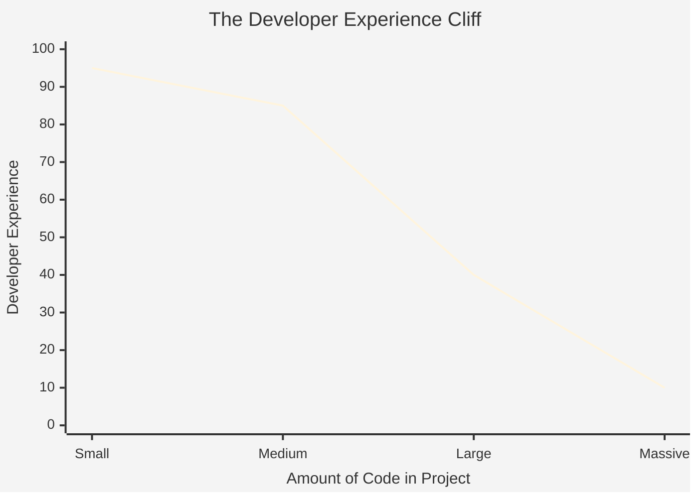

# The Evolution of Web Frameworks: Why React Beats jQuery at Scale

Theo reviews a video by fellow creator The Primeagen, who argues that web development is simply a frustrating pendulum swinging back and forth between server-side and client-side rendering. Primeagen claims that regardless of the framework you choose, once a codebase hits a certain size, the developer experience degrades and the code ultimately becomes miserable to work with. While Theo agrees that large codebases are inherently difficult, he strongly disagrees with the conclusion that the industry is just running on a hamster wheel without making real progress.

### The Illusion of New Frameworks

Theo starts by mapping out Primeagen's core argument, acknowledging that there is a very real correlation between the sheer amount of code in a project and the subsequent decline in developer experience. 



Theo explains that developers often suffer from an illusion regarding "better" new frameworks based on where they sit on this curve. Because React is so ubiquitous, most developers experience it for the first time by joining a massive, mature, and deeply complex React codebase where the developer experience has already crashed. In contrast, when developers try newer frameworks like Svelte, they are usually building small, fresh projects. The development experience feels amazing not necessarily because the new framework is objectively superior at scale, but simply because the codebase surface area hasn't grown large enough to become painful yet.

### Functionality vs. Complexity

This is where Theo diverges from Primeagen's argument. He states that equating developer pain purely to the amount of code drastically shortchanges the massive benefits modern tools provide. To get a true measure of a framework's value, developers must measure the complexity of the codebase against the amount of functionality delivered to the user.

User expectations have skyrocketed over the last decade. Users no longer want simple document viewers; they expect highly interactive, highly responsive web applications. If developers attempt to meet modern user expectations using older technologies, the system collapses under its own weight. 

Theo breaks down how different eras of web technology handle this balance between complexity and functionality:

*   Vanilla HTML and Ajax paved the way for dynamic pages without full reloads, but manually managing the relationships between server data, DOM changes, and user interactions quickly leads to a tangled, unmanageable mess.
*   jQuery offered an exponential leap over vanilla APIs by allowing developers to query and manipulate the DOM easily, which functioned perfectly when users only expected basic web capabilities like early iterations of Gmail.
*   However, if a large team attempts to build a highly active, state-heavy application using jQuery today, it devolves into unpredictable chaos because developers cannot easily track where state originates or ensure queried elements actually exist on the page before manipulating them.
*   React solves this complex routing by modeling relationships top-down using state, allowing teams to build substantially more complex applications with far less code while keeping the intricate relationships between components manageable.
*   The addition of TypeScript to React acts as a massive force multiplier, giving developers the confidence to execute sweeping refactors across massive applications without fearing they are breaking hidden ID bindings scattered throughout the DOM.

```mermaid
%%{init: {'theme': 'base'}}%%
xychart-beta
    title "Functionality Achieved Before Architecture Collapses"
    x-axis "Technology" [Vanilla HTML/Ajax, jQuery, React, React + TypeScript]
    y-axis "App Functionality Delivered" 0 --> 100
    bar [15, 30, 75, 95]
```

Furthermore, Theo points out that modern architectural shifts, such as server components, are not just arbitrary swings of a pendulum back to the server. Server components exist to solve very specific, compounding problems in single-page applications—such as data-fetching waterfalls—thereby reducing the overall complexity required to ship a highly functional app. 

Theo concludes that web development is not a pendulum, but rather a spiral staircase headed towards better software. A comprehensive, massive React codebase might be incredibly difficult to work in, but it delivers an immense scale of functionality that would have entirely destroyed a company like Netflix had they attempted to construct it using jQuery. He warns that developers must acknowledge the objective wins of modern tools. If developers retreat into nostalgia and refuse to embrace the frameworks designed to manage heavy complexity, humans will lose the ability to build great products, allowing low-quality, AI-generated software to dominate the industry instead.
