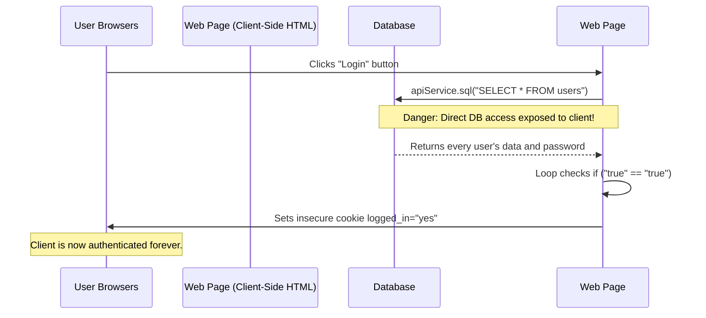
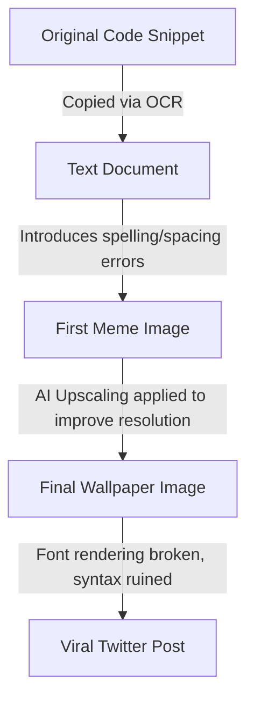

# Exposing the Internet's Worst Code: A Deep Dive into a Viral Nightmare

Theo begins by sharing his reaction to a viral image of code so poorly written it is currently being used as a joke developer wallpaper on Twitter. Unwilling to just laugh at it and move on, he investigates the origins of the snippet, analyzing its technical flaws line by line and tracing the internet footprint of the developer who wrote it. He also briefly highlights his sponsor, Browserbase, noting how their Stagehand package uses AI and Zod schemas to easily automate headless browsers, contrasting modern tooling with the ancient, broken code he is reviewing.

### The Security and Logic Flaws

Theo breaks down the specific codebase, which was originally sourced from a deleted "programming horror" post. Though the author claimed the app was an "intranet" project, they horrifyingly admitted it was exposed to the public internet via the company's main website.

Theo points out several catastrophic vulnerabilities and logical failures in the script:
*   The code is written directly inside an HTML file, exposing the entire authentication logic and backend structure directly to the client browser.
*   The function attempts to verify users by executing a blanket `SELECT * FROM users` SQL query entirely inside client-side JavaScript, meaning any user could open their console and effortlessly delete the entire database.
*   Because the code relies on a blocking HTTP request inside a standard `for` loop, it forces the entire JavaScript thread to freeze while waiting for the monolithic database response to return.
*   The actual validation step features the absurd condition `if ("true" == "true") return true;`, which Theo charitably theorizes is the leftover result of someone accidentally deleting a variable reference like `account.isActive` while trying to debug.
*   Once the broken check completes, the system grants access by simply setting a plain text client-side cookie that reads `logged_in="yes"`, completely bypassing centralized session management or security. 

### Profiling the Original Developer

Looking at the original poster's post history, Theo manages to piece together a profile of the developer responsible. He finds other snippets from the same author featuring identical patterns, such as fetching raw analytics data directly from JavaScript and writing fake, heavily conflicting `setTimeout` chains designed to lie to the user about secure connections loading. 

Based on this evidence, Theo reasons that the author was not a software engineer, but rather a data analyst or corporate IT worker. He explains that non-developers are frequently forced to write quick JavaScript to expose their internal work to management, which perfectly explains the heavy reliance on SQL analytics queries, the fundamental misunderstanding of asynchronous code, and the absolute disregard for web security.

### The Mystery of the Altered Wallpaper

As tools and platforms shared the code over the years, Theo notices syntactic discrepancies between the original archived post and the modern viral wallpaper. Specifically, the wallpaper version features missing CSS selector IDs, bizarre spacing, and the syntactically invalid string "login failed" passed into a jQuery display function.

Theo concludes that the current version of the code is the product of multiple layers of digital degradation. He deduces that someone originally copied the image using awful Optical Character Recognition (OCR), which broke the jQuery syntax. Later, when someone wanted to use the low-resolution joke as a desktop wallpaper, they ran it through an AI image upscaler. Theo points out visual artifacts in the text—like completely malformed ligatures and rounded letters—proving that AI upscaling finalized the terrible code by injecting random spaces and warping the characters, solving the mystery of how the code got quite so bad.
