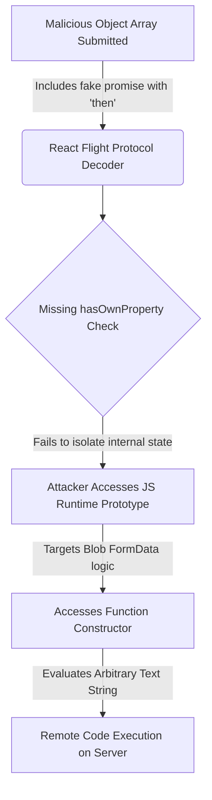

# The React-to-Shell Vulnerability: How It Works and How the Industry Responded

React recently suffered from a maximum-severity vulnerability with a CVE score of 10. The exploit, internally dubbed "React-to-shell," allowed for remote code execution on the server. Theo details that this is one of the worst exploits seen in the modern web, but the story of how it was discovered, patched, and handled by the industry is incredibly impressive.

Because this vulnerability allows bad actors to hijack the connection between the frontend and backend to execute arbitrary code on the server, Theo intentionally delayed this coverage. He wanted to ensure developers had time to patch their systems before raising widespread awareness of how to replicate the attack. 

### Why This Happened: The Flight Protocol

To understand the exploit, Theo explains the underlying mechanics of React Server Components. Server components give developers the superpower to pass unresolved promises from the server directly to the client. The client can then use the `use` hook to suspend rendering until that data resolves. Furthermore, React allows entirely JavaScript-free form submissions by silently embedding encrypted, hashed state into hidden form fields, linking client actions directly to server-side functions. 

Because standard web protocols do not have a native way to serialize a promise over the wire, React had to invent one. This custom serialization format is called the Flight Protocol. While it provides a brilliant and intuitive developer experience, inventing a new protocol for encoding and decoding complex data structures inadvertently opened the door for this vulnerability.

### The Mechanics of the Exploit

Security researcher Lachlan Davidson discovered a way to abuse how the Flight Protocol parses data. Theo outlines how the attacker crafts a microscopic, precise payload to trick React's internal machinery:

*   The attacker sends a payload that mimics a promise by attaching a `then` property, leaning on the fact that JavaScript treats any object with a `then` property as a promise.
*   React attempts to recursively resolve this fake promise using an internal tracking object meant strictly for React's own bookkeeping.
*   The payload exploits a missing safety check—specifically the absence of a `hasOwnProperty` validation—allowing the colon syntax in Flight (which is meant for user-defined object references) to access the internal machinery of the JavaScript runtime.
*   By hijacking a specific step where React parses form data into a Blob, the attacker forces the runtime to evaluate the object's `constructor`. 
*   Once the function constructor is accessed, the attacker can pass an arbitrary string (like a shell command or network request) that gets evaluated on the server with full runtime permissions.

### Who is Affected and How to Mitigate It

Theo stresses that this is not just a Next.js problem. It fundamentally affects the React architecture and any framework leveraging React Server Components. 

*   **Affected Versions:** The vulnerability is present in React 19, 19.1, 19.1.1, and 19.2. It impacts tools like Next.js, React Router, Waku, and the React Server DOM packages.
*   **False Senses of Security:** Even if an application restricts itself entirely to client components, if the server renderer is running on a vulnerable version, the Flight endpoint can still be targeted and exploited.
*   **The Fix:** Updating to the latest patch versions (19.0.1, 19.1.2, or 19.2.1) completely mitigates the issue. React 18 and older versions are completely unaffected.
*   **WAF Protections:** Major hosting providers like Vercel, Cloudflare, and Netlify implemented Web Application Firewall mitigations to block malicious payload shapes. However, Theo warns that these firewalls can be bypassed if an attacker finds a new payload shape, making a package update absolutely mandatory.

### Ripple Effects Across the Ecosystem

The fallout from this vulnerability has already caused noticeable damage in the real world. Theo shares the story of a developer named Eduardo, who was hosting a Next.js application on Hetzner using Coolify. Because his application was vulnerable and running in a Docker container with default root access, attackers gained root privileges to his server. They installed persistent cron jobs, disguised malware as regular web servers, and turned his machine into a crypto miner. Theo strongly cautions developers to never deploy Node or Next.js Docker containers as the root user. 

The mitigation efforts also caused collateral damage. Cloudflare experienced a significant 35 to 40-minute global outage while trying to protect users from this CVE. Cloudflare had to increase their firewall buffer size from 128 kilobytes to 1 megabyte to ensure they were scanning entire Next.js requests for the exploit. A secondary configuration change meant to disable a test rule triggered a fatal null pointer error in their Lua codebase, temporarily taking down vast portions of the web. 

### Theo's Takeaways and Opinions

Theo pushes back against developers from other ecosystems—like PHP, Rails, or pure client-side rendering advocates—who use this exploit to claim their stacks are inherently superior. He argues that whenever engineers build complex solutions to solve complex problems, complex security issues will inevitably arise. In his view, a vulnerability of this depth exists in almost every sufficiently mature codebase; it is just a matter of who finds it first. 

Ultimately, Theo is highly impressed with how the situation was managed. Lachlan Davidson chose the ethical route of private disclosure rather than exploiting the vulnerability for personal gain. Furthermore, the collaboration between Meta researchers, the React team, and major hosting providers led to a patch and public disclosure pipeline of just five days. To encourage this kind of security research going forward, Vercel launched a $50,000 HackerOne bounty for anyone who can find a way to bypass their firewall protections, a move Theo views as an excellent way to ethically incentivize the security community.
