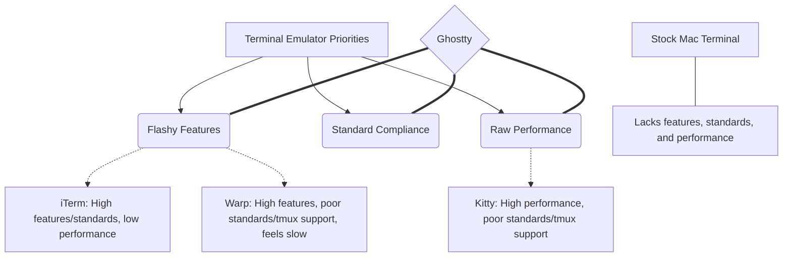

# Theo's Review of the Ghostty Terminal

After going viral for stubbornly using the stock Mac terminal, Theo realized he was making life difficult for CLI developers and set out to find a better tool. After testing around eight different terminals over a year, he found a clear winner in Ghostty. Recently out of closed beta and available to the public, Ghostty represents what Theo considers the perfect, final form of the modern terminal emulator. 

### The Terminal Emulator Landscape

Theo explains that terminal emulators typically force users to choose between three primary directions: following standards, prioritizing flashy features, or focusing on raw performance. Most applications fail to balance all three. 

Ghostty stands out because it successfully commands all three priority areas. It achieves bleeding-edge performance while remaining strictly compliant with terminal standards and offering a tasteful, minimal set of modern features. 

### Why Ghostty is Structurally Unique

Theo outlines several technical and architectural decisions that give Ghostty a distinct edge over its competitors:

*   **Decoupled Architecture:** The project is split into `libghostty` (a cross-platform C/Zig library) and the terminal app itself, with the goal of allowing developers to embed native, high-quality terminals directly into editors like Zed or web-based applications.
*   **Deep Performance Visibility:** Ghostty includes a "Terminal Inspector" similar to browser developer tools, which exposes deep metrics about screen resolution, grid size, rendering rasterization engines, and resource usage.
*   **True Native Integration:** The developers acknowledge two types of "native" applications: compiling natively to the CPU architecture, and using the actual UI primitives of the host operating system. Ghostty does both, being written mostly in Zig for compiled speed while using Swift and Metal to hook into native Mac UI elements.
*   **Mac-Specific Quality of Life:** Ghostty leverages Mac features seamlessly, supporting proxy icons (allowing users to drag and drop folders from the title bar), native tabs, triple-tap lookups, and secure keyboard entry to protect passwords (a rarity among modern performance terminals).
*   **Programmatic Glyph Rasterization:** Instead of relying entirely on standard fonts, Ghostty pre-compiles and rasterizes powerline and nerd glyphs perfectly to the grid, ensuring arrows, bars, and icons look exactly as they should without breaking alignment.

### Theo's Workflow and Configurations

Ghostty aims for a "zero-config" experience for 99% of users. Theo heavily favors this philosophy because minimizing custom configurations ensures his workflow aligns with the creator's intent, reducing the likelihood of future bugs. 

*   **Flawless Tmux Compatibility:** Theo relies almost entirely on `tmux` for multiplexing, window splitting, and tab management, doing so via muscle-memory hotkeys he has used for a decade. While terminals like Warp and Kitty frequently break his tmux workflow, Ghostty supports it perfectly out of the box.
*   **Outperforming the Stock Terminal:** Using the intensive "Doom fire" terminal benchmark, Ghostty rendered effortlessly at over 580 FPS with minimal CPU load, whereas the stock Mac terminal completely froze under the exact same test while exhausting system resources.
*   **Built-in Aesthetics:** Ghostty ships with baked-in nerd fonts and a massive library of pre-installed themes (including Theo's choice, Vesper), which can be previewed seamlessly with a single command.
*   **Native Mac Navigation:** By default, Ghostty respects the native Mac shortcut of holding "Option" and using the arrow keys to skip word-by-word through text, negating the need for custom escape-code bindings. 
*   **Disabling Ligatures:** Theo emphatically dislikes ligatures—a font feature where characters like `!=` are visually merged into a single symbol—and disabled them in Ghostty. He discovered during Advent of Code that ligatures combined underscores and dashes, completely ruining the grid spacing of a generated ASCII Christmas tree. 

### The Developer Behind the Terminal

Theo notes that Ghostty is a passion project built by Mitchell Hashimoto, the well-known founder of HashiCorp and creator of Terraform. Mitchell built Ghostty simply because he wanted a terminal that "sucked less." Because Mitchell does not need to monetize the terminal, it remains a true standard open-source project. Furthermore, Mitchell's positive experience building the application natively in Zig led him to personally pledge $300,000 to the Zig Software Foundation to ensure the language and toolchain continue to thrive.

Theo concludes that after a year of agonizing over his terminal setup, Ghostty is the terminal for "when you're done." It combines standard consistency, robust performance, and true native feeling so well that he has been completely satisfied with it for six months and has no intention of switching.
