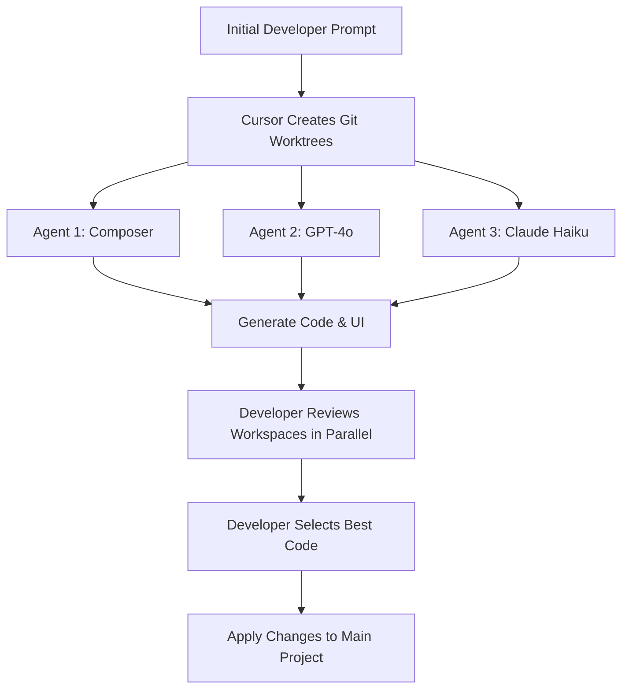

# Cursor 2.0 and the Shift to Agent-Centric Coding

Cursor 2.0 introduces a fundamental overhaul to the coding environment, shifting from a traditional file-centric IDE to an agent-centric workspace. Theo expresses immense enthusiasm for this update, noting that he has been coding exclusively in this new interface. While he transparently discloses that he is an investor in Cursor, he points out that even his historically skeptical manager considers this update a massive breakthrough. 

The update is accessed via a simple toggle, allowing developers to switch seamlessly between a classic text editor view and a dedicated workspace for managing AI agents. Theo breaks down the update into several major pillars: a proprietary new model, parallel agent execution, and a native browser integration.

### The Composer Model

Alongside the software update, Cursor released its own official AI model named Composer. Theo explains that Composer is a frontier model specifically optimized for high-speed use as an agent within Cursor. 

*   Composer was built on the foundation of Cursor’s previous acquisition of Super Maven, leveraging the expertise of Jacob, the original creator of Tab 9, who specializes in lightning-fast autocomplete models. 
*   The model achieves incredible speeds, completing most turns in under thirty seconds, making it feel up to four times faster than similarly intelligent models. 
*   Theo reasons that Composer's high quality stems from reinforcement learning based on vast amounts of telemetry data, specifically tracking which AI-generated code snippets developers explicitly accept and keep in the editor. 
*   Because the model processes planning and multi-file editing capabilities natively, it allows developers to prompt wide-scale architectural changes rather than editing one file at a time.

### Parallel Agents and Git Worktrees

One of the most powerful features Theo demonstrates is the ability to run multiple AI models simultaneously to solve the exact same prompt, comparing their work before merging. 

Cursor achieves this by utilizing Git worktrees in the background, creating hidden directories on the user's machine where different models can work concurrently without causing conflicts in the main code repository. 

In his testing, Theo tasks Composer, Claude Haiku, and GPT-4o with building a localized UI simultaneously. He notes that while GPT-4o takes significantly longer because it is heavy on planning, it produces the most aesthetically pleasing UI. Composer, on the other hand, grinds through the file creation and logic incredibly fast, providing highly competent results at a fraction of the time and cost.

### Native Browser Integration and UI Overhaul

Theo highlights two major interface improvements that directly address the bottlenecks of AI coding: reviewing generated code and testing visual changes.

*   Cursor 2.0 features a completely overhauled review flow that uses standard Monaco rendering, allowing developers to scroll through and approve or stash massive, multi-file code revisions in a single, clean interface. 
*   The software now includes a native browser automation tool that allows the AI agent to spin up a local server, look at the rendered application visually, and correct its own mistakes without human intervention. 
*   During a live demonstration, Theo asks the AI to center an image. The agent opens a localized Chrome instance, realizes its initial code resulted in a broken layout, automatically takes a screenshot to analyze the error, and pushes a fix that successfully centers the element. 

### Theo's Conclusions and Changing Workflows

Theo admits that LLMs remain inherently non-deterministic and prone to occasional errors, such as getting stuck in loops or struggling with package managers like NPM. He continuously uses Bun in his demonstrations to bypass the slow installation speeds that usually bottleneck the AI. 

Despite these familiar quirks, he concludes that Cursor 2.0 fundamentally alters how he writes software. Because he can now execute and compare multiple models seamlessly, he is much more willing to test out different AI interpretations of a problem. Furthermore, this workflow is encouraging him to write more automated tests, as having strict tests in place allows him to quickly verify which of the parallel agents produced a functional solution.
