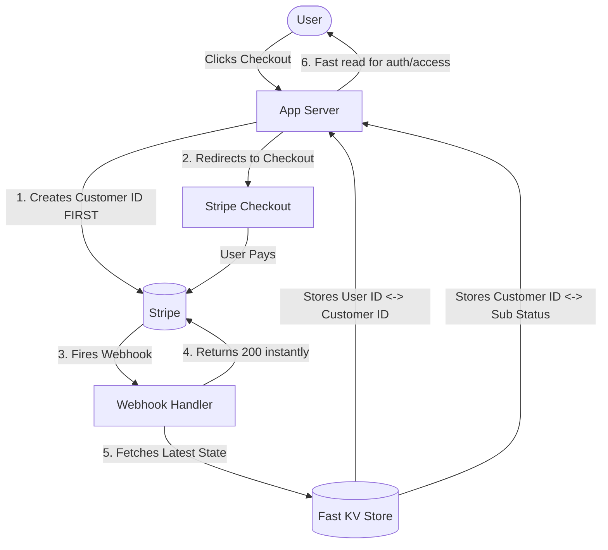

# The Pain of Implementing Stripe in 2025 (And How to Fix It)

Theo argues that while Stripe revolutionized developer-first software by introducing excellent APIs and documentation, setting it up in 2025 has become an incredibly painful experience. He explains that as the rest of the industry moved forward, Stripe's developer experience stagnated and became riddled with confusing edge cases. After experiencing significant frustration implementing Stripe for massive projects, Theo open-sourced his findings to help other developers avoid the same pitfalls.

### The "Split Brain" Problem
The core difficulty with Stripe is the "split brain" data problem: keeping the data in your app's database perfectly in sync with the data in Stripe's systems. 

When a user tries to access a paid feature, your app needs to know if they are a paying customer. Relying directly on Stripe's API for this check is a deeply flawed approach for several reasons:
*   You cannot look up users in via Stripe's API using your app's internal User IDs; you must use Stripe's randomly generated Customer IDs.
*   Stripe enforces aggressive rate limits of 100 reads/writes per second, which will easily bottleneck a high-traffic application.
*   The Stripe API is incredibly slow, often taking three to ten seconds to resolve a request, which drags down your application's entire performance.

To avoid the API, Stripe recommends relying on webhooks—server-to-server events that notify your backend when a user checks out. However, Theo warns that relying purely on webhooks is dangerous because they can arrive out of order (getting an event that a subscription was paid before the customer is fully created), deliver partial updates, or simply be unreliable and cause a broken database state.

### Theo's Recommended Architecture
To solve this, Theo built a resilient workflow that uses a fast Key-Value (KV) store to act as a bridge between Stripe and the application.

To implement this architecture smoothly, Theo outlines several strict technical rules:
*   Instead of letting Stripe's webhooks write directly to the main database, Theo uses the webhook merely as a signal that an account change occurred.
*   Upon receiving a webhook, his server immediately returns a 200 status code to Stripe to stop them from spamming the event, and then runs the actual data fetching in the background.
*   He explicitly verifies the webhook signature to prevent fraudulent requests, and throws an error if the webhook does not contain a valid Stripe Customer ID.
*   He uses a dedicated Key-Value store (such as Upstash or Redis) to maintain two fast-access data sets: one linking the internal User ID to the Stripe Customer ID, and another linking the Customer ID to the actual subscription status.
*   When checking if a user has access to a paid feature, his routes and endpoints check this lightning-fast KV store instead of hitting Stripe's slow API.
*   Theo insists that developers must generate a Stripe Customer ID and attach necessary metadata (like the user's email) before the user is ever allowed to visit the checkout page, preventing absolute chaos where a single user accidentally generates multiple disconnected Stripe IDs.
*   When a user completes a purchase and returns to the app, Theo routes them through a specific success page that forces a background sync with the closest KV store, ensuring the user interface updates their paid status instantly.

### Hidden Pitfalls and Bad Defaults
Beyond the architecture, Theo expresses immense frustration with Stripe's default settings, which he feels are out of touch with modern software needs. 

*   Stripe allows users to subscribe to the same tier multiple times by default, requiring developers to dig deep into checkout settings to manually check a box labeled "limit customers to one subscription."
*   "Cash App Pay" is enabled by default on Stripe checkouts, which scammers heavily abuse by using its delayed mobile-redirect flow to trick applications into granting free access while the payment is left permanently pending.
*   Updating user telemetry on Stripe's usage-based billing behaves inconsistently, summing the data if called within a five-minute window, but overriding the total if called outside of that timeframe.
*   Price IDs for subscriptions must exist entirely separately in development and production environments, forcing developers to manage environment variables manually and redeploy their entire service just to keep staging and live logic in sync.

### Alternative Payment Platforms
Because of these overwhelming pain points, Theo recommends looking at alternatives if you are exhausted by Stripe wrappers. 

He highlights Lemon Squeezy, a Merchant of Record that handles global taxes and compliance natively. They built a far inherently better developer experience and were actually acquired by Stripe, which Theo hopes will eventually fix Stripe's core platform. He also praises Polar, an open-source alternative built on top of Stripe that offers a much smarter developer experience and highly competitive pricing. Finally, he mentions Clerk, an authentication provider that promised a deeply integrated Stripe billing system nearly a year ago, though Theo remains highly skeptical that they will ever actually ship the feature to the public.
