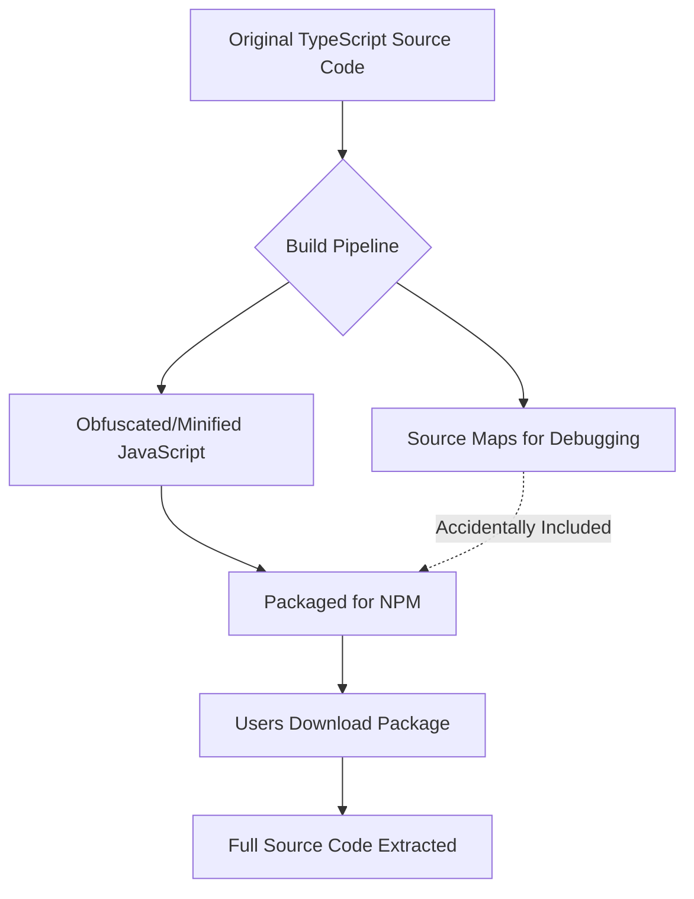

# A Detailed Breakdown of Anthropic's Claude Code Leak

In what Theo describes as one of the most significant leaks in recent AI history, Anthropic accidentally released the proprietary source code for Claude Code, their command-line agentic harness. Historically, Anthropic has fiercely protected this codebase, referring to it as their "secret sauce" and keeping it entirely closed-source, in contrast to open-source alternatives like OpenAI's Open Code. Theo managed to get the leaked version running locally and breaks down exactly how the leak occurred, what the codebase reveals, and how Anthropic should handle the fallout.

### The Mechanics of the Leak

Theo explains that the leak was rooted in a fundamental part of modern JavaScript asset pipelines: source maps. Because deployment environments and browsers run JavaScript rather than the TypeScript developers write, the code is passed through a build step. This step transpiles, minifies, and obfuscates the code to make it smaller and more efficient. However, debugging this obfuscated code is nearly impossible without a map that links the shipped code back to the original source. 

To solve this, developers use source maps, which inherently contain the original, un-minified code.

Theo speculates that because Anthropic was recently dealing with unexpected rate-limit issues, developers likely tried to improve their production logging to track down the bugs. In the process, they accidentally bundled the generated source map folder into the public npm package. Anyone who downloaded the tar file from npm directly gained access to the entire original source code. 

### Debunking the Conspiracies

Because the leak was so sudden and massive, Theo notes that several conspiracy theories immediately began circulating online. He strongly pushes back against the most prominent rumors:

*   The theory that Anthropic leaked the code intentionally is completely false, as evidenced by Anthropic pulling the npm packages immediately, removing files from their servers, and issuing hundreds of DMCA takedown requests to GitHub repositories hosting the leaked code.
*   The rumor attributing the leak to a known bug in the "Bun" runtime is incorrect, as established by Bun's creator, who confirmed that Claude Code uses Bun strictly as a local runtime rather than as a server environment where that specific bug occurs.
*   The idea that competitors will use this code to dramatically improve their own agentic harnesses is misguided, because Claude Code actually performs quite poorly against open-source alternatives, currently sitting at 39th place on Terminal Bench. 
*   Rather than competitors stealing from Anthropic, Theo points out that the leaked codebase actually contains multiple instances of Anthropic referencing and copying behaviors from open-source tools to fix their own features.

### Inside the Codebase

With the code publicly available, Theo and the developer community analyzed the repository to uncover unreleased features, internal habits, and architectural decisions. 

*   The code includes an unreleased "Dream Mode," which is designed to spin up background agents while the user is away to review past sessions, consolidate memories, and automatically align the tool with the user's preferences.
*   A complex "Coordinator Mode" is heavily featured, designed to spin up multiple parallel worker agents with full tool access, though Theo suspects this feature has been delayed due to the massive token costs associated with running multiple sub-agents simultaneously.
*   Anthropic built an "Undercover" flag specifically for their own engineers to use when contributing to external open-source projects, ensuring the agent strictly avoids revealing that the code was AI-generated.
*   The codebase reveals intense paranoia regarding competitors, evidenced by Anthropic moving their feature flags from StatSig to GrowthBook simply because OpenAI acquired StatSig, and implementing "anti-distillation" systems that inject fake tool calls into histories to ruin the training data of Chinese labs trying to scrape their models.
*   To keep the model aligned during long conversations, the system automatically injects the primary system prompt back into the context window right next to the user's input every time the conversational turn changes.
*   The architecture attempts to offset the high costs of parallel agents by using shared prompt caching, allowing sub-agents to branch off from identical context histories without paying redundant input token fees.

### Analyzing the Code Quality

Curious about the actual engineering standards at an elite AI lab, Theo used an AI tool to review the 390,000 lines of original TypeScript. The codebase received a 7 out of 10 rating.

The code features solid type safety, consistent naming conventions, and modern asynchronous patterns with almost no callback hell. They utilize Biome for linting and securely handle dead code. However, the repository suffers from massive "god files" that exceed 5,000 lines of code.

Theo found that Anthropic’s handling of environment variables is highly disorganized, with feature flag checks and variable calls sprawling wildly throughout the business logic. This lack of centralized secret sanitization explains why Claude Code has historically leaked user environment variables. Additionally, the CLI defaults to plain-text credential storage on Linux machines, which Theo views as a major oversight.

### Theo’s Strategic Recommendations for Anthropic

Anthropic issued a standard corporate statement blaming "human error" and emphasizing that no customer data was compromised. Theo feels this approach is a massive mistake and offers several recommendations on how they should pivot their strategy.

*   Anthropic should formally commit to open-sourcing Claude Code by releasing a public roadmap, acknowledging that the code is already out there and giving themselves a month or two to clean up the repository and drop the commit history.
*   The company needs to stop operating out of fear and immediately cease sending DMCA takedowns to developers who are simply examining the code, as relying on lawyers rather than community managers severely damages their reputation.
*   Rather than suppressing the discussion, Anthropic should beat the leakers to the punch by having their engineers write daily blog posts or threads explaining the unreleased features, why they built them, and what they learned in the process.
*   Theo stresses that Anthropic must act like humans rather than a faceless corporation, comparing them unfavorably to OpenAI, who recently handled a public critique from Theo by kindly and publicly making a joke about their own UI bug.
*   By allowing their engineers to express genuine excitement about their hard work rather than hiding behind press releases, Anthropic has the opportunity to turn a massive PR failure into a massive community win.
