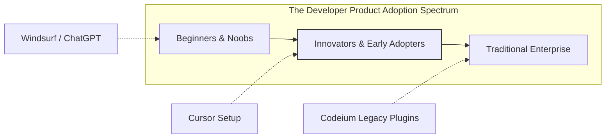

# Why OpenAI is Buying Windsurf for $3 Billion

The landscape of code editors is shifting rapidly, and custom forks of the open-source VS Code editor are proving to be immensely valuable. Theo explores the chaotic environment of AI-integrated development tools, specifically breaking down why OpenAI has positioned itself to acquire the AI editor Windsurf for roughly $3 billion, despite the editor having a relatively small market share. 

### The Evolution of AI Editors
VS Code, built by Microsoft, is widely considered the most popular code editor in the world. It initially won the market by being a lightweight, highly extensible, and truly open-source platform. As AI companies began building developer tools, they started by creating extensions for VS Code, beginning with GitHub Copilot's predictive autocomplete.

However, companies soon realized that VS Code's traditional extension architecture was far too restrictive for deep AI integration. Extensions were largely confined to sidebar panels. Showing in-line code edits required absurd workarounds, like rendering UI elements as SVG images. To overcome these limitations, companies realized they needed to fork the entire VS Code project and build custom editors from the ground up. 

This led to the rise of Cursor, an AI-first editor that Theo discloses he is an investor in. Cursor achieved massive success by identifying a core developer need: lightning-fast, highly accurate autocomplete. To perfect this, cursor acquired the autocomplete technology Supermaven, resulting in an editor that currently generates around $200 million in annual recurring revenue and holds a $9 billion valuation. 

Codeium, the company behind Windsurf, took a different path. They originally focused on building AI helper plugins for enterprise environments, specifically targeting Java developers using JetBrains environments. Recognizing the limitations of standard plugins, Codeium eventually released Windsurf as their own VS Code fork. Theo notes that Windsurf leans heavily into "agentic" coding, where the editor acts autonomously to execute commands and write files based on user prompts, rather than just assisting the developer as they type.

### The Adoption Gap
Despite Windsurf's capabilities, it struggles with market adoption. Theo highlights a core business rule regarding new product growth: early traction requires targeting innovators and early adopters. Cursor captured this crucial middle market of developers who eagerly try new tools. Windsurf, however, tried to build simultaneously for absolute beginners who need environment-setup help, and massive enterprise companies that move very slowly. 

Theo ran market share polls across Twitter, YouTube, LinkedIn, and his Twitch chat. Across all platforms, traditional VS Code and Cursor heavily dominated developer preference. Windsurf consistently captured only 2% to 5% of the vote, making it roughly a tenth of Cursor's size. 

### Why OpenAI is Making the Purchase
Given Windsurf's small market footprint, a $3 billion acquisition initially seems baffling. However, Theo breaks down OpenAI's underlying strategy and why the math makes perfect sense for them:

*   **Losing the developer sentiment war:** OpenAI recognizes that rival Anthropic is currently the developer favorite, with the majority of programmers preferring Anthropic models for coding tasks, and this acquisition is a direct countermeasure to win developers back.
*   **Cursor turned OpenAI down:** OpenAI previously approached Cursor with an acquisition offer, but Cursor declined in order to remain independent and preserve their massive growth unattached to OpenAI's specific models.
*   **Covering the entire market spectrum:** By owning Windsurf and Codeium, OpenAI instantly covers the beginners who want agentic vibe-coding, the enterprise developers stuck on legacy editors, and users of their open-source command line tool, Codeex.
*   **The valuation math is minimal for OpenAI:** OpenAI recently raised capital at a $300 billion valuation, meaning a $3 billion acquisition costs them roughly 1% of their total equity—an incredibly cheap price to eliminate a strategic vulnerability and protect their moat.

### A Potential Open-Source Disruption
Theo offers a bold prediction regarding OpenAI's ultimate plan for Windsurf. Because OpenAI does not need Windsurf to generate direct subscription revenue, they could choose to fully open-source the editor. 

If OpenAI gives away a highly capable, natively integrated AI editor for free, the goal would be to cultivate intense developer loyalty and flood the market with OpenAI-powered tools. Open-sourcing Windsurf would instantly transform it from a minor player into a severe, existential threat to Cursor's paid model. 

While some might argue that undermining the VS Code ecosystem could harm OpenAI's deep partnership with Microsoft, Theo argues that relationship is already fraying. Microsoft has recently made hostile moves, such as hosting Elon Musk's Grok AI on Azure, indicating an executive-level battle where OpenAI no longer feels beholden to Microsoft's feelings. Ultimately, Theo concludes that while Windsurf does not currently beat Cursor on merit, OpenAI's tactical capital placement and potential open-source play make this highly competitive space one to watch carefully.
