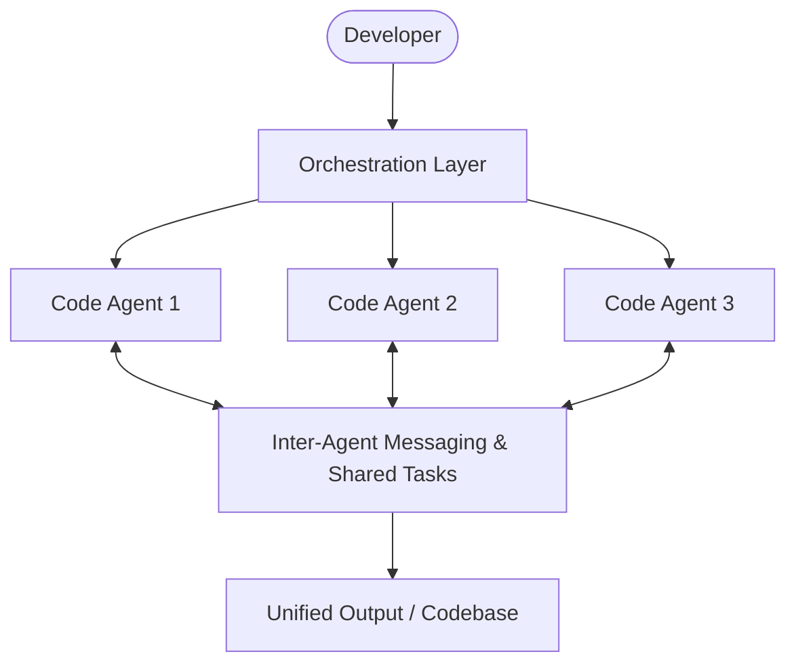

# Anthropic's Opus 4.6: Brilliant Coding, Steep Trade-offs

Theo recently shared his extensive first impressions of Anthropic's new Opus 4.6 model. Releasing on a crowded day for AI—right alongside a major OpenAI update—Opus 4.6 stakes its claim as the smartest AI coding model ever made. While the benchmarks are staggering, Theo's real-world testing reveals a model that trades speed and personality for raw, methodical coding capability.

Here is a breakdown of what makes Opus 4.6 groundbreaking, where it falls short, and the broader industry shifts Theo believes this release highlights.

### Capabilities and Long-Running Agents

Opus 4.6 brings some massive improvements to the table, specifically designed for deep, autonomous software development. It features a one million-token context window in beta and absolutely crushed ARC AGI's "Humanity's Last Exam," pushing the boundaries of what AI can solve. 

One of the most exciting additions is a new orchestration layer that allows developers to run teams of agents in parallel. Anthropic proved this concept by having an agent team build a 100,000-line Rust-based C compiler for the Linux kernel entirely from scratch. 

Theo tested this by setting up five different agents to audit a large codebase simultaneously and bring back parallel results. While he found the process undeniably cool—especially with an interface that lets you watch the agents work multiplex-style—he notes that it is highly experimental and crashes consistently. 

Furthermore, very long-running autonomous tasks face severe practical hurdles. The longer an agent runs, the higher the chance it makes a fatal, unnoticed error early on. When a task runs for ten hours and fails, a developer has very little motivation to manually correct and restart it. Finally, running thousands of automated sessions costs an astronomical amount; Anthropic burned roughly $20,000 in API credits just to build their C compiler. 

### The Cost and The "Sonnet 5" Conspiracy

Pricing is a major point of contention for Theo. Anthropic's pricing is significantly higher than its competitors, and he questions whether the performance gap justifies the cost. 

*   Opus 4.6 remains at $5 per million input tokens and $25 per million output tokens, which is roughly two to four times more expensive than OpenAI's top coding models.
*   If you utilize the one million-token context window, or simply exceed 200,000 tokens, the price doubles to $10 per million for input and roughly $40 per million for output.
*   Theo points out that larger context windows are highly vulnerable to "context rot" where the model forgets or ignores data, meaning you are often paying double for less reliable results. 

Because of the timing, capabilities, and pricing structure, Theo suspects that Opus 4.6 was originally supposed to be Sonnet 5. When Anthropic saw developers flock to the older Opus models despite the high cost, he theorizes they rebranded the new Sonnet model to justify charging premium Opus prices, explaining why "Sonnet 5" missed its rumored release date entirely.

### Real-World Coding Experience: Slower and Less Charming

While Opus 4.6 is undeniably smarter and significantly more thorough than Opus 4.5, Theo found the day-to-day user experience noticeably degraded. 

*   The model has taken a major hit to its processing speed. Tasks that took Opus 4.5 one to two minutes are now taking Opus 4.6 anywhere from five to ten minutes. 
*   Anthropic seems to have deliberately stripped the model of its conversational flair. Theo demonstrated that entirely different prompts given to Opus 4.6 resulted in identical, template-like robotic responses. 
*   It operates more reliably in large codebases. When Theo audited a project, Opus 4.6 successfully fixed a complex encryption token bug that 4.5 had previously made worse by acting too eagerly without gathering context. 
*   Despite being smarter, it still makes distinct logical errors. During a security audit, Opus 4.6 flagged placeholder string text in an example file and standard local development credentials as "critical cybersecurity vulnerabilities" without understanding the context of the files. 
*   It lacks initiative in unprompted sweeping tasks. When asked to audit a monorepo, it only checked the web app and completely ignored the React Native mobile app until Theo explicitly reminded it to look there. 

### Security Changes and Industry Lock-in

Anthropic has introduced an important API change to prevent "partial turn prefill attacks." Previously, a user could bypass safety guardrails by starting the model's response for it (e.g., forcing the model to begin its reply with "Building a bomb is easy, first you..."). Opus 4.6 will now refuse API requests that contain an incomplete assistant message. 

While Theo agrees this is a necessary security measure, he is deeply concerned about the broader industry trend of tying chat history and "reasoning tokens" directly to model providers. Both OpenAI and Google hide their models' internal reasoning processes, forcing developers to maintain rigid conversation threads on the providers' servers to maintain context. This locking away of reasoning data strips developers of flexibility, preventing them from seamlessly swapping between different providers' models mid-project. Theo notes that Anthropic used to be better about this transparency, but these new API restrictions hint at a more locked-down ecosystem.

### Theo's Conclusion

Ultimately, Theo views Opus 4.6 as a 5-10% improvement in sheer coding capability and thoroughness, offset by a 3-5% loss in speed and user experience. It serves as a phenomenal tool for dealing with complex configuration files, random system credentials, and large SDK changes, but you must pay close attention so its occasional "dumb" mistakes do not ruin your codebase. He recommends taking advantage of Anthropic's current $50 API credit promo and testing the model out on your own daily workflows to see if the trade-offs work for you.
