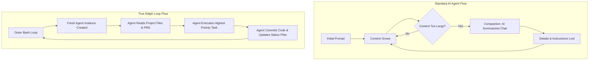

# Understanding Ralph Loops: Orchestrating AI Agents

According to Theo, Ralph loops offer a powerful new way to orchestrate AI agents, meaningfully increasing the scope of tasks you can hand off to an AI. Originally introduced by Jeff Huntley, a Ralph loop is essentially a method of executing AI agents inside an external bash loop so they continue working autonomously. However, Theo points out that as the concept has gained popularity, many implementations have missed the original point, leading to completely different workflows and varying levels of success.

## The Core Problem: Context Rot and Compaction

To understand why Ralph loops exist, Theo explains how AI agents traditionally handle memory. AI models rely on next-token prediction based on the entire history of your conversation. As you continually send follow-up prompts, the conversational context grows larger and larger. 

Eventually, the model hits a context limit, leading to "context rot," where the AI's prediction quality heavily degrades. To solve this, standard AI coding tools automatically trigger "compaction." They send the massive chat history to a model, ask it to summarize the conversation, and replace the detailed history with that shorter summary. Theo argues that this creates a massive flaw: crucial, specific instructions from earlier in the chat are frequently lost in the summary, causing the agent to forget important operational boundaries. 

The Ralph loop throws the compaction model away entirely. Instead of appending message after message into a single long-running chat session, a Ralph loop breaks out every single follow-up task into its own completely brand-new history.

## True Ralph Loops vs. Flawed Implementations

Theo emphasizes that the most critical part of a Ralph loop is how it handles information after wiping the agent's memory. Because the agent starts completely fresh on every loop, all implementation details revolve around passing the exact right context back into the new prompt so the AI can efficiently pick up where the last iteration left off.

Theo highlights several core traits and requirements for a successful Ralph loop implementation:

*   **Memory works entirely through external files:** Instead of relying on chat history, the agent updates a specific plan doc or `prd.json` with task statuses, logs what it learned in a `progress.txt` file, and saves its actual work via Git commits.
*   **The loop must sit outside the agent:** Theo strongly criticizes the popular "Ralph Wiggum" Claude Code plugin because it runs the loop *inside* a single Claude Code session, which overflows the context window and triggers the very compaction issues Ralph loops were designed to avoid. 
*   **The prompt must force the agent to read state:** Every fresh iteration is given a prompt that explicitly instructs the agent to read the project specification file and the implementation plan, ensuring the model gathers only the necessary context before it decides what to do next.
*   **Agile task selection beats rigid orders:** Instead of forcing the AI to go through a checklist sequentially, the prompt should ask the model to look at the list of uncompleted tasks, determine which is the most important, and execute that specific one. 
*   **Graceful termination requires specific instructions:** To prevent the bash loop from running indefinitely and burning through expensive API tokens, Theo recommends setting a maximum iteration cap or programming the agent to output a specific phrase like "promise complete" to signal the loop to close automatically.

## AI Quality Control and Embracing Pre-Commit Hooks

Because AI behavior is inherently chaotic and non-deterministic, Theo notes that establishing acceptance criteria is vital, even if that criteria is just a vaguely written string of text. As long as the agent has the right tools to validate its work, it can usually figure out how to meet those human-readable requirements.

Interestingly, utilizing Ralph loops has completely changed Theo's stance on automated code checks. While he previously hated pre-commit hooks because they create friction and make life miserable for human developers, he now heavily advocates for them when managing AI. Because the agent only saves progress via Git, wrapping the project in strict pre-commit hooks—such as type checkers, unit tests, and AI review command-line tools like Code Rabbit—forces the agent to repeatedly fix its own messy code until it genuinely works, without a human constantly supervising the micro-steps.

## The Case for Linear Tasking 

When humans tackle a massive project, the standard industry approach is to parallelize the work by assigning different tasks to different engineers. Theo argues against mimicking this behavior with AI agents. 

When you run background agents in parallel, they inevitably step on each other's toes, create merge conflicts, and get stuck on overlapping dependencies. Because our current development environments are not built to handle multiple bots coding at once, Theo believes that Ralph loops win by forcing linear execution. The iterative loop limits the AI to choosing the single most important task, completing it, checking it off, and then moving to the next. By throwing away the parallelism aspect, you drastically reduce complexity and increase reliability.

## Context Engineering Over Hype

Despite his thorough breakdown, Theo cautions that you might not actually need a Ralph loop. He points to highly productive developers who simply use standard AI tooling without loops. These developers rely on specific models configured to spend extended periods silently reading files before they write any code, resulting in massive, successful refactors without loop orchestration. If your only goal is to stop your AI from quitting a task halfway through, Theo warns that a Ralph loop will just introduce unnecessary friction. 

Ultimately, Theo concludes that the actual value of studying Ralph loops is learning how to do "context engineering." The takeaway is not necessarily that you must use a bash loop to chain agents together, but rather that you must rethink how you organize your instructions, track progress in external files, and set your AI up with the highest possible likelihood of success before it starts generating tokens.
