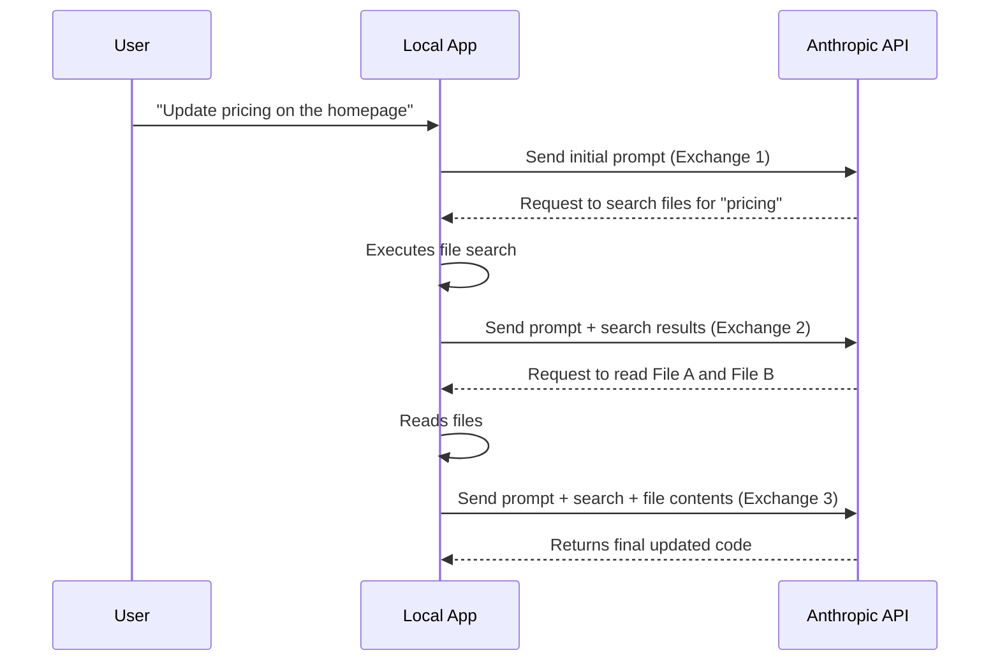

# Distillation Attacks: Analyzing Anthropic's Claims Against Chinese AI Labs

Theo discusses a recent and controversial claim made by Anthropic, which accuses three major Chinese AI labs—DeepSeek, Moonshot, and MiniMax—of coordinating "distillation attacks" against their Claude models. While Theo admits he is an outspoken critic of Anthropic, he carefully examines their specific arguments, sharing his own data and industry perspective to explain why he believes their claims are fundamentally dishonest and mathematically absurd.

### Understanding Distillation

In the AI industry, distillation refers to taking the outputs generated by a highly capable and expensive model and using that data to train a smaller, cheaper model to exhibit similar intelligence. This practice is entirely standard and often legitimate. For example, Theo explains that products like Cursor pay full retail API prices to generate code for users, and they can legally use that generated data to train their own smaller, faster models. 

According to Theo, Anthropic coined the novel phrase "distillation attacks" to describe foreign labs illicitly generating data specifically to bypass terms of service and extract Claude's capabilities, particularly its reasoning and agentic behaviors. 

### Theo's Counterarguments to Anthropic's Claims

Anthropic lists several reasons why these alleged attacks pose security threats and provides specific traffic numbers to attribute these attacks to DeepSeek, Moonshot, and MiniMax. Theo systematically breaks down why he finds these claims highly questionable:

*   Anthropic claims that a distilled model loses entirely the safety guardrails of the original model, allowing bad actors to generate dangerous materials like bioweapons. Theo argues this lacks basic logic, because if Anthropic's safety systems are actually working, the model would refuse to output dangerous instructions in the first place, meaning there is no dangerous data to extract.
*   Anthropic argues that open-weight models multiply security risks because they exist beyond government control. Theo notes that Anthropic is the only major AI lab that refuses to release open-weight models, whereas companies like OpenAI, Google, DeepSeek, and other Chinese labs routinely contribute open-source models and research to the community.
*   Anthropic singles out DeepSeek for generating 150,000 exchanges to steal reasoning capabilities and censorship-safe behaviors. Theo reveals that his own relatively small AI app, T3 Chat, averages 160,000 requests in a single day, proving that Anthropic's target number is trivial and could easily be reached by simply running standard AI benchmarks a few times.
*   Anthropic notes that when a new model was released, the suspected accounts redirected 50% of their traffic to the new model within 24 hours. Theo points out that this is perfectly normal consumer behavior, noting that when he added a new Claude model to his own app, 75% of user traffic naturally shifted to it immediately just by users clicking the new option. 

### The Reality of Tool Calls and Exchange Counts

The most substantial traffic numbers Anthropic cites are 3.4 million exchanges from Moonshot and 13 million exchanges from MiniMax. Theo explains that to a layman, this sounds like millions of individual user prompts, but Anthropic defines an "exchange" in a way that aggressively inflates the numbers through tool calling. 

When a user asks an AI agent to perform a complex task, the model does not answer in one exchange. Instead, it enters a loop of requesting context, reading files, and executing searches. 

As the diagram illustrates, a single user prompt requiring deep research or coding can easily result in dozens or even hundreds of API exchanges. Theo points out that MiniMax previously offered a consumer-facing agent product that legitimately provided access to Anthropic models. Given how tool calls operate, 13 million exchanges could represent a tiny fraction of normal user traffic for a popular consumer application, completely undermining the idea that this volume proves a coordinated distillation attack.

### Theo's Conclusions 

While Theo strongly doubts that the major Chinese labs are orchestrating targeted data theft, he does concede that Anthropic is likely correct about proxy services. Because Anthropic bans Chinese users, third-party hydrocluster architectures have emerged in China to smuggle access to Claude. Theo suspects these gray-market proxy providers might be doing organic distillation on the side to subsidize their operational costs, but this has nothing to do with the specific competitors Anthropic publicly named.

Ultimately, Theo views Anthropic's report as a hypocritical attempt to weaponize American sentiment against successful Chinese competitors like DeepSeek. He highlights the irony of Anthropic complaining about other companies scraping their uncopyrighted data, considering Anthropic built its own models by aggressively scraping the open internet. He challenges Anthropic to contact him privately with solid proof, promising to retract his video if they can actually substantiate their claims.
