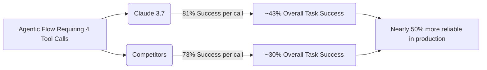

# Claude 3.7 Review: The New Workhorse for Developers

Theo believes Anthropic has shipped its best model yet with Claude 3.7. After testing it extensively on real-world coding tasks, he considers it the best model ever made for developers. While acknowledging that its price is steep compared to recent options from competitors, he argues that the model's performance finally justifies the high cost. 

Claude 3.7 introduces a hybrid architecture, meaning it operates as both a standard model and a reasoning model with visible "thinking" steps. Alongside the model update, Anthropic introduced "Claude Code," an official command-line interface designed to let developers work directly with their codebase.

### Benchmarks and the Competitive Landscape

Theo notes that Claude 3.5 was already dominating the coding space, and 3.7 extends that lead significantly. He highlights several competitive dynamics and benchmark results:

*   **OpenAI's SWE-Lancer benchmark:** OpenAI recently published a benchmark based on real Upwork tasks, where Claude 3.5 solved 24% of application logic problems, compared to GPT-4o's 8% and o1's 16%. Theo expects Claude 3.7 to stretch this lead even further.
*   **The compounding power of tool use:** Claude remains best-in-class at tool calling (e.g., executing searches or hitting APIs). Theo points out that an 8% accuracy advantage on a single tool call compounds massively in multi-step agentic flows, turning a slight edge into a massive reliability advantage in production.
*   **Pricing disparities:** Claude 3.7 costs $3 per million input tokens and $15 per million output tokens, making it over three times more expensive than OpenAI's o3-mini. 
*   **Weaknesses in mathematics:** Theo warns that Claude 3.7 gets completely slaughtered by o1, o3-mini, and DeepSeek R1 in math problems. If a task requires complex mathematical reasoning, he strongly advises using cheaper, more capable models.

To illustrate Theo's point on how Claude's slight edge in tool accuracy creates a massive advantage in complex tasks, here is the math he calculated regarding compound probability:

### Practical Testing and Reasoning Quirks

Theo integrated Claude 3.7 into his own platform, T3 Chat, and tested its new reasoning capabilities. Because Anthropic does not dynamically manage the ratio of thinking-to-output tokens via the API, Theo had to manually code parameters for "Low, Medium, and High" reasoning. 

Through testing, he discovered some fascinating behaviors regarding how the model thinks:

*   **Transparent but strange reasoning:** Unlike OpenAI, Anthropic's thinking process is fully visible to the user. However, Theo observed it hallucinate languages during complex logic puzzles, once thinking entirely in Python before outputting the final code in TypeScript.
*   **The danger of overthinking:** When building a ball-bounce game collision detector, the "High" reasoning mode caused the model to gaslight itself, ultimately breaking the code. Surprisingly, the standard model (no thinking) or the "Low" thinking mode solved the problem perfectly on the first try.
*   **Expensive token generation:** The model tends to rewrite entire scripts rather than just the adjusted parts during its thinking phase. Because thinking tokens are billed as output tokens, this makes heavy reasoning tasks very expensive.

### Claude Code CLI and Final Verdict

To push the model to its limits, Theo used Claude 3.7 inside the Cursor IDE to overhaul his backend chat management system using a strict error-handling package called `neverthrow`. The model correctly refactored multiple files, mapped asynchronous logic flawlessly, and deployed changes that worked immediately without breaking existing external functions.

He then tested the same refactor using the newly released Claude Code CLI to see if it could replace Cursor. Theo found the CLI's interface beautiful and was incredibly impressed that the code it generated worked flawlessly on the first run, passing all type checks. However, he noted that the CLI was quite slow because it lacks the innate context of an IDE, it failed to use his Prettier formatting rules, and the single refactor cost $0.73 in API credits due to heavy thinking. 

Ultimately, Theo concludes that Cursor remains his preferred coding environment, but Claude 3.7 is unequivocally his new default model for production-grade work. While he still uses Gemini for simple tasks due to its sheer speed, Claude 3.7's reliability makes it the undisputed workhorse for developers—though he strongly hopes Anthropic will consider lowering the price.
