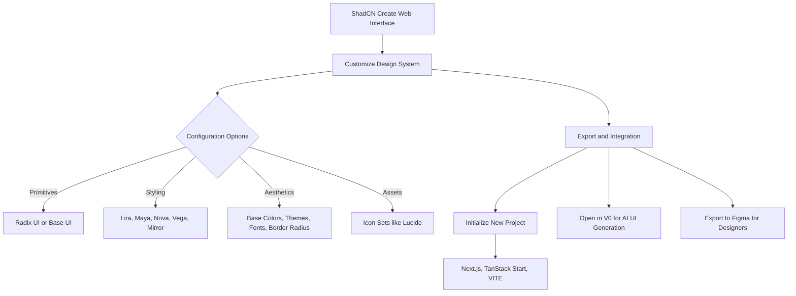

# The Evolution of ShadCN: Customization, AI Integration, and the End of Generic UI

Theo is highly enthusiastic about ShadCN, praising it as a perfect blend of a component library and a style system that lives directly in your codebase. However, he notes a recurring problem in the web development ecosystem: because ShadCN provides such a solid baseline, many developers simply copy and paste the default components without customizing them. This has led to a visually homogenous web where countless sites share the exact same tooltips, dropdown menus, and toast notifications. 

To solve this, ShadCN introduced "ShadCN Create," a massive update designed to put deep customization at the very front of the developer experience. Theo believes this update will drastically raise the baseline design quality across the internet by making it remarkably easy to build a unique design system from scratch.

### The ShadCN Create Experience

Theo demonstrates how ShadCN Create operates as a visual playground for establishing your project's design language before you even write a line of code. You are no longer just copying default code; you are actively generating a personalized system.

*   **Base Primitives:** You can choose between the traditional Radix UI primitives or the new Base UI primitives to serve as the foundation of your components.
*   **Structural Presets:** The system offers layout styles based on intended design density, such as Vega (classic), Nova (compact with reduced margins), Maya (round and soft), Lira (a boxy, brutalist look that Theo prefers), and Mirror (highly dense).
*   **Color Systems:** You can select base colors and accent themes, which instantly update across the preview site. Theo specifically chooses a neutral base because he dislikes the blue-tinted default grays found in Tailwind CSS.
*   **Typography:** You can select foundational fonts for your system. Theo notes his surprise that Vercel's excellent Geist font is not the default, but rather Inter, though he points out the font selection menu needs a visual cue to show that it is scrollable.
*   **Granular Tweaks:** Developers can independently adjust border radiuses and swap out default icon sets, such as choosing Huge Icons over the standard Lucide icons.

Here is a visual breakdown of the new ShadCN Create workflow that Theo highlights in the video:

### Testing Theme-Aware AI Workflows

To see how well AI models handle this new customized architecture, Theo runs an experiment. He tasks several AI coding models to build an "image generation studio" interface, comparing how they perform when given a fresh ShadCN template versus an empty Next.js project.

*   An entry-level model produced classic, ugly "AI slop" with terrible gradients in an empty project, but generated a surprisingly usable and restrained user interface when grounded by the ShadCN component library.
*   Gemini 3 Pro generated a visually distinct UI on its own but defaulted to its signature flaw of creating a useless sidebar. When paired with ShadCN, the component library acted as a guardrail, keeping the model's design choices cohesive.
*   Claude Opus struggled with CSS and font imports in the empty project but ultimately generated a beautiful, landing-page-style UI without ShadCN, showing that highly capable models can sometimes do well without design templates.
*   The GPT model built the most thoughtful, well-spaced mock UI utilizing the custom ShadCN theme. However, it hallucinated entirely and broke down trying to import the non-standard Huge Icons pack Theo had selected. 

Theo concludes that if you are using AI to generate code, sticking to standard libraries like Lucide icons is crucial. Overall, providing a customized ShadCN library helps bad UI models become decent, reigns in models prone to hallucination, and gives instruction-following models the exact tools they need to succeed.

### Ecosystem Impact and Critiques

While Theo is overwhelmingly positive about the update, he does have one structural critique. Currently, ShadCN Create forces you to generate a brand new project rather than allowing you to easily inject your custom configuration into an existing codebase. He acknowledges, however, that because the tool heavily configures Tailwind and structural files, injecting it cleanly into older projects would be incredibly difficult. 

Theo also draws a direct line between this official release and TweakCN, a third-party tool created by a developer named Sahage. TweakCN allowed users to deeply theme ShadCN components in a similar visual manner. Sahage was subsequently hired by Vercel to work on v0, and Theo points out the clear inspiration ShadCN Create took from that project. He loves that developers can now customize their theme in ShadCN Create and immediately export it to Vercel's v0 to have AI generate applications perfectly matched to their new visual style.

Ultimately, Theo respects that ShadCN is not locking users into a pure Vercel funnel. By supporting non-Vercel fonts, various frameworks like Vite, and exporting directly to Figma, ShadCN is evolving to push the entire web development ecosystem toward better, less generic design.

### A Note on Code Review

Separate from the ShadCN discussion, Theo emphasizes the value of AI in code review, specifically sponsoring and praising a tool called Grapile. He argues that while AI's usefulness in writing code is debated, its utility in reviewing code is undeniable. By indexing an entire codebase, Grapile catches genuine regressions and lazy errors—such as a missing benchmark tag Theo forgot in his own code—saving engineering teams massive amounts of time and preventing broken deployments.
