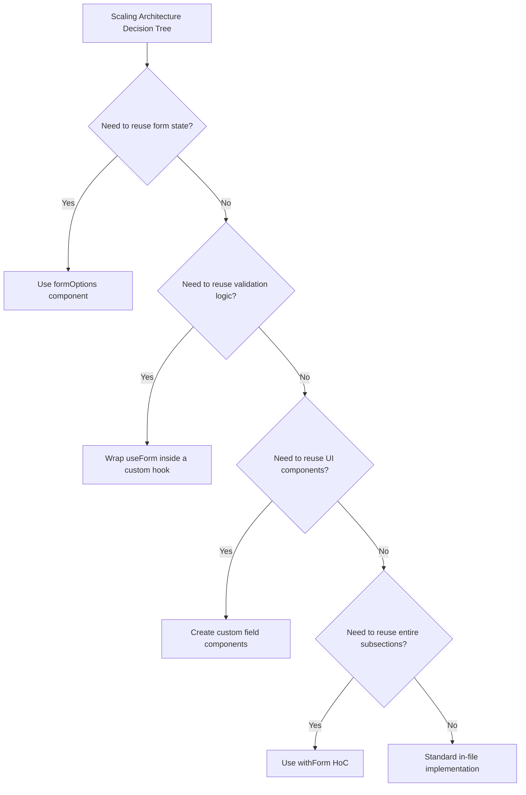

# TanStack Form v1: The New Standard for Type-Safe Forms

Theo considers the release of TanStack Form v1 to be one of the most exciting developments in the React ecosystem. After more than two years in development, this headless, framework-agnostic form library has arrived to solve the longstanding pain points of form state management. While he expresses deep gratitude for React Hook Form's massive contribution to the space, he believes that older libraries have fundamentally aged out of modern client-server behaviors and deep type safety. 

Tanner Linsley initiated the project, and Corbin (Crutch Corn) abandoned his own custom form library to join forces and help lead TanStack Form to completion. Before diving into the technical details, Theo briefly highlights his sponsor, Code Rabbit, noting that AI code-review tools provide genuine value by catching logical regressions that human reviewers might miss.

### The Modern Era of Type Safety

Theo explains that we have entered a "deep TypeScript era" where typing goes far beyond manual definitions. Modern libraries rely on runtime defaults and advanced inference to guarantee safety. 

*   **No manual generics required:** Typing complete forms in older libraries often requires arcane TypeScript wizardry, but TanStack Form infers everything directly from your runtime default values. 
*   **Field-level schema validation:** The library integrates seamlessly with standard schema validators like Zod and Valibot, allowing you to validate a whole form or track individual field validations independently.
*   **Built-in async capabilities:** Features like debouncing, abort signals, and async validation on blur are baked directly into the default API, eliminating the need to write custom cancellation logic.

### API Philosophy and The "Controlled" Input Debate

A major selling point for TanStack Form is its cohesive, unified API. Theo praises the team for writing a philosophy document to guide their design, noting that fragmentation makes libraries harder to learn. However, he warns that unified APIs require care, pointing out that React's `useEffect` is a prime example of a single API being stuffed with too many implicit behaviors. TanStack Form approaches this by providing a single set of composable APIs rather than entirely conflicting ones. 

He also aggressively contrasts TanStack's flexible approach with older tools like Formik, which forced developers into rigid patterns and provider components. Forms require high flexibility for custom timings, selective validations, and highly tailored error messaging.

Theo unpacks TanStack Form's decision to use controlled inputs, exploring the specific trade-offs involved:
*   **Controlled inputs (TanStack's choice):** React owns and updates the input state on every keystroke. This enables perfect predictability, easy testing, conditional logic rendering, and functioning without a reliance on the DOM.
*   **Uncontrolled inputs:** The browser handles the input state natively, and React only reads the value via a reference upon submission. This prevents performance bottlenecks where React renders too slowly and misses keystrokes.
*   **Theo's stance:** While controlled inputs are generally vastly superior for web development due to their predictability, Theo notes they can cause severe input-lag issues in React Native. Regardless, he agrees that for a robust, predictable library, controlled state is the right architectural choice.

### Seamless Full-Stack Integration

One of the improvements Theo is most excited about is the strict, first-class relationship between the front-end and the back-end via React Server Components, Next.js App Router, and TanStack Start.

*   Modern server actions can be imported directly into client components and bound to form validation.
*   Server functions are created using a clean builder pattern that feels highly reminiscent of tRPC, making endpoint configuration incredibly straightforward.
*   The API elegantly handles server-side edge cases and returns validation errors directly to the client UI.
*   Developers no longer have to manually write boilerplate `onSubmit` functions to handle standard data submission, as the framework integration handles the necessary routing and action calls natively.

### Scaling and Composing Large Forms

Because Tanner Linsley built his open-source tools to manage massive, complex dashboards, TanStack Form is uniquely designed to scale gracefully across thousands of lines of enterprise code. 

*   **Reusable component contexts:** You can build custom generic UI components that hook straight into TanStack's context, ensuring they retain strict type safety no matter where they are used in the application.
*   **Targeted subscriptions:** The library allows elements like submit buttons to subscribe only to specific form states, preventing the entire form from re-rendering out of control.
*   **The `withForm` Higher-Order Component:** Large forms can effortlessly be broken down into smaller, manageable child components without losing any type inference or writing complex type definitions.
*   **Lazy loading elements:** For enormous forms, individual inputs can be lazy-loaded alongside suspense boundaries so that massive component bundles do not block the initial page load.

To illustrate how the library expects developers to compose their architecture, Theo highlights the decision tree provided directly in the official documentation:

### Conclusion

Theo believes TanStack Form successfully takes the operational lessons learned from React Hook Form and pushes them to their absolute limits in a type-safe environment. He clarifies that there is no rivalry between the maintainers of these libraries; rather, this is a natural evolution of the ecosystem. Impressed by the zero-dependency footprint, the granular APIs, and the phenomenal developer experience, Theo concludes that TanStack Form is now his undeniable default for building forms in React.
