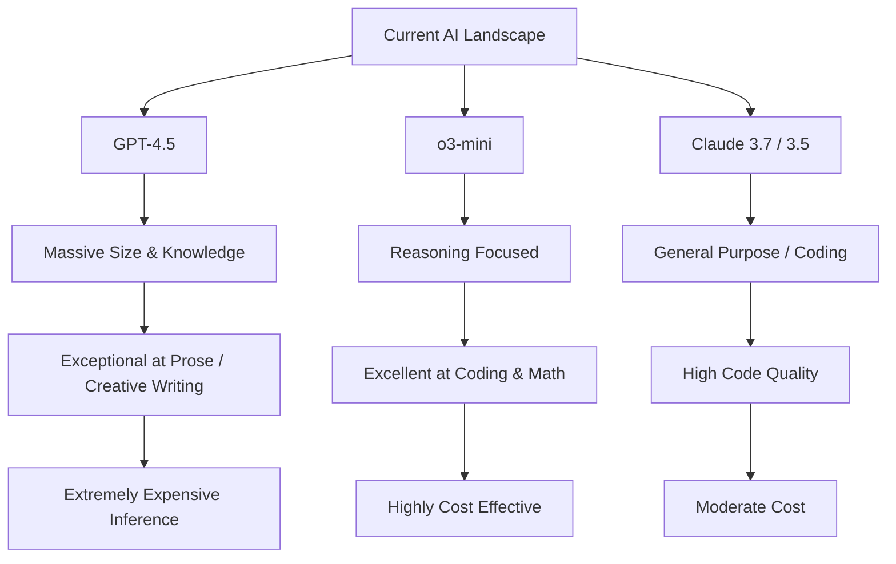

# The Weird Reality of GPT-4.5: Creative Genius, Coding Failure

Theo explores the highly anticipated release of OpenAI’s GPT-4.5, a model he describes as a "creative genius" that easily passes the human vibe check, but falls surprisingly short in other areas. While it writes exceptional prose, it genuinely struggles with programming and comes with a historically massive price tag. Theo breaks down why the model behaves this way, why the pricing actually makes sense from a hardware perspective, and what this release signals about OpenAI's long-term strategy. 

### The Cost and Capability Paradox
The most glaring attribute of GPT-4.5 is its cost compared to its utility for developers. Theo points out that it sits entirely outside the normal pricing trends of recent artificial intelligence releases. 

*   The pricing is borderline absurd, costing 25 times more than Claude and 750 times more than Gemini 2.0, translating to about $150 per million output tokens.
*   Theo calculates that writing a standard novel with GPT-4.5 would cost roughly $18, which is remarkably cheap for a book, but significantly more expensive than generating the same word count with models like GPT-3.5 or Gemini.
*   The model is so massive and compute-heavy that OpenAI currently lacks the GPUs to release it to standard Plus subscribers, temporarily restricting it only to the Pro tier.
*   Theo had to restrict GPT-4.5 access on his own platform, T3 Chat, to a "bring your own API key" model because the inference costs would bankrupt his service overnight.
*   Despite speculation that OpenAI might be price-gouging, Theo argues the cost isn't a markup scam; achieving a mere 10 percent increase in model quality requires an exponential, logarithmic increase in data and computing power, meaning this model genuinely costs a fortune to run.

### Testing, Benchmarks, and Behavior
Theo compares GPT-4.5 against other models through community A/B testing and official benchmarks, revealing a distinct split in where the model shines and where it completely fails.

*   OpenAI explicitly designed this as their largest and most knowledgeable model, rather than their "smartest," and they have confirmed it is the last non-reasoning model they plan to release.
*   When tested on writing prompts, like generating a video intro or an emotional synopsis of Alan Turing's life, GPT-4.5 vastly outperforms Gemini 2.0 and Claude by avoiding cringe-inducing text and adopting a highly natural, authentic voice.
*   GPT-4.5 performs exceptionally well at multi-step agentic tasks because, unlike reasoning models that often overthink and gaslight themselves into making logical errors, it simply follows the instructions given.
*   In coding benchmarks like SWE Lancer, GPT-4.5 fundamentally cannot compete; it only slightly beats GPT-4o and is entirely smoked by much cheaper reasoning models like o3-mini and Claude 3.7.
*   The model is uniquely persuasive, succeeding 57 percent of the time in a benchmark designed to see if it could con or manipulate another AI model into giving it money.
*   It performs terribly on high-level cybersecurity context evaluations, prompting OpenAI to avoid putting heavy safety restrictions on it because it simply isn't smart enough to create functional, real-world exploits.

### OpenAI's Broader Strategy
Theo concludes that GPT-4.5 was never intended to be the default daily driver for developers. As Sam Altman noted, its purpose is to feel like talking to a thoughtful person rather than solving complex math or passing coding benchmarks. 

OpenAI functions not just as a consumer product company, but as a deep tech company pushing boundaries. Theo believes that OpenAI released this incredibly expensive, non-reasoning behemoth to advance the boundaries of massive parameter limits and raw data ingestion. The structural knowledge gained from running GPT-4.5 will likely be used to train and optimize future flagship models, like GPT-5 or o4. Ultimately, Theo advises developers to skip using GPT-4.5 for coding tasks and stick to cheaper, highly capable reasoning models instead.
