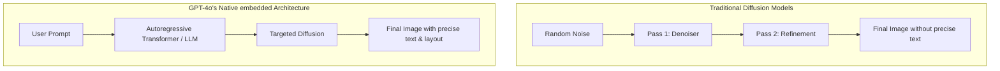

# OpenAI's GPT-4o Image Generation: A Massive Leap Forward

Theo explores OpenAI’s newly released image generation capabilities within GPT-4o, marking a significant shift in the AI landscape. Historically, OpenAI has dominated text generation but lagged behind smaller, self-funded competitors like Midjourney in image generation (diffusion). However, Theo argues that this new update leapfrogs the competition, particularly because OpenAI has finally solved the problem of rendering accurate text within AI images. 

Before diving into the technical details, Theo briefly notes his reliance on PostHog, an open-source analytics tool he highly recommends for founders to track LLM costs, user behavior, and overall product observability.

### The Technical Shift: Why Text Hated Diffusion

To understand why this update is a breakthrough, Theo explains the fundamental differences in how AI models have historically generated content. 

Traditional text models (LLMs) act like highly advanced autocomplete. They process context and generate responses token by token, calculating the most probable next chunk of text. Conversely, traditional diffusion models (like Midjourney or older versions of DALL-E) do not generate things linearly. They start with an image made entirely of random noise—similar to television static—and run multiple passes to refine and correct that noise until it resembles the user's prompt. 

Because diffusion relies on gradually refining blurry shapes into recognizable objects, it is inherently terrible at generating text. Letters require precise strokes and exact spelling, which diffusion naturally scrambles as it attempts to shape noise into concepts. 

However, Theo points out that GPT-4o renders images from top to bottom, not by universally clearing up static. OpenAI achieved this by deeply embedding the image generation natively within the autoregressive GPT-4o model, leveraging the LLM's vast knowledge base to power the diffusion process.

### Hands-On Testing and New Capabilities

Theo tests the new model extensively to see how it compares to his past experiences with Midjourney and older DALL-E models. He is highly impressed by the results and highlights several major features:

*   **Incredible text rendering:** When asked to generate a JavaScript programmer with a laptop, the initial text was slightly off, but upon requesting a fix, the model perfectly rendered working code for the Fibonacci sequence. It even handled formatting a meme about OpenAI and Midjourney with surprising structural accuracy.
*   **Highly realistic textures:** Theo notes that the skin textures and hair stylings are borderline unbelievable, capturing nuances like natural lighting and volume that older models turned into plastic-looking surfaces.
*   **Complex reflections and relationships:** The model accurately handled a prompt placing a developer in front of a whiteboard. It not only generated precise text on the board but also rendered a highly accurate reflection of that text and the developer in a mirror. 
*   **Character consistency:** The model can remember a specific generated subject—like a cat with specific coat patterns—and place that exact character into different environments or UI mockups, which Theo notes is incredibly useful for early-stage game storyboarding.
*   **True transparent backgrounds:** As a professional graphic designer, Theo was thrilled to see that asking for a transparent background yields an actual, cleanly cut PNG image rather than a fake checkerboard pattern grabbed from Google Images.

### Limitations, Safety, and Flaws

While Theo is blown away by the progress, he is careful to highlight OpenAI's recognized limitations and his own frustrations with the platform's user experience.

*   **Boundary pushing and UI bugs:** Theo tested the safety guardrails regarding real people and political figures. The model happily generated Donald Trump eating ice cream and Mike Tyson hugging Kamala Harris. However, when he asked it to make Tyson and Harris fight, the safety filter caught it, rejected the prompt, and subsequently broke the ChatGPT user interface via a loading loop.
*   **Density limits:** The model struggles heavily when asked to render more than 10 to 20 distinct concepts at once. When Theo asked for a periodic table, it hallucinated completely, inventing elements and repeating countries like Egypt and Vietnam.
*   **Feature restrictions:** Unlike Midjourney's robust interface that allows for subtle upscaling and aspect ratio tweaks post-generation, ChatGPT's interface is clunky. When Theo asked the model to upscale a 1024x1024 image, it failed to do so and simply spit out the exact same resolution without admitting it couldn't perform the task.
*   **Safety tracking:** OpenAI includes metadata to label images as AI-generated and utilizes an internal, unreleased technical tool to verify if an image was created by their models. 

### Integration with Sora and Final Thoughts

Theo concludes by showcasing that this same foundational model is actively integrated into Sora, OpenAI's video generation tool. Currently, Sora allows users to generate two high-quality starting images at once, refine the prompt, and then smoothly translate that static image into a video. 

Ultimately, Theo views this as a revolutionary shift for digital media creation. Because the text generation is finally competent, everyday users no longer need advanced Photoshop skills to manually fix AI failures. However, he remains mildly terrified of the societal implications, noting that this level of coherent, text-accurate generation will likely result in a massive influx of highly convincing, misleading AI content flooding platforms like Facebook.
