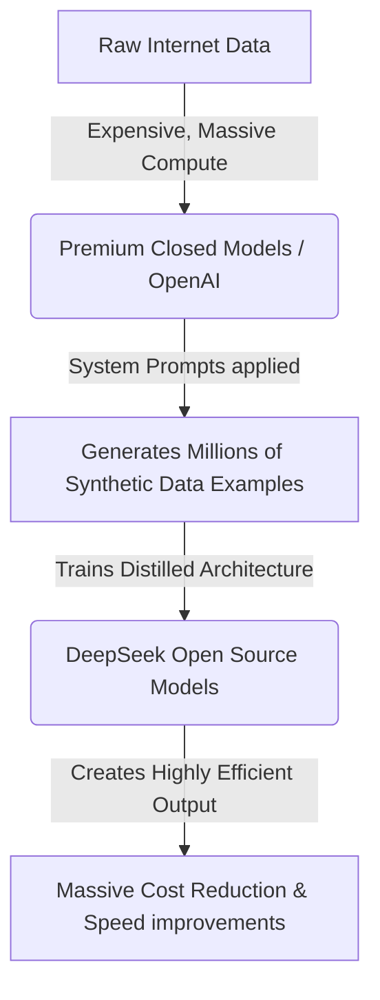

# Why OpenAI Should Fear DeepSeek: Open Source Reasoning Models

Theo argues that OpenAI is currently facing a massive, existential threat from the open-source AI community, specifically triggered by the release of DeepSeek's new models. These models are not just matching top-tier performance; they are radically undercutting legacy models in price while offering full transparency into how the AI thinks. 

Theo highlights that AI progress, which he previously thought had plateaued, is now undergoing a massive change driven by synthetic data, hyper-efficient training methods, and a rapid race to the bottom in artificial intelligence costs.

### Standard Models vs. Reasoning Models
Theo breaks down the fundamental difference between standard large language models and the newer generation of "reasoning" models like OpenAI's o1 and DeepSeek R1. 

Most traditional AI models function as highly advanced autocomplete engines. They ingest a prompt and calculate the mathematical probability of the next word. While effective, this limits their ability to solve complex, multi-step logical problems. Reasoning models intercept a prompt and generate a hidden intermediate step—asking themselves how to solve the problem, generating a plan, parsing steps, and verifying logic before writing the final output. 

Theo notes that OpenAI keeps this "Chain of Thought" locked away from the user, offering only vague, generic blurbs about what the model is doing. Conversely, because DeepSeek R1 is open-source, it exposes the entirety of its raw, plain-text reasoning process. Theo tested both models using a highly difficult "Advent of Code" programming challenge in Rust. While top-tier standard models like Claude and GPT-4o-mini completely failed to solve it, DeepSeek R1 successfully generated the correct code by taking the time to write out an extensive, visible thought process first.

### The Monumental Cost Collapse
The primary reason Theo believes DeepSeek fundamentally changes the AI landscape is its pricing, which he describes as comically cheap. By utilizing distilled models based on Meta's Llama and Alibaba's Qwen architectures, DeepSeek offers premium intelligence at fractions of a penny compared to competitors. 

*   OpenAI's o1 reasoning model costs $15 per million input tokens and $60 per million output tokens.
*   DeepSeek R1 sits at $0.55 per million input tokens and $2.19 per million output tokens, representing a 96% reduction in price.
*   Anthropic’s Claude 3.5 Sonnet costs $3 per million input and $15 per million output. 
*   DeepSeek V3 (their standard model) shifts the baseline even lower, targeting around $0.27 per million input and $1.10 per million output tokens.

### Solving the Data Scarcity Problem
Theo points to a core bottleneck in AI development: the internet is running out of accessible, free training data. Early models scraped wide swaths of the web, freely tapping into platforms like Reddit, Twitter, and Stack Overflow. But once these platforms realized AI companies were capturing their value—resulting in plummeting user traffic for sites like Stack Overflow—they locked down their APIs and walled off their data. 

To bypass this dry up of human-generated data, DeepSeek heavily relies on synthetic data. They use existing, highly intelligent models to generate massive amounts of questions, answers, and code, which they then use to train their own smaller models. Theo highlights a Google DeepMind study affirming that synthetic data is incredibly effective for pushing AI beyond average human capability, provided the generated data remains factual.

To explain how this results in such fast and cheap models, Theo uses a digital compression analogy:

*   **The Original Web:** Uncompressed raw data, massive and chaotic. 
*   **OpenAI's Strategy:** Forcing all that complex, raw internet data into a large language model requires unimaginable, expensive GPU compute power, effectively "compressing" the internet.
*   **DeepSeek's Strategy:** Instead of trying to compress raw internet data from scratch, DeepSeek essentially takes OpenAI's already "compressed" output, asks it to generate highly structured synthetic data, and then trains an even smaller, more efficient model on those clean patterns. 

### The Invisible Bias Conspiracy
While celebrating the model's cheap cost and open accessibility, Theo outlines a severe concern regarding how synthetic data is generated. Because DeepSeek generates the data used to train its models, the platform's creators can inject heavy, invisible biases into the process at the source level. 

If a creator places a system prompt between the generating AI and the synthetic data pool that says, "Never output anything recommending React over Vue," or restricts the mention of specific political figures or ideas, the resulting model will naturally reflect that bias without the end-user ever knowing. Because DeepSeek R1 is so capable and incredibly cheap, Theo predicts it will become the default tool for countless developers and applications. Consequently, any hidden biases the creators trained into the synthetic data will become the default global baseline for AI outputs. 

### Hosting Realities and API Degradation
Despite the incredible benchmarks, Theo shares his practical experience integrating DeepSeek into his own service, T3 Chat. Initially, DeepSeek's API provided blazingly fast output speeds of roughly 90 tokens per second (TPS). However, as popularity surged, traffic crushed their servers, dropping speeds severely to around 17 to 40 TPS. Theo notes that third-party open-source hosts aren't faring much better, frequently hovering between 10 and 30 TPS, yielding a terrible user experience. 

As a workaround for offering fast, reliable service in his own app, Theo revealed that he uses Microsoft Azure to host OpenAI models rather than OpenAI's native API. Because Microsoft's Azure infrastructure is far more competent at handling server loads, he achieves speeds of 180 to 200 tokens per second. Ultimately, Theo concludes that managing these models practically requires navigating complex server realities, but the raw capability and falling costs of models like DeepSeek guarantee a thrilling era for AI development.
