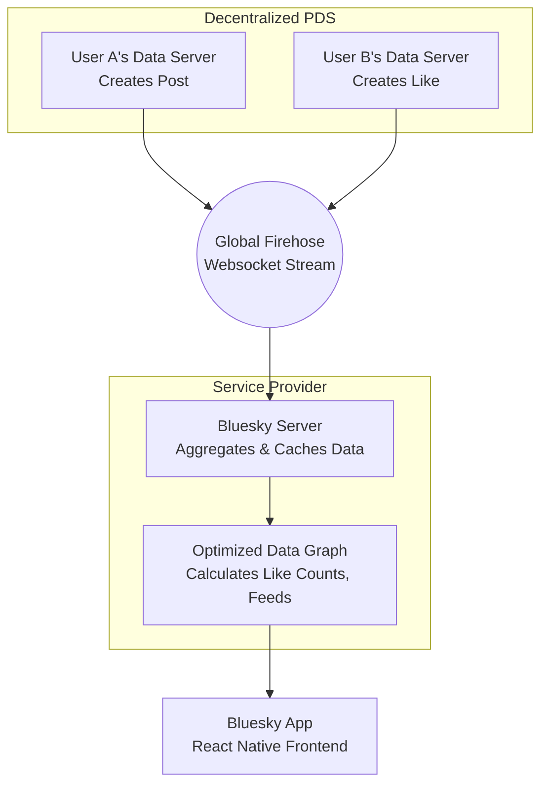

# The Tech and History Behind Bluesky's Success

Bluesky recently hit number one on the App Store, and the fact that an entirely open-source app has achieved this level of mainstream success is a massive milestone. Theo uses this opportunity to break down the fascinating history of the platform, the underlying technologies powering its apps, and the revolutionary decentralized data protocol that makes it all work. Because he is producing so much content right now, Theo sponsors this video himself, inviting brands to reach out to him to reach his audience of senior developers.

### The Origins and Independence of Bluesky

It is a common misconception that Bluesky is just another startup trying to copy Twitter. It actually began inside Twitter itself.

In 2019, Twitter's original CEO, Jack Dorsey, announced a plan to fund a small, independent team of open-source architects to build a new open standard for social media. Twitter’s early success was largely driven by its open APIs, which allowed developers to build massive ecosystems on top of the platform. Over time, Twitter walked back that openness, making APIs expensive and inaccessible. Bluesky was conceived as a highly open alternative.

Following a request for proposals, developer Jay Graber won the bid and became the CEO of the Bluesky project in 2021. While the team started as an independent company, they relied heavily on Twitter for funding. Fortunately, just before Twitter’s major acquisition and the subsequent drying up of that funding, Bluesky secured an $8 million seed round. They recently followed that up with a $15 million Series A round and plan to introduce subscriptions, cementing their financial independence.

### Building the App: React Native, Expo, and Dan Abramov

The Bluesky client is a massive, production-ready codebase boasting over 200,000 lines of code, fully open-sourced on GitHub. Theo points out several key technical decisions that make the app's development deeply interesting to frontend engineers.

*   The entire project uses React Native for iOS, Android, and the web, utilizing React Native for Web to translate native components like text and views into standard HTML elements like spans and divs.
*   React Native for Web actually originated at Twitter as a way to restrict developers from using outdated or problematic HTML tags, forcing them to build within a safer, more predictable subset of web standards.
*   Theo stresses that navigation on mobile is fundamentally different than on the web, as mobile users move up, down, left, and right through preserved tab states rather than navigating a single linear history stack of URLs.
*   The team relies heavily on Expo, which Theo considers the absolute standard for building React Native apps because it handles all the complex native platform bindings—like haptics, video playback, and face detection—so JavaScript developers do not have to write native bridging code.

A major contributor to the codebase is Dan Abramov, a former React core team member and the creator of Redux. Theo highlights how Dan has been dogfooding experimental features like the React Compiler within Bluesky, finding and fixing performance flaws in React Native itself as a result. Furthermore, despite Redux's legacy, the Bluesky codebase does not use it at all; instead, it relies heavily on customized hooks wrapping React Query to handle data fetching, caching, pagination, and invalidation as a single source of truth.

### The AT Protocol: Reimagining Social Data

The most revolutionary aspect of Bluesky is not the app itself, but the protocol it runs on: the AT Protocol, commonly referred to as atproto. Theo explains that atproto stands for "Atmosphere Protocol," and it is designed to separate the data layer from the application layer.

*   On Bluesky, every user is essentially operating as their own website, which is why technical users often use their personal domain names (like `t3.gg`) as their handles.
*   The protocol functions a lot like an advanced RSS feed, where data is completely decentralized and hosted on Personal Data Servers rather than locked inside a corporate database.
*   Data is strictly typed and schema-driven, meaning different applications can understand exactly what a post, a profile, or a like is supposed to look like.
*   In this data model, relationships are decentralized; for example, if you like a post, that "like" record is owned by your profile and stored in your data collection, not inherently attached to the original poster's data.

Because calculating decentralized data on the fly would crash the app, Bluesky utilizes a global "firehose." The firehose is a massive, open websocket stream containing every single event happening across the entire network. 

Theo explains that the Bluesky company backend is essentially just a specialized server that ingests this public firehose, caches the data, and builds an optimized relational graph so the mobile app can load feeds and interaction counts instantly. 

### Final Thoughts on the Open Web

While the average user is flocking to Bluesky simply because they want an alternative to Twitter, Theo argues that the platform's true value lies in how it is built. By utilizing open standards and an open firehose, anyone can build their own custom client, algorithm, or specialized app using the exact same data. If the Bluesky app or company ever fails, the user data will still exist independently on the protocol. Theo concludes that this architecture represents a beautiful return to the early, optimistic days of the internet, where open protocols enabled developers to build freely on top of shared, interconnected foundations.
