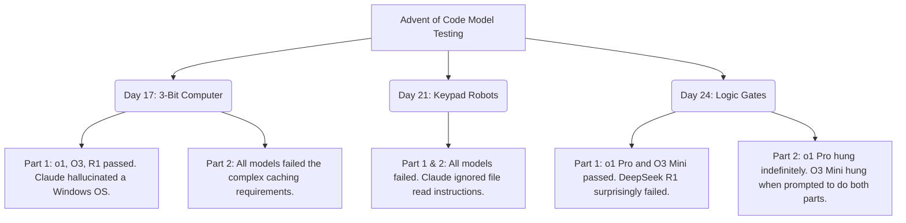

# OpenAI's O3 Mini: A Direct Response to the DeepSeek Revolution

Theo is highly enthusiastic about OpenAI’s release of O3 Mini, praising it as a reasonably priced and highly capable reasoning model. However, his main thesis is that this release is not solely a product of OpenAI's internal roadmap, but a direct and necessary reaction to the market disruption caused by the Chinese AI company, DeepSeek. 

Theo views O3 Mini as a fantastic tool that keeps OpenAI from falling behind, but he credits DeepSeek with forcing this sudden shift in AI affordability and performance. 

### The Pricing War

Theo points out that the pricing landscape of AI has shifted dramatically. Historically, top-tier models like OpenAI's o1 and Anthropic's Claude have been incredibly expensive for developers. Claude, in particular, is the largest expense for Theo's own platform, T3 Chat, and o1 costs a staggering $15 per million input tokens and $60 per million output tokens. 

DeepSeek upended this by introducing models with top-tier reasoning capabilities at a fraction of the cost. DeepSeek R1 charges roughly $0.55 for inputs and $2.19 for outputs per million tokens. 

Theo notes that OpenAI clearly paid attention to this. 03 Mini is priced incredibly competitively at $1.10 for inputs and $4.40 for outputs. Theo points out that this is deliberately set to be exactly double the price of DeepSeek R1. This strategic pricing severely undermines the value proposition of competing non-reasoning models like Claude 3.5 Sonnet, making O3 Mini one of the most compelling options for developers today.

### Real-World Testing with Advent of Code

Rather than relying on traditional benchmarks, Theo tested Claude, o1 Pro, O3 Mini, and DeepSeek R1 against notoriously difficult programming challenges from the Advent of Code.

### Technical Quirks and the Battle Over Reasoning Data

While O3 Mini boasts impressive speed and raw performance that often beats DeepSeek R1, Theo experienced several frustrating quirks while integrating and testing it.

*   OpenAI deliberately hides O3 Mini's internal reasoning tokens from developers using the API, likely to prevent competitors like DeepSeek from using that reasoning data to train their own distillation models.
*   By contrast, DeepSeek R1 is fully transparent, outputting exactly what it is thinking directly to the user regardless of how it is hosted.
*   Because the reasoning is hidden, O3 Mini does not stream its API responses piece-by-piece; instead, it waits until it is completely finished and dumps the output all at once, which prevents users from stopping a bad generation early.
*   O3 Mini suffers from bizarre formatting hallucinations, frequently ignoring standard markdown conventions, adding random bars, and failing to tag code blocks properly, which forces developers to build complex workarounds in their user interfaces.

### The State of AI User Interfaces

Throughout his testing, Theo was heavily critical of the official ChatGPT web interface. He experienced severe lag, broken pagination, and unresponsiveness. When O3 Mini or o1 Pro were given difficult tasks, the ChatGPT UI would silently hang for up to half an hour without updating the user, eventually failing.

Theo contrasts this with his own platform, T3 Chat, noting that a small team of developers can build an interface that actively streams multiple responses side-by-side without locking up the user's browser. He believes OpenAI severely needs to overhaul how their frontend handles highly intensive reasoning tasks.
