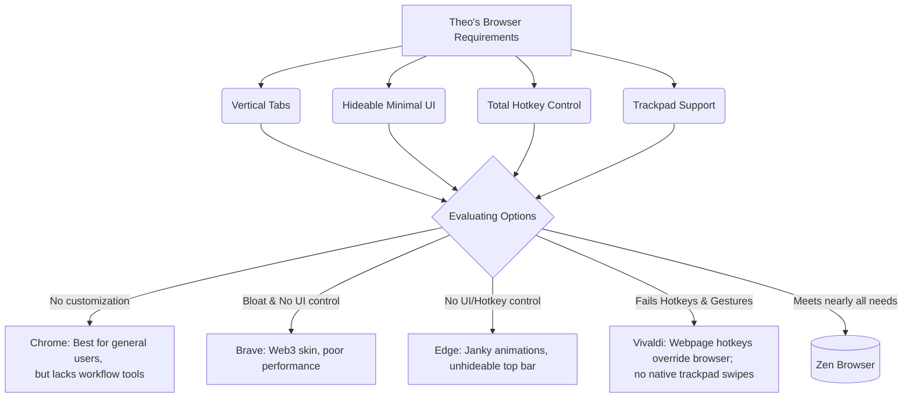

# Theo's Journey to Finding the Perfect Browser

Theo has spent the last year deeply frustrated with the state of web browsers, leading to a rigorous search for a tool that genuinely respects user needs and hardware limits. He begins by formally retracting his past endorsement of the Arc browser, explaining that the development team has shifted focus toward enterprise features while entirely ignoring severe performance issues. For Theo, Arc turned his efficient M2 MacBook Pro from an eight-to-ten-hour workhorse into a machine that dies in under two hours, consuming six times more battery than Chrome and causing his laptop's fans to overdrive. Dissatisfied with Arc's venture capital-funded disregard for users, he went looking for an alternative. 

Before diving into his search, Theo briefly highlights his sponsor, Convex, praising it as an excellent open-source, all-in-one backend platform for Next.js developers that effortlessly handles server functions, database queries, and real-time syncing. 

### Evaluating the Browser Market
Once Theo realized he had to leave Arc, he outlined a strict set of requirements for his ideal daily-driver browser. He wanted a vertical tab bar, a clean interface with a hideable top bar, reliable performance, a Chromium engine, and total control over custom hotkeys. Most importantly, he needed a dedicated hotkey to toggle his sidebar and a fast shortcut (Command-Shift-C) to copy the current URL unhindered. 

This strict list immediately eliminated most mainstream options:
*   **Chrome:** While it remains the reliable gold-standard browser he recommends for the general public, it lacks the deep customizability, sidebar features, and specific workflow tools he has grown to rely on.
*   **Brave:** Theo found its performance heavily degraded, entirely bloated by web3 integrations, and devoid of the required hotkey customization. 
*   **Edge:** Despite having a passable vertical tab setup, Edge suffers from janky hover animations, a prominent unhideable top bar, and zero native hotkey customizability.
*   **Safari:** He quickly dismisses Safari as a rudimentary "toy" rather than a serious browser for complex professional workflows.

Out of the mainstream alternatives, Vivaldi came the closest to satisfying his needs. It allowed deep interface customization and complex macro setups, but it ultimately failed due to specific developer philosophies that clashed with his workflow. In Vivaldi, webpage shortcuts always override the browser's custom shortcuts. When Theo tried to close his sidebar using his customized keybind on websites like Excalidraw, the shortcut triggered the website's export tool instead, rendering his browser controls useless. Furthermore, Vivaldi's developers heavily prioritize right-click mouse gestures over native trackpad swipes, leaving macOS laptop users relying on outdated and buggy third-party extensions just to swipe backward and forward. 

Frustrated by both Arc and Vivaldi, Theo briefly experimented with building a custom browser using HTML and Electron. He quickly realized that safely sandboxing web processes and managing memory without directly forking the Chromium C codebase was a nightmare, choosing to abandon his prototype rather than maintain an insecure tool.

### The Unlikely Winner: Zen Browser
Despite holding a longstanding disdain for Firefox, Theo ultimately chose the open-source, Firefox-based Zen browser as his new daily driver. He was initially skeptical but found that Zen nailed almost every requirement he set out to find, effectively acting as the perfect open-source alternative to Arc. 

Theo's decision to stick with Zen is rooted in both the software's flexibility and the team's culture:
*   **Community-Driven Support:** The developers are actively engaged in their Discord and fix bugs immediately. When Theo complained about an animation toggle bug breaking his sidebar, the team identified and merged a fix within twenty minutes.
*   **Unmatched Interface Polish:** Zen natively supports moving the vertical tabs to the right side of the screen (preventing them from covering web content) and properly hides macOS window controls to maximize screen real estate.
*   **Deep UI Customization via Mods:** Instead of relying entirely on standard web extensions, Zen features entirely separate "Zen Mods" that alter the browser's core UI. Theo used these to easily hide split-view highlights and remove the annoying hover status bars that pop up in the bottom corner of traditional browsers.
*   **Direct CSS Access:** For granular complaints, like the green activity dots that appear on notification tabs, users can directly modify the browser's core appearance using custom CSS.

Theo concludes that Zen proves a vital point in modern software engineering: a small community of passionate open-source developers who genuinely care and listen to their users can build a much better product than heavily funded corporations. He is so confident in Zen's trajectory that he is personally buying a MacBook for one of their core maintainers to aid in macOS development and financially backing their Patreon at the highest tier.
