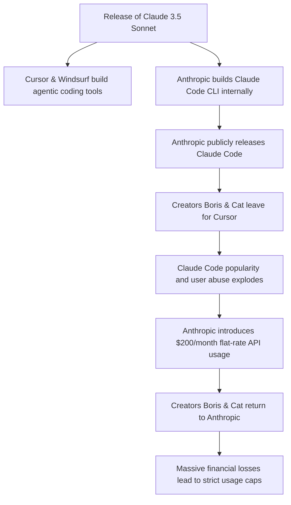
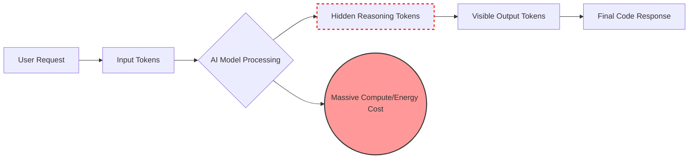

# The End of the "Unlimited" AI Free Lunch: Why Anthropic is Capping Claude Code

Two weeks ago, when Cursor changed its pricing tiers, developers angrily migrating to Claude Code’s $200-a-month Max plan thought they had found a permanent loophole. Theo warned his audience then that the AI industry's massive GPU and infrastructure costs meant this "free lunch" was mathematically doomed. Now, he confirms his prediction has come true. Anthropic recently announced that they are rolling out strict weekly limits for Claude Pro and Max users, effectively ending the era of unlimited Claude Code inference for a flat fee. 

Theo explains that this course correction is long overdue. A subset of super power users were costing Anthropic tens of thousands of dollars in API compute while only paying a $200 subscription fee, forcing the company to rethink its strategy. 

### The Evolution of Claude Code

To understand how Anthropic found itself in this predicament, Theo outlines the rapid rise and internal shifting surrounding Claude Code. The release of Claude 3.5 Sonnet brought revolutionary tool-calling capabilities, making it the perfect foundation for agentic coding tools like Cursor and Windsurf. 

Anthropic decided to build their own internal CLI tool, eventually releasing it as Claude Code despite fears of leaking their "secret sauce." Interestingly, the original creators of the tool, Boris and Cat, left Anthropic to join Cursor. Right around the time of their departure, Claude Code exploded in popularity and unprecedented abuse. 

According to Theo, Boris and Cat eventually returned to Anthropic, likely because they saw their creation growing uncontrollably toward a financial collapse and wanted to save it.

### The Economics of AI Tokens

Theo dives deep into the realities of AI pricing to explain why a flat $200 fee was fundamentally broken. AI models are priced based on input and output tokens, with output tokens being significantly more expensive. Furthermore, Claude 4 and Claude Opus models are extraordinarily costly compared to models like Google’s Gemini 2.0 Flash or OpenAI's o3-mini.

Theo points out a massive hidden cost in AI generation: reasoning tokens. Pointing to Grok 4 as an example, he notes that an AI might generate over 2,000 output tokens of "reasoning" behind the scenes just to deliver a two-sentence answer to the user. Because Claude Code relies exclusively on premium Anthropic models rather than routing simpler tasks to cheaper models, the token generation rapidly snowballs into massive API bills. 

### How Power Users Broke the System

When users saw a $200 unlimited tag, their expectations shifted. Instead of treating it as a generous toolkit, a subset of developers pushed the system to its absolute limits, resulting in absurd API costs that Anthropic simply had to swallow. Theo highlights several extreme examples of this abuse:

*   Developer McKay Wrigley built "Claude Pewtor," a Mac Mini with complete system control that ran Claude 24/7 in an infinite loop, spontaneously writing music and keeping a dream journal just for fun.
*   Zach Jackson utilized a cluster of computers to run massive automated workloads, chewing through 4,000 to 5,000 inference tokens a day to compile Linux kernels to Wasm and completely port TSLint to Go. 
*   Armin from Sentry tasked the AI with building a Sentry clone, which resulted in two and a half hours of continuous generation and 25,000 lines of terrible code that would have cost a fortune on standard API billing. 
*   Because a single CLI request actually initiates dozens of back-and-forth loops behind the scenes, a developer's daily usage could easily rack up thousands of dollars in real-world compute costs. 

### Theo’s Stance on the Backlash

When Anthropic announced the new limits, the immediate community response was to complain that standard API pricing is too expensive. Some users argued that Anthropic should just raise the flat tier to $2,000 a month rather than institute caps. 

Theo strongly pushes back on these complaints. He argues that users simply do not want to pay the true cost of running complex AI logic. He points out that even a $2,000 monthly fee wouldn't cover the hardware, electricity, and API throughput these super users are consuming. From a business perspective, it makes zero sense for Anthropic to let a single developer burn through thousands of dollars of compute for a flat $200 when they could be selling that exact same GPU time to enterprise clients at full price. 

Theo defends Cursor’s recent unpopular tier changes, stating they were trying to build a sustainable business. By contrast, he feels Anthropic’s $200 unlimited tier was an inexcusable miscalculation born of a "Zero Interest Rate Phenomenon" marketing strategy—willing to bleed millions just to win users.

Ultimately, Theo leaves his audience with three critical conclusions:
*   If an AI service’s capabilities seem too good to be true, the provider is heavily subsidizing your usage.
*   If a subscription product is significantly cheaper than the raw API costs required to run it, that product is operating as a temporary marketing loss-leader. 
*   There is no such thing as "unlimited" AI, because the industry remains strictly bottlenecked by the physical realities of finite GPUs and electricity constraints.
