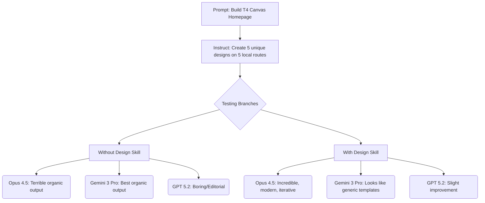

# The Secret to Generating High-Quality UI Design with AI Models

Theo explores which current frontier AI model is best at generating front-end web design. While many developers claim Gemini 3 Pro is the top choice for UI creation, Theo argues that Opus 4.5 is actually the superior designer. However, Opus only takes the crown when paired with a highly specific, open-source Markdown file that fundamentally changes how the model approaches aesthetics.

Within the video, Theo briefly mentions his sponsor, Railway. He highlights it as a modern alternative to Heroku that allows developers to deploy servers, databases, and assets incredibly fast while only billing for active CPU usage rather than total uptime. 

### The Testing Methodology

To prove his point, Theo sets up a parallel testing environment. He runs six agents simultaneously across different models including Gemini 3 Pro, Opus 4.5, and GPT 5.2. He also later tests Kimmy K2.5. 

Theo's prompt asks the models to build an incredible, high-end marketing homepage for a fictional AI image generation studio called "T4 Canvas." He explicitly asks each model to create five distinct designs hosted on five separate local routes. 

Theo notes that asking for five unique designs in a single prompt is a powerful hack for working with AI models. Because the model holds all five designs in its context window simultaneously, it is forced to make each one genuinely unique to satisfy the prompt. This prevents the model from spitting out the exact same generic template five times in a row and reveals the underlying templates the model was trained on.

### The Secret Weapon: The Front-End Design Skill

The core of Theo's workflow relies on a tool called the "front-end design skill." This is simply a Markdown file originally found in the Claude Code GitHub repository. 

A "skill" acts as a reusable block of context that dictates how the model should behave. This specific Markdown file bluntly tells the AI to avoid generic "AI slop" aesthetics. It explicitly bans overused fonts, cliché color schemes like purple and pink gradients on white backgrounds, and predictable layouts. Instead, it instructs the model to choose either bold maximalism or refined minimalism and to execute the design with precise intentionality. 

### Model Performance and Observations

Theo carefully analyzes the output of each model both with and without the design skill applied. 

*   **Opus 4.5 without the skill is objectively the worst.** It relies heavily on ugly pink and purple gradients, chaotic noise textures, repetitive layouts, and text elements with terrible contrast that are incredibly difficult to read.
*   **Gemini 3 Pro has the best organic design capabilities.** Without the skill, Gemini produces highly creative, varied, and modern designs that utilize space well, though its CLI tool is buggy, frequently gets stuck, and hallucinates errors.
*   **GPT 5.2 tends to default to an editorial, text-heavy aesthetic.** It often ignores the instruction to *not* use the skill because its system prompt prioritizes it, but its designs generally feel a bit boring, structured, and visually flat.
*   **Kimmy K2.5 struggles heavily with project scaffolding but creates interesting retro aesthetics.** Once Theo manually fixed its broken code, the open-weight model produced cool vaporwave and brutalist designs, though it failed entirely on basic UI details like legible text clipping and functional scrolling.
*   **Opus 4.5 paired with the design skill completely transforms into the best designer.** The Markdown file causes Opus to drop the ugly gradients entirely, resulting in clean, tasteful, and highly usable modern interfaces that respect whitespace and typography.
*   **Gemini 3 Pro actually gets worse when forced to use the design skill.** Instead of pushing boundaries, the rules in the Markdown file cause Gemini to seemingly pattern-match against the most generic, boring Tailwind templates from its training data.

### The Deciding Factor: Malleability and Iteration

While Gemini can randomly output a fantastic design organically, Theo explains that actual development requires iteration. To test this, he takes the two best designs from Gemini and the two best from Opus, feeds them back to the respective models, and asks them to generate new variations based on those specific aesthetics. 

Gemini fails this test completely. When asked to iterate on its own good designs, it entirely loses the context and generates completely unrelated, broken, or objectively ugly layouts. Theo concludes that Gemini isn't actually designing; it is just blindly applying predefined templates. 

Opus, however, excels at iteration. When prompted to create variations of a favorite design, Opus successfully maintains the core aesthetic while implementing meaningful layout changes and structural adjustments. It proves to be highly steerable, making it a much better tool for actual front-end workflows. Theo's chat audience participates in a live poll and overwhelmingly agrees that the Opus outputs are superior.

### How to Implement the Workflow

Theo concludes by sharing exactly how developers can use this Markdown file in their own projects with modern coding tools.

*   You can access the skill via Vercel's agent skills directory by navigating to the URL "skills.sh".
*   Search the directory for the "front end design" skill, which consistently ranks in the top ten most popular tools.
*   Copy the provided terminal command, paste it into your local terminal, and select which tools you want to make the skill available to, such as the Cursor editor.
*   Applying the installation globally allows the context file to be shared seamlessly across all your coding environments without needing to be configured per repository.
