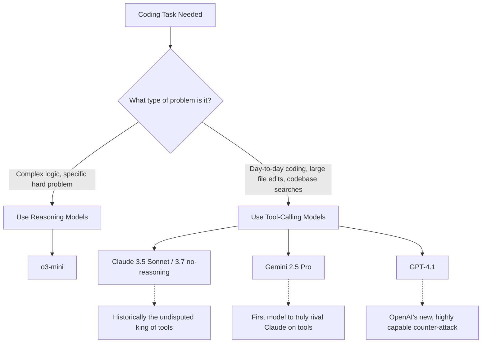

# Breaking Down OpenAI's Developer-Focused GPT-4.1 Release

Theo breaks down OpenAI's surprise release of the GPT-4.1 model family. Unlike previous flagship releases, you will not find these models on the standard ChatGPT website. They are strictly available via the API and are heavily tailored toward developers building applications. Theo previously interacted with these models while they were in stealth on OpenRouter (under the names "alpha" and "optimus alpha"), and he is highly impressed by what they bring to the table.

### The New Model Lineup and Pricing

Theo highlights that this release fundamentally shifts OpenAI's pricing and performance tiers, though not all the new models make sense to him. GPT-4.5 is also being deprecated to free up GPU compute for these more efficient models. 

*   **GPT-4.1:** This is the flagship of the drop. It costs $2 per million input tokens and $8 per million output tokens, making it cheaper than GPT-4o while performing significantly better across the board.
*   **GPT-4.1 Mini:** Surprisingly, this model is noticeably more expensive than its predecessor, GPT-4o Mini. Theo notes that the only reason to use it over something like o3-mini is if you explicitly do not want a reasoning model, but still need fast responses with OpenAI's tool ecosystem.
*   **GPT-4.1 Nano:** Theo is thoroughly confused by this model and recommends avoiding it. It is priced identically to Google's Gemini 2.0 Flash, but OpenAI's own charts show it is less intelligent than the older GPT-4o Mini. Because it cannot beat Gemini 2.0 Flash in intelligence, latency, or throughput, Theo sees no practical use case for it.

### Context Windows and Efficiency Gains

OpenAI is finally catching up to Google by expanding the context window to one million tokens, effectively a 10x jump from their historical limits. This allows developers to pass entire large codebases, such as eight copies of the React source code, into a single prompt.

*   **Solving the needle in a haystack:** Loading massive amounts of data usually degrades an AI's ability to pull out specific details, but 4.1 manages complex multi-retrieval tasks with over 50% accuracy even at a million tokens, effectively beating much more expensive models.
*   **Prompt caching discounts:** Because processing a million tokens gets expensive, OpenAI introduced a 75% discount for cached prompts. This allows developers to affordably run continuous queries against large, pre-loaded codebases.
*   **Diff-based code generation:** The model was explicitly trained to output precise code "diffs" (only the lines that changed) rather than rewriting entire files. Theo notes this saves immense time and API costs, and surprisingly, training the model to do this actually increased its overall coding accuracy.

### The AI Coding and Tool Calling War

Theo argues that the true value of an AI coding assistant isn't just its raw intelligence, but its ability to use "tools" to independently search files, update variables, and check errors. Historically, Anthropic's Claude completely dominated this space, allowing them to charge a premium price. 

Theo explains that reasoning models (like o3-mini or 3.7 reasoning) are excellent for thinking through difficult, isolated logic problems. However, giving reasoning models access to automated editor tools often goes wrong, as the models will talk to themselves and launch dozens of redundant tool calls, essentially gaslighting themselves. Because of this, developers heavily prefer non-reasoning models for day-to-day coding in IDEs like Cursor or Windsurf.

GPT-4.1 represents OpenAI's aggressive counter-attack against Anthropic and Google in the tool-calling space. Early evaluations from AI editors like Windsurf show that 4.1 scores 60% higher than 4o and is 30% more efficient at using tools without wandering down narrow rabbit holes. 

Furthermore, 4.1 makes massive leaps in strict instruction following, which is critical for developers building automated systems. It now reliably adheres to exact data formats like XML or YAML. Most importantly, it correctly follows "negative instructions"—meaning if you tell the model *not* to do something, it will actually listen, whereas older models were often provoked into doing the exact thing you told them to avoid.
