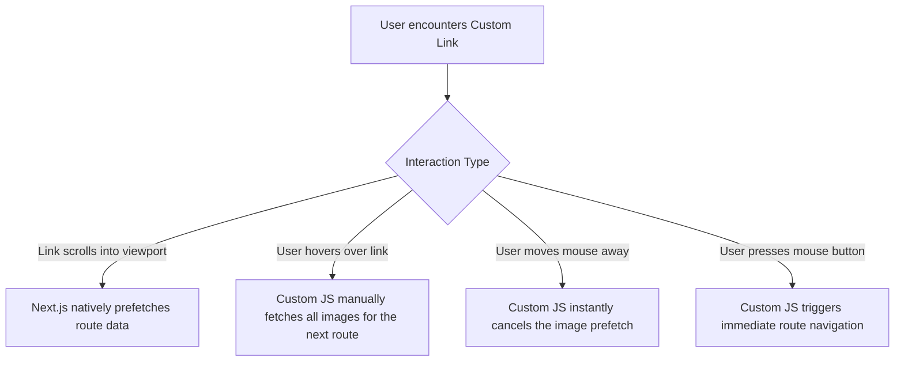

# The Secret Behind the McMaster Website's Speed and How to Beat It with Next.js

Theo explores the highly celebrated speed of the McMaster-Carr website, breaking down the technical realities of why it feels so fast. He then transitions into analyzing a community-built clone called "Next Faster," which uses Next.js to achieve even greater speed while utilizing significantly less custom code. 

### The Reality of McMaster's Performance

Many developers assume the McMaster website is fast because it uses simple, vanilla HTML and avoids modern JavaScript frameworks. Theo strongly pushes back against this misconception. 

*   **Massive JavaScript overhead:** Opening the network tab reveals the site loads over 1.5 megabytes of JavaScript on the initial render. 
*   **A custom-rolled framework:** The site pairs a fast .NET backend with a complex, custom-built JavaScript layer that actively tracks user hovers, splices JSON data, swaps DOM elements, and heavily prefetches content.
*   **Metrics versus feel:** The site actually scores a poor 61% on Lighthouse performance metrics and has very slow JavaScript execution times, proving that standardized speed testing tools do not always accurately reflect how fast an application actually feels to the user.
*   **Intent over framework:** Theo points out that websites are not slow simply because they load JavaScript; they are slow when JavaScript blocks rendering or servers fail to respond to user intent. McMaster's speed comes from a massive business investment in prefetching and predicting user actions, not an absence of modern web tech.

### Engineering "Next Faster"

To prove modern frameworks can compete, a team of developers built "Next Faster," a functionally similar clone utilizing Next.js, a Drizzle ORM, and AI-generated mock data. Theo notes that the clone navigates instantaneously and transfers a fraction of the data (around 300 kilobytes) compared to the original McMaster site, meaning less JavaScript is sent to the client.

The team achieved this performance through a mix of standard Next.js features and clever custom optimizations:

*   **Database caching:** The backend utilizes standard Drizzle ORM queries wrapped in Next.js's `unstable_cache` with a two-hour revalidation time, ensuring the database is rarely the bottleneck.
*   **Static generation:** Using the `generateStaticParams` function, the application pre-builds all the category and collection routes at build time so the server does not have to assemble pages dynamically on the fly.
*   **Native router prefetching:** Setting `prefetch={true}` on Next.js links guarantees that dynamic route loads—including any data queries obscured behind loading boundaries—are entirely resolved in the background as soon as the link enters the user's viewport.
*   **Server-side image prioritization:** A custom counter runs on the server component to load the first 15 images eagerly with synchronous decoding, while forcing all subsequent images below the fold to load lazily. 
*   **Extreme image compression:** Next.js native image optimization aggressively shrinks file sizes down to roughly 20 kilobytes at 65% quality, balancing rapid network delivery against the CPU cost of unpacking compressed files on lower-end devices.

### The Magic Link Component

The most complex optimization in the clone is a customized, 150-line Link wrapper component. Theo highlights this as the cleverest piece of engineering in the repository because it granularly orchestrates exactly when heavy assets are allowed to load.

### The "Mouse Down" Accessibility Debate

A controversial aspect of the custom link behavior is navigating the user on "mouse down" rather than the standard "click" (which triggers upon releasing the mouse button). Theo firmly defends this design choice against claims that it harms accessibility. 

He argues that for users with motor disabilities, or those operating in VR environments, releasing a mouse button or trigger inherently alters the user's physical balance and hand placement. This slight shifting upon release dramatically increases the likelihood of a misclick. By firing the action exactly when the button is depressed, the interface operates much more accurately and is ultimately more accessible. 

### Future Improvements to Next.js

Theo notes that the CTO of Vercel took notice of the "Next Faster" experiment and is looking to upstream several of these custom optimizations directly into future versions of Next.js. 

*   **Inlining CSS:** Because utility frameworks like Tailwind keep CSS payloads incredibly small, inlining CSS to allow first-contentful-paint in a single network round trip will likely become a supported feature.
*   **First-class image preloading:** Vercel aims to separate standard route prefetching from heavy image prefetching, allowing images to load specifically based on high-intent actions like hovering.
*   **Built-in image eager-loading:** There are plans to make the first block of images on a page load eagerly by default, replacing the need for developers to manually build server-side counters.
*   **Navigation options:** Built-in configurations for `onMouseDown` navigation and cancelable router fetching are being highly considered.

Theo concludes by expressing how impressed he is that a single modern framework, utilizing standard idiomatic code and one custom component, could thoroughly outpace a highly established, custom-rolled enterprise architecture.
