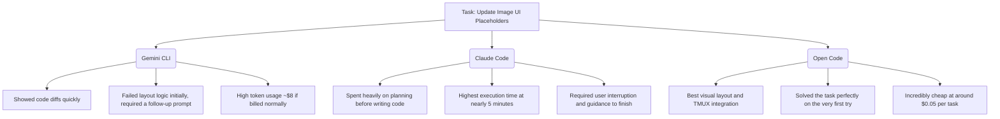

# Google's Surprise Open Source Release: Exploring the Gemini CLI

Google has unexpectedly entered the terminal AI code generation race by launching the Gemini CLI. Theo notes that the project is completely open-source under the Apache 2 license, a move he suspects is a semi-rogue, highly motivated internal effort to stay aggressively competitive with Anthropic. 

Before diving into the tool, Theo highlights Exa, the sponsor of today’s video. Exa provides an incredibly cheap and effective search API for AI tools. At just $5 per 1,000 requests, it vastly undercuts Google's own search grounding, which costs $35 per 1,000 requests. 

### The AI Pricing Wars
The release of the Gemini CLI highlights a broader battle in the AI space regarding compute costs and user limits. Theo explains that tech giants are currently using an "embrace, extend, extinguish" strategy to monopolize the developer market.

* By offering unmatched individual usage limits on their free tier, Google is absorbing what Theo calculates out to potentially hundreds of dollars a day in compute costs per power user.
* Google can afford to eat these inference costs because they own the hardware, infrastructure, and models, allowing them to price out third-party competitors who have to pay retail API prices.
* This aggressive pricing is a direct response to Anthropic's Claude Code, which recently introduced a $200 per month plan that offers usage limits effectively worth thousands of dollars.
* The ultimate goal for both Google and Anthropic is to get developers completely hooked on their respective ecosystems, establishing long-term dominance before eventually regulating prices.

### Technical Architecture and the Rust Debate
The Gemini CLI is written in TypeScript and uses Ink, a React-based library for rendering command-line interfaces. Theo strongly supports this architectural choice, pointing out that dealing with web requests, streams, and file parsing is simply easier and faster to iterate on in the JavaScript ecosystem. 

He criticizes competitors, specifically OpenAI's Codeex team, for attempting to rewrite their TypeScript CLI into Rust. Theo argues that Rust is unnecessary for a tool that is not CPU-constrained and that moving away from JS will only harm a team's iteration speed for no tangible user benefit. 

### Live Code Testing
To see how the tools stack up, Theo tasks three different CLIs with updating a React UI codebase to conditionally render two image placeholders instead of one, depending on the AI model being used. 

Ultimately, Open Code was the most impressive tool in Theo's test. He was particularly impressed that it managed to keep API costs to mere pennies while outperforming models backed by massive corporate funding. 

### System Prompts and Internal Dogfooding
Theo reviews Simon Willison's breakdown of the Gemini CLI, which extracted the core system prompt. The prompt reveals some amusing biases, such as Google instructing the AI to default to React, Vue, Bootstrap CSS, and Flask, while entirely ignoring modern tools like Tailwind. 

More importantly, the prompt reveals how hard Google is working to address Gemini's known flaws. 

* The CLI is intentionally restricted to a small set of tools to prevent the model from getting confused and failing to execute tool calls.
* Theo believes that Google building this CLI forces their internal engineers to "dogfood" their own products and experience the same frustrations developers face.
* According to Theo, Gemini 2.5 Pro currently struggles significantly with reliable tool calling compared to the older 2.0 Flash model.
* Because Google engineers are now personally reliant on this CLI, they are highly incentivized to fix these underlying tool-calling bugs at the model level.

### Innovative Features
During the stream, a lead contributor to the project joined the chat to highlight some of the CLI's advanced features. Theo was highly impressed by the tool's flexibility and transparency.

Developers can completely override the default system behaviors by pointing the CLI to a local markdown file, allowing for live updates and custom system prompts. Furthermore, the CLI supports the Model Context Protocol (MCP) natively. By simply placing an `extensions.json` file globally on a machine or locally within a project repository, developers can instantly grant the Gemini CLI access to custom tools and context. 

Theo concludes that the release of the Gemini CLI is a massive win for the developer ecosystem. Whether through Google offering incredible free usage, Open Code innovating on user experience, or models simply getting better at tool calling through internal testing, developers are receiving highly capable tools at an unprecedented pace.
