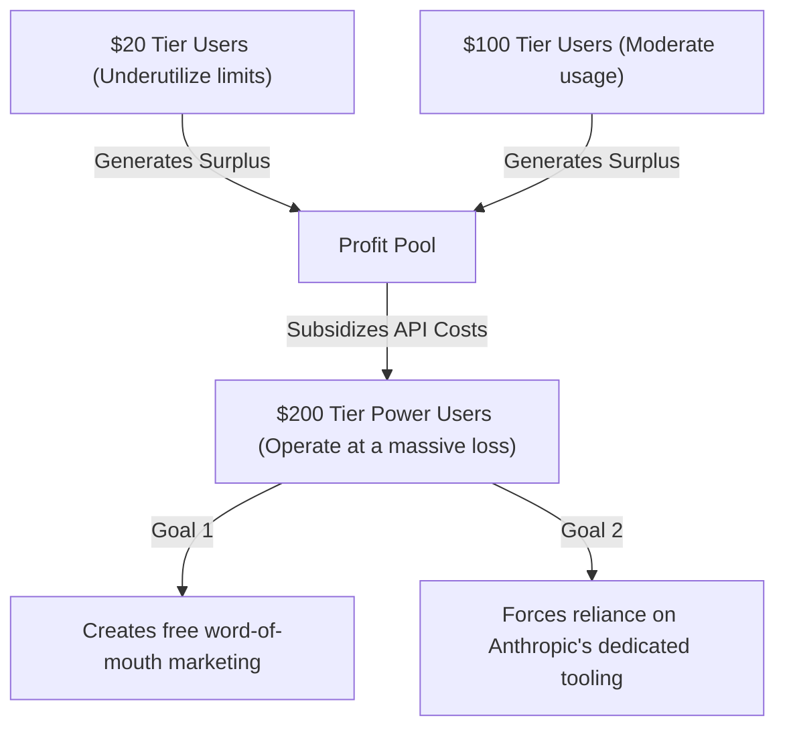

# Anthropic's Restriction on Claude Code Subscriptions

Theo expresses deep frustration with Anthropic's recent decision to block developers from using their Claude Code subscription plans in third-party applications. For a flat monthly fee of $100 or $200, Anthropic had been offering incredibly generous usage limits for Claude Code. Because these limits were so high, developers found ways to use their Claude Code OAuth tokens in alternative environments like Open Code or Claudebot, effectively taking their subsidized API limits to customized, third-party workspaces. 

Anthropic has now entirely shut this down. Users attempting to route their subscriptions through outside tools are receiving an error stating their credentials are only authorized for Claude Code. Theo argues this is a heavily anti-competitive move designed to force ecosystem lock-in while burning whatever goodwill Anthropic has left with the developer community.

### The Economics of Lock-In

Theo breaks down how these generous subscription plans actually work behind the scenes. Heavy users utilizing the $200 tier easily burn through thousands of dollars in actual API inference costs. Anthropic survives this by treating the high-end tier as a loss leader, subsidized by the mass of casual users on the $20 tier who never hit their limits. 

Theo argues that the $200 tier is essentially a massive marketing spend for Anthropic. However, if a developer takes those cheap tokens to a third-party application like Open Code, Anthropic loses their primary objective: ecosystem lock-in. Independent tools make it incredibly easy to swap models with a single click, meaning Anthropic can lose a developer to OpenAI or Google overnight. By restricting token usage strictly to their own closed-source tools, Anthropic ensures you must play entirely within their walled garden to access their financial subsidies. Theo compares this to the famous "Diapers.com" strategy, where Amazon intentionally operated at a steep loss just to kill off competitors and monopolize the market.

### A Track Record of Developer Hostility

Theo views this sudden restriction as part of a much broader, historical pattern of anti-developer behavior from the company. He outlines several instances where Anthropic has penalized users for stepping outside their intended workflows:

*   Anthropic aggressively issues DMCA takedowns on GitHub, notably targeting developers who published source maps that Anthropic themselves accidentally shipped.
*   They cut off API access for entire companies without warning, recently banning all xAI employees from using Anthropic models inside the Cursor editor simply because they view xAI as a rival. 
*   They maintain a fully closed-source Agent SDK, heavily tying developers to an abstraction layer that makes it difficult to migrate away from Anthropic models later. 
*   An Anthropic employee publicly defended the recent API restrictions by citing a lack of debugging telemetry and "unusual traffic patterns," an excuse Theo dismisses as weak legal cover for an aggressive, anti-competitive business choice.

While Theo acknowledges that manipulating API limits to work in third-party apps is an ongoing cat-and-mouse game, he points out that such workarounds are entirely legal under US law. Anthropic is fully within their right to ban users through their Terms of Service, but it remains heavily antagonistic to the developer community. 

### Industry Contrast and Solutions

To highlight how unnecessary this restriction is, Theo points to OpenAI. Despite having a closed-source ecosystem of their own, OpenAI has been highly collaborative. They immediately open-sourced their CLI and actively worked with the creators of Open Code to officially whitelist ChatGPT Plus and Pro subscriptions for use inside Open Code. Google, meanwhile, is entirely absent from the conversation because their current models are not widely utilized for day-to-day engineering. 

Theo concludes by warning Anthropic that their perceived superiority relies entirely on having marginally better coding models—an advantage that disappears fast in the AI space. He urges them to repair their developer relationship with the following steps:

*   Open source Claude Code immediately, as there is no competitive reason to keep the CLI hidden.
*   Reverse the third-party token restriction and establish an official, blessed OAuth application process for developers building alternative tools.
*   Financially support the open-source tools that elevate their models, rather than constantly trying to suffocate them.
*   Hire external counsel to evaluate how heavily their strict, corporate-minded policies are damaging developer goodwill before implementing them.
