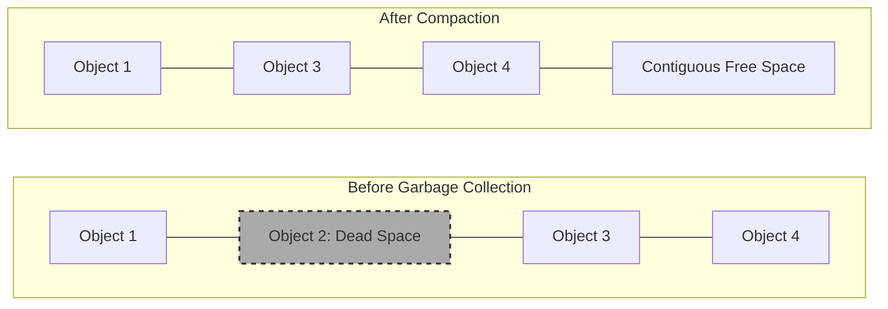

# How Pointer Compression Cuts Node.js Memory Usage in Half

Node.js developers have long accepted that JavaScript is not perfectly memory efficient, but a recent breakthrough shared by Node core contributor Matteo Collina changes that dynamic entirely. Theo explores how a simple one-line Docker image swap can reduce Node.js memory consumption by 50% without requiring a single change to application code. 

The underlying magic relies on a V8 engine feature called pointer compression. In a standard 64-bit system, every JavaScript object uses 64-bit memory addresses to point to values, properties, and other objects. Pointer compression reduces these 64-bit pointers down to 32-bit offsets. It works mechanically similar to Unix time: it establishes a fixed starting base address for the memory heap, and all pointers simply record the relative distance from that base. This halves the memory footprint of structures like objects, arrays, and closures.

### Why This Wasn't the Default

Despite being available in Chrome since 2020, Node.js disabled pointer compression for two historical reasons:

*   **The 4-Gigabyte Cage Limitation:** Previously, enabling this feature meant the entire Node process had to share a single 4GB memory block between the main thread and all worker threads. Cloudflare and Igalia spent a full year getting a 62-line change merged into V8 that created "Isolate Groups", allowing every worker thread to have its own 4GB memory cage.
*   **Fears of CPU Overhead:** Compressing and decompressing pointers requires the C++ layer of V8 to perform an extra mathematical addition or subtraction every time memory is accessed. Many developers assumed this extra cycle would drastically harm application latency.

To test exactly how much the CPU overhead mattered, Matteo's team created *Node Caged*—a custom-built Node 25 Docker image with pointer compression compiled in—and tested it against real-world production workloads.

### Real-World Performance and Garbage Collection

When tested on a complex Next.js e-commerce application with simulated database delays and server-side rendering, the performance trade-offs proved entirely worthwhile. While average latency increased by a virtually unnoticeable 2.5%, the P99 latency (the slowest 1% of requests) actually became nearly 8% faster.

Theo points out that the real-world benchmark validates his long-held belief about performance testing: pure V8 micro-benchmarks (like stringing together HTML in a loop) will show extreme overhead because they only test CPU limitations. However, real applications spend most of their time waiting on network requests, database logic, and I/O. In heavy real-world applications, the CPU overhead of pointer compression rounds down to noise.

The reason the slowest requests got faster comes down to Garbage Collection. Because pointer compression shrinks the size of every object by half, the Node heap fills up much slower. When V8 does pause execution to scan memory and sweep away dead objects, there is significantly less data to scan and less physical memory to move around during compaction. 

Theo visually broke down why this matters using the concept of memory fragmentation. When dead objects are removed, V8 pushes the remaining live objects to the front of the memory block to create a single, contiguous chunk of free space at the back. Because the live objects are half their original size, V8 can move them and complete the garbage collection pause much faster.

### High-Impact Use Cases

Theo highlights several specific areas where this optimization is highly impactful for engineering teams:

*   **Massive Infrastructure Savings:** If a Node application normally requires 2GB of RAM per pod, pointer compression drops it to 1GB. Teams can run twice as many pods per server node, potentially saving massive fleets hundreds of thousands of dollars annually.
*   **Edge Computing:** Platforms like Cloudflare Workers and Deno Deploy operate with incredibly strict memory limits (often 128MB to 512MB). This optimization allows these platforms to safely pack double the amount of tenants onto the same hardware.
*   **Websocket Connections:** Applications maintaining thousands of idle websocket connections are historically bottlenecked by RAM, not CPU. Halving the heap size per connection takes a server from a 50,000 connection limit to a 100,000 connection limit.

### Limitations and Adoption

There are a few minor constraints to factor in before swapping out a Docker image. First, standard JavaScript heaps will be hard-capped at 4GB per isolate (though native C++ allocations and ArrayBuffers do not count toward this limit). Theo notes that if a standard Node backend requires more than a gigabyte of memory, there is likely a memory leak in the code anyway.

The only hard compatibility block stems from legacy Native Abstractions for Node (NAN). Packages built on legacy NAN expose V8 internals directly, which breaks when pointer compression changes the underlying object representation. Modern packages using Node-API are unaffected. 

To verify if an application is safe to migrate, developers can run `npm ls nan` in their project directory. If the terminal returns no results, the application is compatible. Theo ran this command live against his own T3 Chat codebase, confirmed it was clear, and stated he plans to adopt this Docker image for his own active projects immediately.
