# The Illusion of Code as a Bottleneck and the True Value of AI

Theo observes a modern paradox: developers today have access to powerful AI agents and "vibe coding" tools that generate massive amounts of code, yet we aren't seeing a proportional explosion of real, shipped product features. Prompted by an article by software engineer Pedro, Theo argues that this is because physically typing out code was never actually the bottleneck in software engineering. AI is currently being used to speed up the wrong parts of the development process, which threatens to make the real bottlenecks even worse. 

### The Real Bottlenecks in Software Engineering
Theo strongly agrees with Pedro's assessment that the true hurdles in software development are deeply human and process-oriented. Generating working code is cheap, but the cost of understanding, testing, and trusting that code is higher than ever. The actual bottlenecks include:
*   **The review and debugging process:** Reading code, recognizing unfamiliar patterns, and catching unintended side effects takes significantly more time and mental energy than writing the code in the first place.
*   **Knowledge transfer and alignment:** Teams rely on shared context, mentoring, and collaborative understanding, which breaks down when code is generated faster than humans can discuss it.
*   **Agile rituals and bureaucratic processes:** The labyrinth of planning meetings, Jira tickets, and cross-departmental approvals drags out timelines long before a developer opens an editor.
*   **Building the wrong thing:** Following a lengthy, rigid chain of command often results in shipping a product that users don't actually want, leading to scrapped projects and wasted months.

### The Problem with the Traditional Pipeline
Drawing from his experience building features like ModView at Twitch, Theo explains why the standard corporate development pipeline is fundamentally broken. Traditionally, a Product Manager identifies a problem, works with a designer, and writes a massive 30-page spec document. After endless presentations and approvals, developers write an equally dense technical spec, build the feature over 6 to 18 months, ship it, and pray the users actually like it. 

Theo notes that reading and writing these massive specs is universally despised. Worse, if a bad assumption is made at the beginning of this pipeline, the team won't realize it until a year later when the product fails upon release. 

### How AI Can Break (or Worsen) the System
Theo warns that if we just plug AI into this traditional process to write production code faster, we are heading for disaster. He compares it to the invention of the word processor, which caused legal legislation to skyrocket in length without improving in quality. If AI is used to generate massive product requirements documents or push gigabytes of unreviewed code into production pipelines, developers will be forced to spend their days doing the things they hate: sitting in useless meetings, reading massive AI-generated specs, and reviewing giant piles of AI-generated "slop." 

Instead, Theo advocates for using AI to adopt an iterative, prototype-driven approach. 

```mermaid
graph TD
    subgraph Traditional Process
        A[PM Identifies Problem] --> B[Design & Giant Spec Written]
        B --> C[Approvals & Meetings]
        C --> D[Devs Write Tech Spec]
        D --> E[Months of Building]
        E --> F[Ship to Users]
        F --> G[Realize It's the Wrong Product]
    end

    subgraph Theo's Iterative Prototype Approach
        H[Identify Problem] --> I[Rapidly Build Throwaway Prototype]
        I --> J[Get Real User Feedback]
        J --> K{Is the idea good?}
        K -- No --> I
        K -- Yes --> L[Write Minimal Tech Spec]
        L --> M[Build Clean Production Code]
    end
    
    style G fill:#ffcccc,stroke:#cc0000
    style M fill:#ccffcc,stroke:#009900
```

### Throwaway Code vs. Production Code
To successfully utilize AI and rapid prototyping, teams must understand the critical difference between two types of code. Theo argues that principal engineers often clash with product managers because they fail to make this distinction, judging prototyping tools entirely by production standards.

*   **Throwaway Code:** This is code written purely to test an assumption, gain an insight, or figure out what features users actually want. It is stitched together rapidly (often in days), is never meant to be reviewed by the team, and is intended to be deleted once the lesson is learned. AI and vibe coding tools are incredibly effective here.
*   **Production Code:** This is the code meant to run the actual business. It is heavily scrutinized, highly maintained, rigorously reviewed, and built to last. 

### Optimizing for Insights
Theo concludes that the ultimate goal of modern development tools shouldn't be to speedrun the writing of production code, but to optimize the "time to next realization." AI gives every team the ability to build a rough, functional prototype in three days rather than three months. By using AI to quickly build throwaway code, teams can test ideas, find the flaws in their assumptions, and figure out exactly what the right product is before they ever write a single line of permanent production code.
