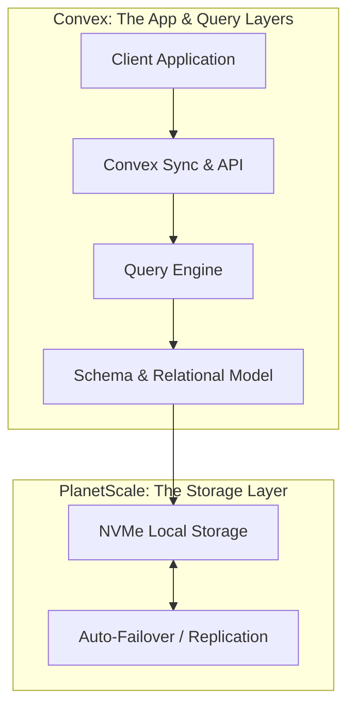

# Theo's Unexpected Return to Postgres

Theo recently announced a surprising shift in his infrastructure for T3 Chat: he is moving entirely to Postgres. For nearly a decade, Theo has actively avoided Postgres, largely favoring PlanetScale's MySQL solutions. However, a major industry shift forced his hand in the best way possible. 

Historically, Theo relied on PlanetScale for its unmatched speed and reliability, but he had to transition T3 Chat to Convex to handle complex time-syncing and real-time client updates. Because he loved both services, he tried to advocate for a partnership between them. To his surprise, PlanetScale recently announced "PlanetScale for Postgres," and Convex immediately became a launch partner, migrating their backend to this new architecture.

### How PlanetScale Made Postgres So Fast

To understand why this move is a big deal, Theo explains the history of PlanetScale. The company didn't originally bet on MySQL; they bet on Vitess. Vitess is a technology built at YouTube that acts like Kubernetes for databases, automatically sharding and scaling data. MySQL was chosen originally because its internal components are highly composable, making it easier to integrate with Vitess compared to Postgres, which is tightly bound. 

However, PlanetScale didn't just build a new version of Vitess for Postgres. The massive speed gains in their new Postgres offering come from hardware architecture, specifically their "Metal" infrastructure. 

Traditional cloud providers like AWS separate compute nodes from storage nodes (like EBS or S3) over a network because servers frequently die. If storage was tied to a dying server, data would be lost. PlanetScale took a radical approach by using local PCI-based NVMe drives directly on the CPU nodes. This skips the network entirely, granting virtually unlimited I/O and drastically lowering latency. 

Because PlanetScale's Vitess layer was engineered for the worst possible server conditions, it handles failure effortlessly. Every database on PlanetScale is highly replicated. If a node with a local NVMe drive dies, the system instantly auto-routes to a replica without dropping a query. This allows them to safely pair hyper-fast volatile storage with bulletproof reliability.

### Benchmarking the Competition

Theo shares a series of performance benchmarks showing how PlanetScale's Postgres implementation absolutely crushes the standard industry alternatives, often at a significantly lower cost.

*   Compared to Neon, PlanetScale delivers a consistent 50% increase in queries per second with a flat 50-millisecond latency, whereas Neon experiences terrifying spikes of up to a full second under load, all while PlanetScale costs a fraction of the price.
*   Against AWS Aurora, which is Amazon's scalable Postgres solution, PlanetScale still achieves 50% better throughput and nearly three times better latency, all while remaining slightly cheaper month-to-month.
*   When faced with heavy concurrent connections, Supabase showed severe degradation and latency spikes, requiring upgrades that push its monthly cost to over $2,100, compared to PlanetScale's $1,400 for better performance.
*   Heroku, which Theo notes he previously had a terrible experience with, performed the worst by a massive margin, processing 16 to 20 times fewer queries per second than PlanetScale and suffering from multi-second latency freezes.

### Why Convex Chose Postgres Over MySQL

One of the most pressing questions is why Convex didn't just adopt PlanetScale's heavily optimized MySQL. The answer comes down to multi-tenancy and pricing limitations.

PlanetScale's managed MySQL implementation requires a dedicated VTGate for every single database cluster. This means you can only run one database per server instance. Because PlanetScale's Metal infrastructure has a high minimum monthly cost, there was no way for Convex to offer a free tier to its users if every project required a dedicated server. 

PlanetScale's implementation of Postgres, however, allows for multiple databases to exist on a single hardware instance. This fundamental difference is what allows Convex to efficiently pool resources, absorb the infrastructure costs, and continue offering a free tier to developers while utilizing premium, enterprise-grade hardware under the hood. 

### The Real-World Impact on T3 Chat

The migration has yielded incredible real-world results for Theo's applications. Since Convex moved T3 Chat to PlanetScale Postgres, the application's write latency for adding messages dropped from an average of 100 to 180 milliseconds down to just 20 to 40 milliseconds for the 99.9th percentile. 

While queries reading data initially saw a tiny regression during the transition, the Convex engineering team quickly wrote custom Rust code to bypass inefficient Postgres query planners, dropping read latencies down to a highly stable 50 to 60 milliseconds. 

Theo concludes that a database is not just an opaque box, but a stack of layers. Convex excels at replacing the query layer, the relational schema, and real-time client syncing, but they do not want to innovate on the raw storage layer. By passing the persistence and disk-level logic down to PlanetScale, both companies are doing exactly what they are best at. Ultimately, Theo is thrilled to be back on Postgres, noting that he doesn't have to directly maintain its quirks because Convex handles the developer experience, effectively making PlanetScale's free tier Convex itself.
