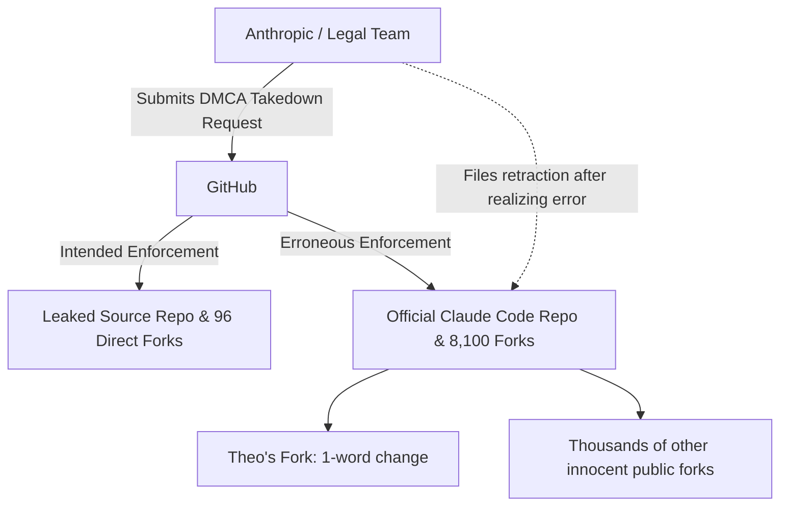

# The Absurdity of the Claude Code DMCA Takedown

Theo woke up to a surprising DMCA notice from Anthropic. Initially assuming it was related to a recent YouTube video he made discussing the leaked Claude Code source, he discovered the strike was actually against his GitHub account. Even more bizarrely, the notice did not target the fork containing the leaked code. Instead, GitHub had struck his fork of the official, public Claude Code repository, where Theo had submitted a pull request changing exactly one word in a single markdown file. 

This led Theo to explore the mechanics of the Digital Millennium Copyright Act (DMCA). He explains that the DMCA includes a "safe harbor" provision protecting platforms like GitHub or YouTube from liability as long as they comply with content owners' takedown requests. However, this system is frequently abused or mismanaged. In this instance, a massive enforcement error resulted in strikes against a network of roughly 8,100 repositories, capturing thousands of innocent developers who had simply forked the safe, official repository. 

To illustrate how this miscommunication likely unfolded between Anthropic and GitHub, Theo maps out the breakdown:

Shortly after the strikes were issued, the tide unexpectedly turned. Anthropic filed a retraction for all repositories except the specific one hosting the leaked code and its 96 direct forks. Theo's repository was reinstated. This pivot impressed Theo, prompting him to shift from anger to defending Anthropic's handling of the crisis, before ultimately returning to his core criticism of the company's open-source philosophy. 

Here is how Theo breaks down the legal, cultural, and strategic facets of the incident:

*   **The legality of the erroneous strike depends on where the breakdown occurred.** It is illegal under US law to file a false DMCA strike against non-infringing content, but if Anthropic provided the correct target and GitHub mistakenly enforced it against the wrong network of 8,100 forks, the liability shifts, making it a platform execution error rather than an illegal request by Anthropic.
*   **Anthropic's team successfully humanized the crisis instead of hiding.** Taking advice from Theo's previous video, employees engaged with the community on Twitter with humor and transparency, making jokes about the leak and openly discussing features, which successfully diffused a lot of public anger.
*   **The company demonstrated a healthy "blameless" developer culture.** When asked about the developer who caused the leak, an Anthropic representative clarified it was a process failure—specifically an error involving a manual deployment step that should have been automated—rather than an individual's fault. Theo, whose own team strictly automates npm deployments, highly praises this systemic approach to ownership.
*   **Derivative works remain legally protected.** Projects like a rust-based rewrite of Claude Code generated widespread popularity and were not targeted by the DMCA requests, as they do not mirror the original network and fall under protected derivative works.
*   **The root cause remains a stubborn refusal to open-source.** Theo concludes that while Anthropic managed the crisis well, the entire legal and public relations disaster is entirely their own fault for keeping Claude Code closed-source. He argues that the damage and risk of maintaining a closed-source model vastly outweigh the costs of open-sourcing it, suggesting Anthropic is now only keeping it closed out of a refusal to admit they were wrong.
