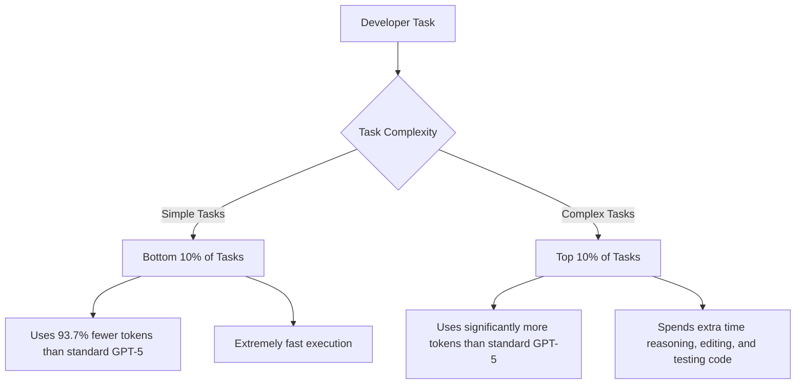

# Review of OpenAI's GPT-5 Codeex: A Developer's Perspective

OpenAI recently granted Theo and a few other developers early access to a brand new model built specifically for software development workflows. While Theo is incredibly impressed by the core logic and efficiency of the new model, he found the surrounding ecosystem and naming conventions to be highly frustrating and broken. Because he is currently recovering from hand surgery and cannot type at his normal speed, he relied heavily on "vibe coding" (guiding the AI without explicitly writing the code) to test the limits of this new release.

### The Naming Confusion
Theo strongly criticizes OpenAI's decision to name this new model "Codeex." OpenAI currently uses the Codeex name for a web interface, a command-line interface (CLI), a VS Code extension, and now the actual model itself. He argues this creates a massive branding problem because users trying the buggy web interface might wrongly conclude that the underlying model is bad, simply because everything shares the exact same name. 

### Adaptive Token Usage: The Model's Greatest Strength
Theo notes that standard AI models (like Claude, Gemini, or standard GPT-5) historically use a massive minimum baseline of tokens, making them feel slow and expensive even for simple requests. The new GPT-5 Codeex model fundamentally changes this behavior by adapting its token consumption directly to the difficulty of the prompt.

*   By dropping token usage by over 93% for simple tasks, the model feels incredibly fast and responsive for basic developer queries.
*   For highly complex tasks, it will happily consume double the tokens of previous models, taking the necessary time to deeply reason about dependencies and iterate on tests.
*   Theo has pushed it to use anywhere from a handful of tokens for small edits to over a million tokens for heavy, one-off project generation. 

### Hands-On Testing Experiences

Theo put the model through several real-world coding tests, uncovering both its strengths in reasoning and its glaring weaknesses in search and user interface generation. 

*   When generating web layouts from scratch, Theo found that standard GPT-5 actually produced slightly better visual results, while the new Codeex model introduced minor CSS bugs like overlapping layers and clipping issues.
*   When tasked with setting up a full-stack Next.js and Convex project, the model committed heavily to outdated documentation, attempting to pull imports from depreciated file paths and failing to correctly wire up client and server actions.
*   To fix its coding errors, Theo gave the CLI web search access, but discovered the model is exceptionally bad at querying the internet.
*   Instead of searching for official documentation to resolve errors, the model hallucinated random clusters of keyword jargon or simply searched through local node modules using file explorers, completely missing the actual solution.

### Code Review and Open Source Strategy
OpenAI has trained this variant of GPT-5 specifically for automated code reviews. Theo notes that instead of just reading static text diffs, the model actually spins up a cloud container, runs the code, and tests for critical flaws. This results in about a third as many incorrect comments compared to standard automated reviewers, making it a viable competitor to specialized tools like CodeRabbit.

Theo also points out that OpenAI is rapidly open-sourcing the Codeex CLI and surrounding tools under a highly permissive Apache 2.0 license. He speculates this aggressive open-source approach might be a calculated maneuver regarding their intellectual property agreement with Microsoft. By releasing the tools to the public, OpenAI ensures the whole developer community benefits, rather than just funneling the technology exclusively into Microsoft's ecosystem.

### Ecosystem Limitations and Conclusion
While the foundational model is highly capable, Theo feels the actual software built around it is severely lacking cohesion. Setting up internet access for the agent requires tedious manual configuration and jumping through confusing UI hoops. Furthermore, the cloud-based background agents are fundamentally broken, with live-notification systems reporting tasks as active hours after they have finished. 

Ultimately, Theo concludes that GPT-5 Codeex is an excellent model for code generation because it reasons more when it should and appropriately scales back when it shouldn't. However, because OpenAI's native Codeex extensions and web interfaces remain incredibly clunky, he still vastly prefers mapping the raw OpenAI models into third-party agentic tools like OpenCode or KiloCode to get his work done.
