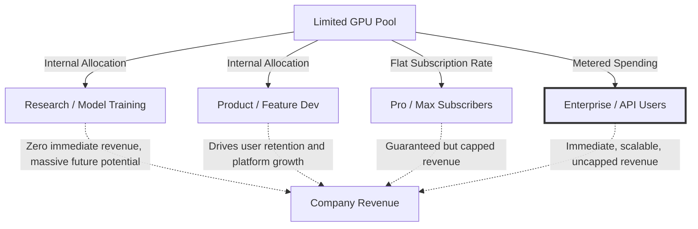

# Understanding Anthropic's Claude Code Rate Limit Crisis

Theo breaks down the recent controversy surrounding Anthropic's decision to drastically alter rate limits for Claude Code subscribers across Free, Pro, and Max tiers. During peak weekday hours, specifically between 5:00 AM and 11:00 AM Pacific Time, users now burn through their five-hour session limits significantly faster than before, even though their generic weekly limits remain untouched. Roughly 7% of users are expected to quickly hit limits they previously would not have encountered. 

While the developer community is furious, Theo argues that Anthropic is facing a very literal economic wall. Historically, Anthropic’s $200-a-month subscription could yield up to $5,000 worth of compute, a generous subsidy that the company simply can no longer afford to maintain as it scales. Theo clarifies that these rate limit changes are an intentional triage effort, completely separate from recent rumors regarding caching bugs or source code leaks.

### The Internal Tug-of-War for GPUs

The core issue driving this change is a drastic shortage of hardware. Unlike competitors who continually buy virtually all available compute, Anthropic was historically slow to purchase GPUs and relies heavily on leased hardware through partnerships with Amazon and Google. 

Because Anthropic is constrained by a fixed pool of GPUs, they face constant internal battles over how those graphics cards are allocated. 

*   **Researchers need compute to build the future:** They are actively using massive amounts of GPU power to train ambitious, unreleased models (rumored to be called "Mythos"), which yield zero immediate revenue but represent the company's long-term future.
*   **The product team requires heavier computing power than ever:** As Anthropic builds more complex features like background agents and automated code review, individual requests consume far more tokens and demand more immediate GPU time.
*   **Enterprise adoption is skyrocketing and taking priority:** With revenue jumping from $100 million in 2024 to a projected $14 billion in 2026, and eight of the Fortune 10 companies adopting Claude, lucrative enterprise API customers generate immediate, uncapped revenue. 
*   **Subscribers offer limited financial upside:** A user paying a flat subscription rate provides the same revenue whether they use $50 or $5,000 worth of compute, making them the easiest group to throttle during peak Enterprise hours (5:00 AM to 11:00 AM PT).

Below is a visualization of how these different factions compete for the same limited hardware, and how their usage impacts Anthropic's bottom line.

Theo points out that Anthropic's internal culture heavily influences how it handles this scarcity. Anthropic was founded by researchers, and its executive team fundamentally thinks like a research lab rather than a consumer product company. Internally, employees have their GPU access throttled or reallocated all the time to make room for priority tasks. Because the leadership views resource shuffling as a normal day at the office, Theo suspects they saw no issue passing that exact same experience down to their subscribers to ensure enterprise clients had adequate bandwidth during morning work hours.

### The Communication Disaster

While Theo defends the economic logic behind Anthropic's rate limit strategy, he heavily criticizes how the company executed and communicated the change.

*   **They implemented the limits before announcing them:** Users began hitting drastic usage caps without warning, with some reporting that regular workflows suddenly drained 100% of their limit instead of the usual 10%. 
*   **The official announcement was practically nonexistent:** Anthropic did not put a warning in the product dashboard, the CLI, or even on their official website.
*   **Communication fell entirely on one low-level employee:** The only public confirmation of the change came hours late via a tweet from "Thoric," an individual Developer Relations employee without an official company badge on his profile.
*   **The messaging lacked transparency:** The announcement vagueley stated users would "move through limits faster" without providing exact multipliers or numbers, leaving developers to guess how constrained they actually were.

Theo emphasizes that frustrated users should not direct their anger at Thoric. As a DevRel employee likely restricted by internal corporate lawyers, Thoric is currently the only person advocating for users and offering any transparency at all. 

Ultimately, Theo contrasts Anthropic's behavior with OpenAI, a company that constantly resets rate limits to generate goodwill, communicates transparently through multiple executives, and offers clear pricing tiers like "batch" and "priority" to manage server loads. He concludes that while Anthropic's throttling made logistical sense for a company out of hardware, its complete inability to understand and communicate with human developers continues to ruin its public trust, prompting Theo to stick with OpenAI's tools for the time being.
