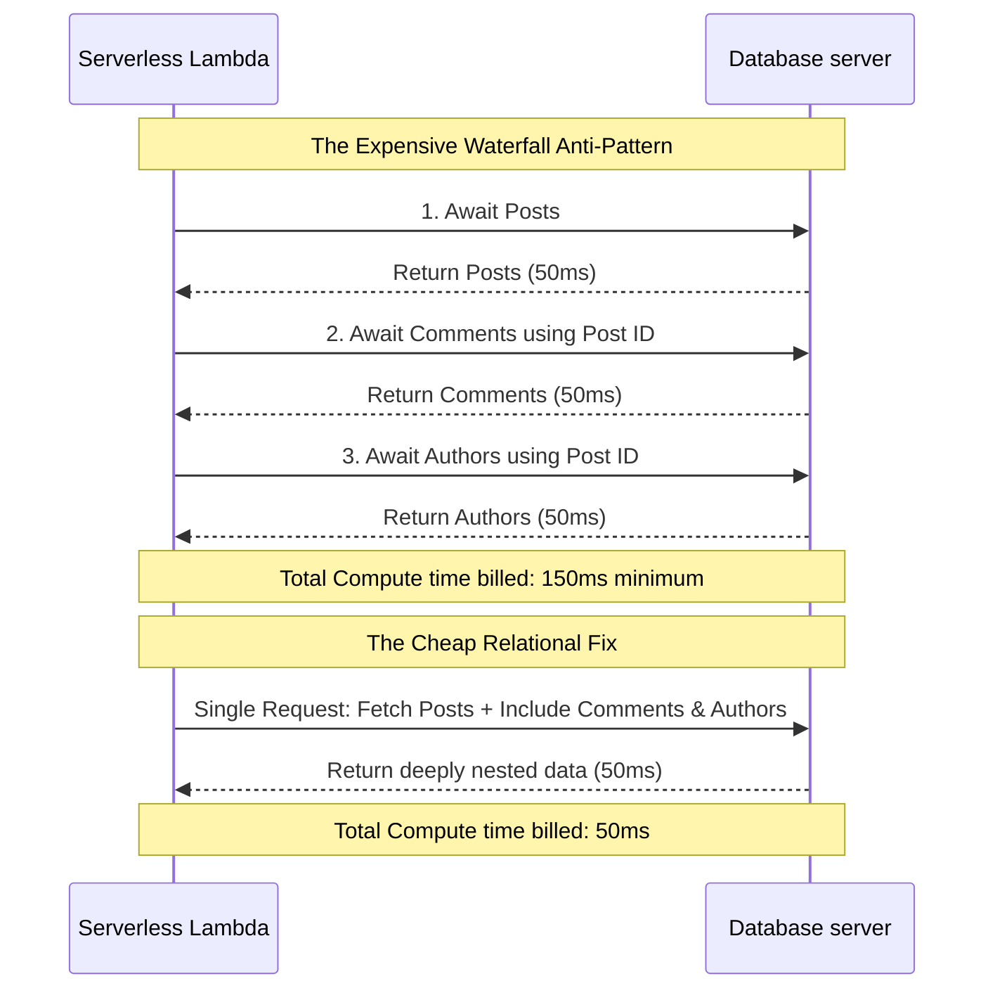

# How to Avoid Massive Vercel Bills

Theo, no longer sponsored by Vercel, uses his newfound freedom to tackle one of the most common fears in the web development community: unexpectedly massive Vercel bills. After auditing numerous codebases responsible for these exorbitant charges, he built an intentionally unoptimized app to systematically demonstrate exactly how developers drive up their costs and how to fix those mistakes. 

### Bandwidth and the Public Directory

The easiest way to rack up thousands of dollars in egress charges is by misusing the `public` directory in a Next.js project. Vercel automatically hosts everything in this folder on a premium, high-speed CDN. While this is excellent for tiny assets like favicons or SVGs that need to load instantly, it is incredibly expensive for large files. 

Theo's strict rule is to never put anything larger than four kilobytes in the public directory. If you host a large video or high-resolution image in this folder, every single view eats heavily into your premium bandwidth allowance. The solution is simple: move large assets to dedicated file hosts or object storage providers like AWS S3, Cloudflare R2, Vercel Blob, or his own service, Uploadthing. By hosting the large files elsewhere and simply linking them via URL, you drop your Vercel egress costs for those files to zero.

### Image Optimization Hazards

Vercel provides an excellent built-in image optimization service through the Next.js image component, but it can quickly become a billing trap due to how it is priced. Vercel charges based on unique optimized URLs: the free tier allows 1,000 optimizations, the Pro tier allows 5,000, and after that, it costs $5 per 1,000 images. Theo highlights a few critical mistakes developers make with this system:

*   Developers frequently waste optimization compute by running already-tiny images, like three-kilobyte API sprites, through the Next.js image component when they do not need to be compressed any further.
*   Leaving the `remotePatterns` configuration too broad allows malicious actors to use your application as their own personal optimization endpoint. For example, if you allow any image from a general GitHub domain or a generic upload service, outsiders can optimize tens of thousands of random images on your dime.
*   To secure your bill, you must restrict allowed image paths to highly specific remote directories or specific app IDs, ensuring the optimizer only processes images actually belonging to your application.
*   If your application naturally requires optimizing more than 5,000 unique images, Theo advises migrating to cheaper third-party image loaders, such as Cloudflare, or his upcoming project, image.engineering.

### Database Waterfall Queries

Serverless compute time is another massive driver of high bills. Vercel charges you for the time your serverless functions are running. If a user drops into your routing and your code is inefficient, that compute time scales terribly. 

Theo frequently sees developers write "waterfall" database queries. This happens when code queries a database for a post, waits for that to finish, then uses the post ID to query for comments, waits, and then queries for user data. Because the server is blocked waiting for external responses sequentially, a request can easily take 20 seconds. If a request takes 20 seconds, you are paying for 20 seconds of compute per user. 

To fix this, developers must learn how to efficiently use their database relationships to request all required data in a single pass. For tasks that genuinely require long waiting periods, such as waiting for an AI API to generate an image, Theo recommends using background queuing services like Inngest or Trigger.dev. This allows the function to spin down and stop billing you while waiting for the external task to finish. Furthermore, simply enabling Vercel's new serverless concurrency feature allows Lambdas to serve other users while waiting on external fetch calls, directly reducing compute costs.

### Caching and Static Site Generation

Not doing the compute at all is the best way to save compute costs. Theo recommends aggressively utilizing caching and static rendering whenever user-specific data is not strictly required.

*   You can wrap slow, frequently accessed, but rarely changed database queries in Vercel's `unstable_cache`, which saves the result to a Vercel KV store and bypasses the database call on subsequent page loads.
*   When a user interacts with the app to change data, such as leaving a comment, you simply call `revalidateTag` to reset that specific cache block, shifting the compute burden from every page load to only when a modification actually occurs.
*   Developers must avoid forcing dynamic rendering on pages that don't need it by accidentally leaving `export const dynamic = 'force-dynamic'` on static pages like blogs or terms of service sites.
*   You should regularly check your Vercel deployment build output to verify that pages intended to primarily serve HTML are marked with a circle symbol indicating they successfully built as static, rather than an "f" indicating a dynamic serverless function.

### Analytics and Spend Management

Theo explicitly advises against using Vercel's built-in web and product analytics. While it seems convenient directly in the dashboard, the pricing model scales poorly. He points out that Vercel charges roughly $14 per 100,000 events, with hard caps on enterprise data ingestion. Instead, he strongly suggests using dedicated analytics tools like PostHog, which offer far cheaper rates, allowing up to a million events for free and scaling at mere fractions of a cent thereafter.

Finally, for developers who remain terrified of going to sleep and waking up to financial ruin, Vercel offers a Spend Management feature. You can set a hard dollar limit on your account in the billing settings. If traffic exceeds this threshold, Vercel will aggressively shut down your service. Theo warns that your site will completely go offline if this happens, but it guarantees your bill will not exceed your budget. He notes that he never actually enables this feature himself, because heavily optimized code keeps costs so hilariously low that even sustained bot attacks rarely generate bills over a hundred dollars.
