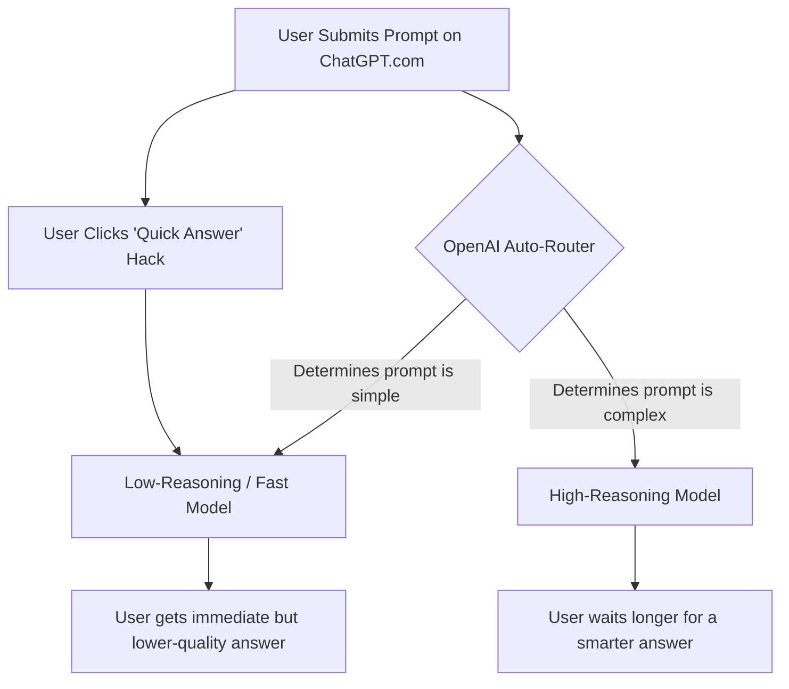

# Theo's Breakdown of the GPT-5 Launch, the Backlash, and OpenAI's Mistakes

Theo addresses the massive disconnect between his glowing early reviews of GPT-5 and the frustrating experience the public ultimately received. He acknowledges that his audience felt misled, but he clarifies the timeline of his testing, explains the technical missteps OpenAI made during the rollout, and pushes back strongly against accusations that he was paid to praise the model. 

### The "Paid Shill" Accusations and the Unfortunate Timeline

Theo adamantly denies being paid by OpenAI to promote GPT-5. He explains that he actually lost roughly $25,000 in inference costs through his own platform, T3 Chat, testing and hosting the models. While OpenAI did offer him a $1,000 appearance fee for a promotional video, he declined it. He gained early access to the model simply by reaching out to his personal contacts at OpenAI, hoping to test the new technology as an independent developer rather than as part of a corporate partnership.

Much of the backlash stems from poor timing. Theo tested an early build of the model, recorded his genuine, highly enthusiastic reaction, and scheduled his videos to publish while he was away on vacation at Defcon. Because he was competing in contests and disconnected from the internet, he did not see the rapid shift in public sentiment. To make matters worse, a video he had planned months in advance criticizing Anthropic's business practices happened to auto-publish right around the GPT-5 launch. While he admits the scheduling looked incredibly suspicious, he maintains that the Anthropic critique was genuinely held and entirely coincidental to OpenAI's release.

### The Capability Gap: Early Access vs. Public Release

Theo points out that the version of GPT-5 he initially tested is fundamentally different from what the public is currently experiencing.

*   **The early build was highly capable:** When using the early API parameters (specifically a build code-named "Nectarine") and working within Cursor, the model perfectly executed complex coding tasks and user interface updates on the first try.
*   **The current experience has degraded:** Retesting exactly the same prompts on the current public builds yields significantly worse results, with the model generating glitchy UI elements, ignoring instructions to use gradients, and introducing structural errors.
*   **Tool integrations are currently struggling:** Applications like Cursor are actively trying to rework their internal systems to accommodate GPT-5, but recent updates appear to have broken the seamless experience Theo enjoyed prior to launch.
*   **Opus is still not the answer:** Despite his frustrations with the current state of GPT-5, Theo notes that when he feeds GPT-5's failures to Anthropic's Claude Opus, Opus produces even worse, more expensive mistakes. 

### How OpenAI Botched the Launch

Theo believes the public backlash is largely OpenAI's fault due to several misguided product decisions aimed at managing server load and catering to casual users. 

Theo identifies three massive mistakes OpenAI made with the consumer-facing version of ChatGPT:
*   **The Auto-Router is flawed:** Instead of giving users a dedicated smart model, OpenAI implemented an "auto-router" that dynamically scales the model's reasoning based on the prompt. Because many users are used to the instant speed of older models, the router aggressively defaults to the "dumbest" version of GPT-5 to provide fast answers.
*   **UI hacks ruined the experience:** To appease users frustrated by the wait times of a reasoning model, OpenAI introduced a "quick answer" button that turns reasoning off entirely, further ensuring users do not experience the model's actual capabilities.
*   **Hiding previous models caused panic:** OpenAI deprecated and hid older, familiar models from the interface, forcing users into this confusing, poorly optimized auto-routing system without an easy way to opt out.

### The Emotional Toll of Authenticity

Theo concludes by expressing deep frustration over how the community treated him. He feels he is being punished for sharing his authentic, organic reaction to a genuinely impressive piece of early technology. Had he waited to see the community's reaction or simply joined the crowd in bashing the launch, he notes he would have gained significant social clout. Instead, by attempting to be fully transparent, leaving money on the table, and refusing sponsorships, he has had to spend his vacation defending his integrity. He stands by his initial assessment that the highly capable version of GPT-5 exists within the API, but firmly agrees that OpenAI's execution of the public launch was entirely unacceptable.
