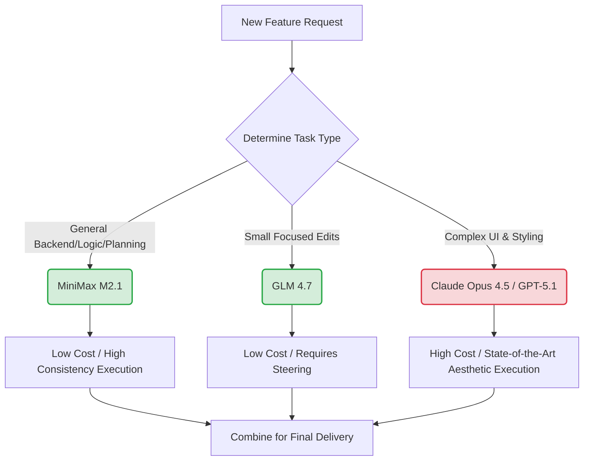

# The Holiday Drop: Reviewing GLM 4.7 and MiniMax M2.1

Theo recently spent two days aggressively testing two new open-weight AI models that dropped right around the holidays: Zhipu AI’s GLM 4.7 and MiniMax M2.1. While the internet has been hyperbolic with claims that OpenAI and Anthropic are doomed, Theo takes a more grounded stance. He firmly believes that Anthropic's Opus remains the top-tier model, but he is completely blown away by what these new open-weight alternatives can accomplish, especially given their hilariously low operating costs. 

Theo tested these models using open-source VS Code extensions like Kilo Code and Open Code, asking them to build a full archive chat feature and generate UI designs. His testing revealed distinct personalities, strengths, and weaknesses for both models.

### MiniMax M2.1: The "Walmart Brand Opus"

Theo has incredibly high praise for MiniMax M2.1, noting that the team focused heavily on making it proficient across a wide variety of programming languages (like Rust, Go, and Elixir) rather than just Python. He found its agentic scaffolding capabilities to be outstanding, meaning it plays very nicely with terminal-based harnesses and VS Code extensions. 

*   MiniMax M2.1 excels at long-running tasks, as Theo found it could grind on a single feature for over 20 minutes across hundreds of lines of code without losing track of its original instructions.
*   When faced with Language Server Protocol (LSP) errors in Theo's codebase, the model successfully reasoned through the problems—such as realizing a React query returned an object rather than raw boolean data—and corrected its own code.
*   The model runs fast and is remarkably lightweight compared to its competitors, with previous versions compressing down to around 78 gigabytes, allowing Theo to comfortably run them on a consumer MacBook with unified memory.
*   While it does occasionally struggle with specific tool call formatting (like string-replacement edits in Open Code), Theo found it requires very little hand-holding and consistently executes solid architectural plans. 

### GLM 4.7: Impressive Benchmarks, Mixed Reality

GLM 4.7 is a massive 358-billion parameter model, requiring around 300 to 700 gigabytes of storage depending on compression. While you can technically run it on hardware a consumer could purchase, Theo warns it is not a trivial undertaking. The model boasts incredible benchmark scores, particularly in coding and complex reasoning, and even scored a 66% on Theo's personal "Skatebench," a niche test measuring 3D spatial recognition and skateboarding knowledge.

*   Despite claims that GLM 4.7 is a master at "vibe coding" and UI generation, Theo found its actual frontend performance to be abysmal, generating completely broken layouts with hardcoded data URLs stuffed into Tailwind classes.
*   The model struggles immensely with long-running, multi-step tasks, frequently hallucinating the need for complex logic (like optimistic updates) that wasn't requested, leading to a cascade of broken code and duplicated text.
*   Theo notes that GLM 4.7 gets easily confused by large context windows, requiring the user to break larger feature requests into very small, rigidly steered tasks to get any successful output.
*   The model repeatedly failed to understand how to handle his development environment, persistently trying to run new dev servers, losing track of them, and requiring manual interruption.

### The Economics of Open-Weight AI

The most compelling aspect of both models is their pricing. Theo points out that while expensive models like Opus 4.5 are incredibly capable, they cost $5.00 per million input tokens and $25.00 per million output tokens. In contrast, these new models offer a staggering value proposition that changes how developers can build software.

*   GLM 4.7 costs roughly $0.40 per million input tokens and $1.50 per million output. 
*   MiniMax M2.1 is even cheaper, sitting at around $0.30 per million input and $1.20 per million output—making it roughly 20 times cheaper than Opus 4.5.
*   Because the costs are so remarkably low, Theo managed to have MiniMax write almost 400 lines of functional production code for roughly one single cent.
*   Theo notes that these models are "chatty," meaning they generate a lot of unseen reasoning tokens per line of actual code, but their base price is so exceptionally low that the final cost to the developer remains essentially negligible.

### Tooling Insights and Optimal Workflows

During his testing, Theo observed some stark differences in the AI tooling ecosystem. He discovered that Anthropic's highly praised "Front-End Design Skill" found in Claude Code is not some advanced algorithmic system, but rather just a 900-token Markdown file injected into the system prompt that aggressively tells the model to stop using cliché AI gradients, robotic text, and overused fonts. Furthermore, he clarified that Claude Code itself is entirely closed-source, despite a popular GitHub repository that simply hosts these community Markdown skills.

Because these new open-weight models have distinct strengths and rock-bottom prices, Theo suggests a hybrid workflow for developers looking to maximize both capability and budget.

Theo concludes that while we aren't yet at the point where these open-weight models completely dethrone the major labs in every category, they have fundamentally shifted the baseline. The fact that a developer can download a file, run it locally or via a cheap API, and execute real automated architecture in a production codebase proves we are entering an incredible new era of software development.
