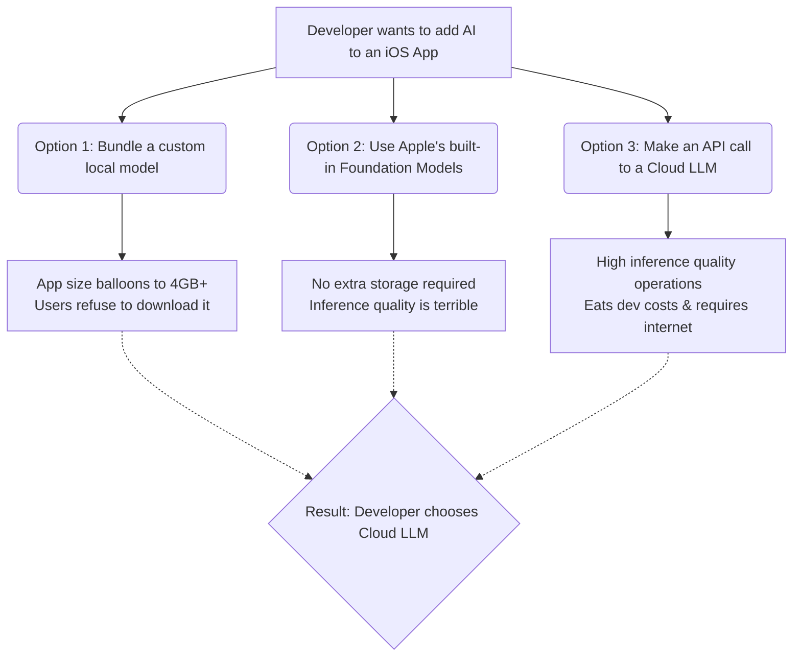

# Theo's Breakdown of WWDC 2025: Massive Changes, Breakthroughs, and Missteps

Theo notes that WWDC 2025 effectively brought the focus back to developers, despite Apple treating it like a mainstream consumer announcement. The event showcased some incredibly deep structural changes to Apple's operating systems, alongside massive user interface overhauls. While Theo relies on macOS daily and champions some of the underlying technological leaps, he remains highly critical of Apple's walled-garden approach, their hostility toward web platforms, and their massive lag in the AI space. 

### The "Liquid Glass" UI Redesign 
Apple is overhauling its operating systems with a new aesthetic called Liquid Glass. Theo points out that while it looks strikingly similar to the Windows 7 Aero aesthetic, it forces major implications onto the developer ecosystem.

*   Theo dismisses most of the accessibility complaints around Liquid Glass, noting that the blurred backgrounds only cause minor contrast issues in specific, transient scroll states.
*   His primary complaint with the new UI centers on the slow, blocking animations that make the operating system feel sluggish and force users to wait for elements to slide into place.
*   Theo argues this update is a massive win for React Native but a nightmare for Flutter, because React Native hooks into the actual native UI components while Flutter uses a game engine to simulate them.
*   Because Flutter has to painstakingly render counterfeit UI components, Theo predicts future Flutter apps will be deeply trapped in the "uncanny valley," unable to natively replicate the new Liquid Glass depth and blur effects.
*   He suspects Apple's redesign of Safari's URL bar—which now blends into the webpage and covers bottom-oriented inputs—is a deliberate attempt to make Progressive Web Apps (PWAs) look and function worse than native apps.
*   Theo is thrilled with the new left-aligned notification system, noting that it finally modernizes the interface for larger phone screens by reducing cognitive load and providing better visual anchoring.

### Platform Advancements and Swift's Evolution
Apple shocked developers by openly embracing modern open-source initiatives and expanding the scope of their proprietary language, Swift.

*   Apple introduced "Containerization," a Swift package that effectively serves as a native Docker clone built directly by Apple, featuring a customized lightweight Linux kernel and ext4 file system support. 
*   This move signals that Swift is evolving into a systems-level language to rival Rust, with Apple actively using it to build backend architectures rather than just application interfaces.
*   The gaming experience on Apple devices is leaping forward, not just through the Game Porting Toolkit 3 adding frame generation, but more importantly because Apple has enabled WebGPU in Safari by default.
*   Coupled with Google recently removing the 4-gigabyte memory limit for WebAssembly in Chrome, Theo believes native-quality, high-performance web gaming is finally becoming a reality.
*   Swift 6.2 introduces official interoperability with C++, Java, JavaScript, and WebAssembly, allowing developers to theoretically compile Swift code to run directly within a web browser.

### Apple's AI Lag and The Developer Experience
Theo dedicates a significant portion of his analysis to how far behind Apple is in the artificial intelligence race, specifically regarding developer tools and on-device inference. He points out that mobile developers are historically hesitant to adopt new tooling compared to web developers, and Apple's internal teams seem to be the slowest of all. 

Apple recently allowed developers to bring their own AI models into Xcode, but the implementation is clunky, requiring users to manually configure API endpoints. Furthermore, Theo argues that Xcode is hopelessly burdened by decades of outdated code originating from NeXTSTEP, making it desperately in need of a ground-up rewrite.

When it comes to building AI directly into consumer applications, Theo explains that Apple’s commitment to offline, on-device privacy has backed developers into a corner. Because Apple will not allow a shared local registry where multiple apps can call upon a single high-quality model, app developers are left with a terrible set of choices.

Theo points out that because Apple's local Foundation models are vastly inferior to modern standards, developers will simply bypass the neural engine on the iPhone entirely and route their AI requests to faster, cheaper, and smarter cloud APIs. He notes that Apple executives have even had to delay Siri updates because their initial architecture was too fundamentally limited to meet quality standards.

### The Sunset of Rosetta 2
Just after WWDC, it was revealed that Apple is preparing to phase out Rosetta 2. 

*   Rosetta 2 was the crucial translation layer that allowed Intel-based x86 applications to run flawlessly on ARM-based Apple Silicon machines during the hardware transition.
*   Apple plans to deprecate it around 2028 with macOS 27, marking the official end of life for Intel-based Macs.
*   Theo is not worried about this phase-out because the overwhelming majority of modern processes already run natively on Apple Silicon, though Apple will likely keep a tiny subset of Rosetta alive solely to support legacy video games.

Theo concludes by acknowledging that while he simply cannot do his daily job without his Mac, he has never been less interested in building apps for the Apple ecosystem. He hopes Apple will one day loosen its grip on the platform and embrace cross-platform realities, warning that their current trajectory of fighting web standards and lagging on AI could eventually alienate their most prized developers.
