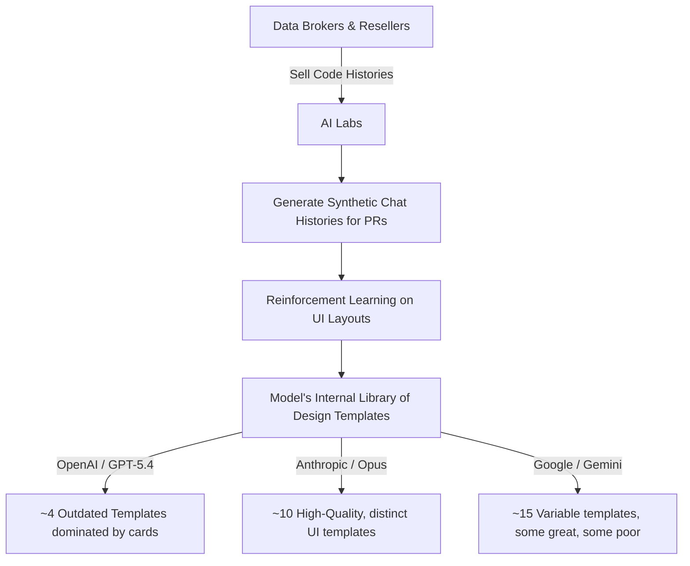

# Theo's Critique of OpenAI's GPT-5.4 Frontend Capabilities

Theo frequently relies on OpenAI's models, particularly Codex and GPT-5.4, for complex backend coding and logic. However, he strongly disagrees with OpenAI's recent claims regarding their models' capabilities in frontend design. Prompted by an official OpenAI article titled "Designing delightful frontends with GPT 5.4," Theo unpacks why he believes the company is misleading developers about the model's UI skills.

Before diving into the critique, Theo briefly highlights the video's sponsor, Kernel. Kernel is a managed OAuth platform that solves a major pain point for AI agents by allowing them to programmatically and persistently sign into websites using a simple four-line setup. 

### The Flaws in OpenAI's Frontend Claims

Theo argues that OpenAI's article essentially gaslights developers by framing the model's poor UI generation as a user prompt issue rather than a fundamental flaw in the model. According to Theo, OpenAI's provided examples of "production-ready" frontends are actually an embarrassment.

He notes several specific issues with OpenAI's guidelines and outputs:
*   The model suffers from what Theo calls "card sickness," where it defaults to wrapping almost every UI element in boxed cards, even when the prompt explicitly forbids it.
*   OpenAI's documentation suggests using long, convoluted prompts and lowering the model's reasoning levels to get decent layouts, which Theo finds absurd compared to how easily other models handle design.
*   OpenAI's proprietary frontend design skill repeatedly injects unnecessary pills, floating elements, and poorly cropped images into its designs, resulting in generic and buggy templates.
*   In contrast, Anthropic provides a highly effective, simple markdown file representing their design skill, which steers models away from generic system fonts and cliché purple gradients without requiring hyper-specific user prompts.

### Benchmarking Frontend Models

To prove his point, Theo reviews a benchmark created by community member Dra, which tests multiple models generating landing pages with and without Anthropic's design skill.

*   **GPT-5.4:** The model consistently generates terrible, repetitive layouts plagued by square cards and bad contrast, failing to produce a usable starting point even when paired with a good design prompt.
*   **Kimmy K2.5:** Despite being a highly affordable open-weight model, Kimmy produces surprisingly good, minimalist designs with tasteful gradients and hover animations that outshine OpenAI's outputs.
*   **Claude Opus:** Theo considers Opus his go-to for design because it reaches for a solid repertoire of aesthetically pleasing templates, though he notes it occasionally requires minor cleanups to remove unnecessary status pills or fix image dimensions.
*   **Gemini 3.1:** Gemini utilizes the widest variety of distinct UI templates and can produce stunning brutalist or elegant designs, though it often requires multiple generation attempts and aggressively alters page copywriting to match the requested design aesthetic.

### Theo's Theory on Why GPT-5.4 Fails at UI

Theo speculates that the difference in UI quality stems from how these models are trained on historical design data. In the past, developers built pages using structural templates (like Tailwind UI). Today, AI labs train their models using synthetic chat histories mapped to GitHub pull requests and repository diffs.

Because reinforcement learning requires verifiable rewards, the models need a reference for what constitutes "good" design. Theo believes the models effectively memorize a limited number of design systems or "templates" during this process.

Theo suspects that Anthropic and Google recently purchased superior, modern frontend datasets from data brokers, while OpenAI is relying on older training data. This explains why GPT-5.4's frontend capabilities seemingly flatlined after previous iterations. 

He concludes by suggesting that OpenAI's DevRel team likely wrote the frontend article as an internal mandate to address the model's known UI shortcomings. Because they cannot alter the model's actual weights, they attempted to solve the problem through prompt engineering. Theo implores OpenAI to be more transparent about their models' weaknesses rather than publishing articles that erode developer trust, and he advises developers to stick to Claude or Gemini for frontend design work.
