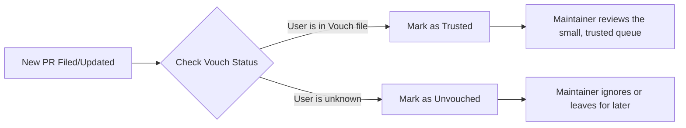

# The Threat AI Poses to Open Source Software

Theo owes his entire career to open-source software, but he is genuinely terrified for its future. AI is currently having a profound and largely negative impact on the open-source ecosystem. Projects are being overwhelmed by AI-generated spam, maintainers are burning out faster than ever, and funding models are collapsing. If the industry does not push back and protect its foundational infrastructure, Theo warns that software development as a whole could be doomed.

### The Problem with AI "Slop" and PR Spam
The most immediate issue facing open-source projects is an unprecedented volume of low-quality, AI-generated Pull Requests (PRs). Theo recently experienced this firsthand when he launched his public project, T3 Code. Despite explicitly stating they were not accepting external contributions, the repository received over 100 PRs a day from developers eager to contribute.

This creates a multifaceted problem for the integrity of software:
*   When developers rely heavily on AI to write code, their grasp of the overarching system architecture inherently degrades.
*   If maintainers merge hundreds of AI-generated PRs that they do not fully comprehend, they quickly lose control and understanding of their own codebase. 
*   Reviewing this sheer volume of submissions is impossible for small teams, resulting in massive CI (Continuous Integration) costs and severe emotional burnout for the maintainers who spend their entire weekends triaging spam.

### Entitled Users and Open Source Brain Rot
Beyond bad code, AI has fundamentally changed the type of user interacting with open source. Theo notes a sharp decline in foundational technical knowledge, replaced by what he describes as a unique "brain rot" among non-developers learning to code exclusively through AI prompts.

Because AI allows these users to ship functional applications quickly, many develop a toxic god complex. Theo shares experiences of receiving jargon-filled, nonsensical questions from users who lack basic programming context but demand immediate support. When these users submit broken, redundant AI-generated PRs and are ignored or rejected, they frequently turn hostile, harassing maintainers across multiple platforms. 

Theo stresses that this degradation of community etiquette is a severe security threat. He points to the recent XZ backdoor incident, where a distressed maintainer was socially engineered into giving up control of a vital Linux compression library after being bombarded by fake, complaining accounts. With AI, a malicious actor can effortlessly orchestrate automated PR spam and harassment campaigns to break a maintainer's spirit and take over critical infrastructure.

### GitHub's Failure to Protect Maintainers
Theo strongly criticizes GitHub, arguing that the platform is doing practically nothing to shield developers from this new wave of spam. 

*   He points out that GitHub historically struggled with basic platform safety, referencing a time when trusted UI libraries were spammed with malicious links, only prompting GitHub to act after Theo publicly criticized them.
*   He contrasts GitHub's billions of dollars and decade of development with his small, former team at Twitch, who successfully built a highly customizable, robust moderation dashboard (Mod View) in just seven months.
*   GitHub's lack of intuitive moderation, automated spam filtering, and granular blocking tools forces the open-source community to build protective barriers themselves.

### Filtering the Chaos: The Vouch System
Because platforms won't protect them, developers are engineering their own solutions. Theo is particularly impressed by a community trust management system called Vouch, created by Mitchell Hashimoto. 

Vouch operates via GitHub Actions to automatically filter the noise and highlight developers who have proven themselves trustworthy. 

This system allowed Theo to reduce 150 open PRs down to a manageable 43 trusted requests. He prefers this over AI-based "anti-slop" scanners, which can be expensive to run, or karma-based PR trackers that completely block out new developers from breaking into the ecosystem.

### The Collapse of Open Source Funding 
AI is also destroying the already fragile business models that keep open source alive. Maintainers historically supplemented their unpaid labor by selling instructional courses or premium UI components. Today, a user can simply hand an AI tool a screenshot of a premium layout and prompt it to clone the design perfectly. 

While Theo does not believe AI companies should arbitrarily "dumb down" their models to protect these business strategies, he acknowledges that the financial upside of open source is disappearing. Top-of-funnel engagement is dropping because developers are using AI to build their own private alternatives rather than contributing to or paying for original projects. 

### How the Community Must Respond
To prevent open source from collapsing under this weight, Theo urges developers and companies to change how they interact with maintainers. 

*   **Fund the foundations**: Theo champions the Open Source Pledge, a growing movement where companies publicly commit to paying open-source maintainers a minimum of $2,000 per year for every developer on their staff. 
*   **Be a "Golden" contributor**: Stop submitting massive, sprawling PRs. The best contributions are small, single-purpose fixes (one to five lines) that clearly explain the problem, the solution, and reference an existing issue. 
*   **Help with triage**: Users can tremendously reduce a maintainer's burden by reading through confusing project issues, validating if bugs still exist on the latest version, and kindly answering questions from other users. 
*   **Express genuine gratitude**: Because open source is fundamentally a thankless job, heartfelt appreciation is often the only thing keeping a maintainer from quitting. Theo advises developers to reach out to the creators of the tools they rely on—not to ask for anything, but simply to thank them for their work and validate their massive efforts.
