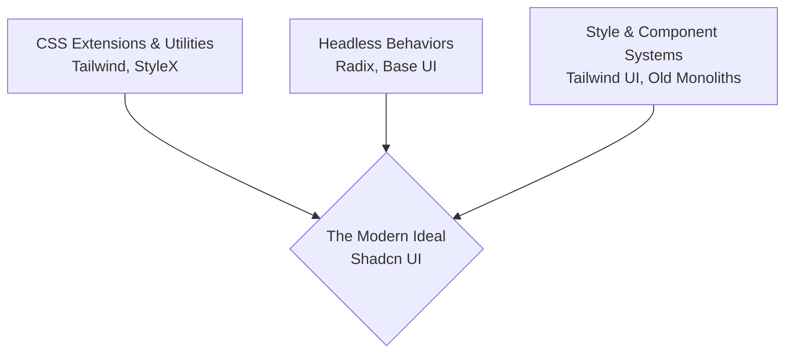

# The Evolution of Web Styling: Why Modular Systems Won

Two years ago, Theo outlined a mental model for navigating the chaotic landscape of CSS and UI libraries. Since then, the ecosystem has shifted dramatically, moving away from monolithic component libraries and embracing highly modular, component-driven architectures. Theo revisits his framework to explain how tools like Tailwind, Radix, and Shadcn UI have permanently changed how developers style web applications in 2025.

### The Three Pillars of Styling

Theo categorizes the UI ecosystem into three distinct pillars, which developers historically had to choose between or manually wire together. Now, the industry is converging on solutions that sit in the optimal center of these three areas.

Theoretical approaches to styling fall into these categories, according to Theo:

*   **Extensions of CSS:** Tools that give developers better primitives for writing styles. Theo notes that Tailwind has completely won this space for large-scale projects. While Tailwind used to enforce a strict design system (like specific padding intervals), the addition of arbitrary bracket syntax (e.g., `p-[1.5rem]`) and a true compiler has shifted it from a rigid style system back to a pure CSS extension. 
*   **Headless Behaviors:** Libraries like Radix that provide zero styling but handle all the complex browser logic. They manage accessibility, focus control, and keyboard navigation perfectly without forcing a specific visual look onto your application.
*   **Style Systems:** Out-of-the-box visual components. Historically, this was dominated by highly opinionated libraries like Bootstrap, which handled responsiveness but dictated exactly how an app looked.

### The Fall of Monolithic Libraries

Theo explicitly critiques "all-in-one" libraries like legacy Material UI (MUI). These monolithic solutions attempted to handle functionality, styling primitives, and visual appearance all at once, which usually resulted in doing none of them exceptionally well.

According to Theo, adopting an all-in-one solution means accepting behavior that is inferior to Radix, styling primitives that are inferior to Tailwind, and visuals that require heavy, fragile overrides if you want to stray from the default theme. This created deep vendor lock-in. If an accessibility bug was fixed in a future major version of the monolith, updating might break all your custom CSS hacks. Theo points out that even the creators of MUI realized this flaw and are now pivoting toward modular tools like Base UI (a headless library) and Pigment CSS (a zero-runtime CSS-in-JS tool). 

He also debunks the rumor that runtime CSS-in-JS was killed by a Facebook conspiracy to promote Tailwind. Runtime CSS-in-JS naturally fell out of favor for performance reasons, and modern tools like Facebook's own StyleX now compile to standard CSS at build time. 

### Why Shadcn UI represents the Future

Theo argues that Shadcn UI is the optimal middle ground that the industry desperately needed. It successfully combines the absolute best parts of the ecosystem without the rigid lock-in of older frameworks.

*   **It uses best-in-class dependencies:** Shadcn defaults to Tailwind for styling primitives and Radix for complex, accessible behaviors.
*   **It operates via ownership, not installation:** Instead of running an `npm install` for a massive Shadcn package, you use a CLI command that directly copies a component's underlying code into a folder within your own project.
*   **It prevents framework lock-in:** Because the code lives directly inside your repository, you maintain total control over the markup and layout. You have a full, private design system from day one.

Theo addresses two major counterarguments he often hears regarding Shadcn:

*   **The "everything looks the same" argument:** Critics claim Shadcn makes the web look homogenous. Theo counters that this is only true if developers leave the default styles untouched. Because you literally own the component code, you can completely overhaul the visuals, and he points to popular neo-brutalist component libraries built entirely on Shadcn as proof of its flexibility.
*   **The "it's too hard to maintain" argument:** People worry that owning the code makes updates impossible. Theo thoroughly rejects this, explaining that front-end component structures rarely need updates. When complex behavioral or accessibility fixes are required, those updates happen inside the underlying Radix packages, which you can easily and granularly update via npm without touching your UI code.

### The Industry Shift Toward Composition

Theo concludes that the era of the global CSS cascade and monolithic style frameworks is over. The industry has accepted that standard vanilla CSS is notoriously difficult to maintain at scale due to conflicting classes. Components are the only viable way to ship web applications today.

The magic of modern web development is having modular logic that is perfectly paired with modular styling. Developers can now instantly generate an excellent, accessible component, place it in their codebase, and retain the absolute freedom to rip it apart or restyle it whenever necessary. By breaking styling into headless behaviors, utility text, and copy-paste functional layers, developers finally have tools that balance simple setups with limitless scalability.
