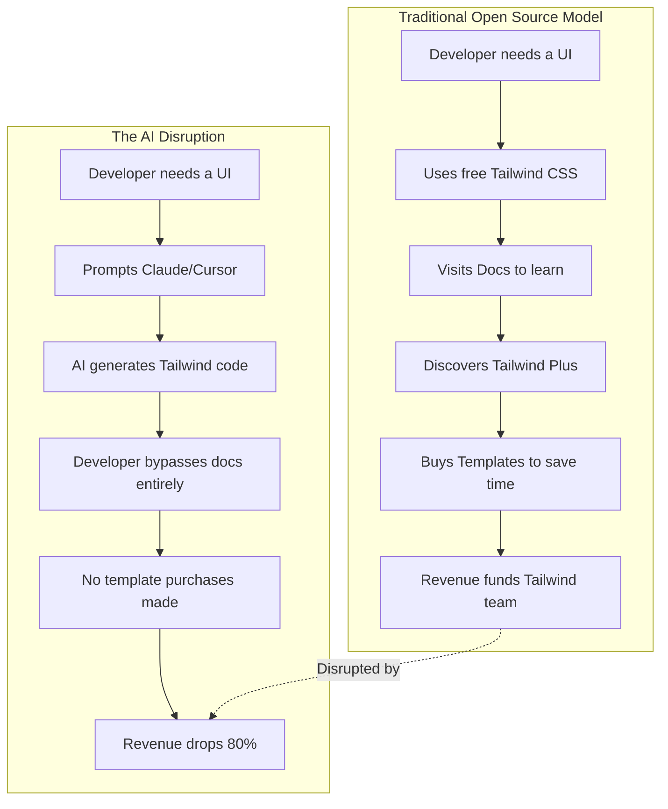

# AI and the Crisis of Open Source Monetization

Theo highlights a harsh reality currently hitting the web development community: the organization behind Tailwind CSS had to lay off 75% of its engineering team. This equates to three out of their four engineers losing their jobs, driven by a staggering 80% drop in business revenue. Theo points out that this is one of the first concrete examples of AI directly causing job losses by silently eroding a company's revenue stream, rather than through corporate speculation.

Drawing from his own past, Theo shares deep empathy for Adam Wathan, the creator of Tailwind. In early 2023, Theo had to lay off nearly his entire team at his own company, Ping, when he realized the business model was not sustainable. He respects Adam for making the painful decision early enough to ensure his team receives generous severance, rather than waiting until the bank accounts were completely empty.

### The Breakdown of Tailwind's Business Model

To understand why a widely popular and growing framework is suddenly facing financial ruin, Theo explains how open-source projects like Tailwind actually make money. Tailwind the framework is free, but the team sustains itself through sponsorships, a design book called *Refactoring UI*, and primarily a premium commercial product called Tailwind Plus, which offers UI blocks, components, and templates. 

Theo outlines several reasons why this specific monetization strategy is failing in the current landscape:

*   The business operates much like a musician dropping an album, where they have to fight for every single one-off sale without building compounding, recurring revenue.
*   The premium templates were often sold as lifetime purchases, meaning a customer acquired years ago still uses the product today but no longer contributes any new money to the company.
*   AI models like Claude and Cursor have become exceptionally good at writing Tailwind code and generating high-quality designs on the fly.
*   Developers who previously lacked design skills and relied on purchasing Tailwind's premium templates to build nice interfaces are now achieving the same results using their flat-rate AI subscriptions.

### The PR Controversy and the Future of Open Source

This financial reality came to a head publicly when a community member submitted a pull request to add an LLM-optimized text file to Tailwind's documentation. The goal was well-intentioned: to help AI agents understand Tailwind's newest features better. Adam closed the PR and faced immediate backlash from community members who assumed that making the framework easier to use would mathematically lead to more revenue.

Theo defends Adam's decision to reject the PR. He notes that traffic to Tailwind's documentation is actually down 40% since early 2023, despite the framework being more popular than ever. Because the official docs are the primary funnel for selling their commercial products, making AI better at using Tailwind without developers ever visiting the site offers zero financial return. Theo emphasizes that Adam simply cannot spend his time doing free work to improve AI tooling when he needs every waking second to save the business and pay the remaining staff.

Ultimately, Theo warns that this is just the beginning of a broader crisis for the open-source ecosystem. If traditional monetization strategies like consulting and selling UI templates are completely replaced by AI agents, fundamental frameworks will lose their funding and become abandoned. He passionately urges companies and individual developers to actively sponsor the open-source projects they rely on, and he encourages his viewers to support Tailwind directly by purchasing their design book or paying for a tier of sponsorship.
