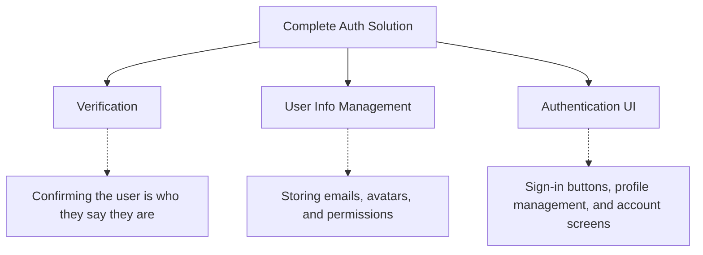

# The State of Authentication in Modern Applications

Choosing an authentication provider is one of the most stressful technical decisions a developer can make, mostly because migrating from one solution to another is incredibly painful. Theo breaks down the fundamental concepts of modern authentication and reviews the current landscape of providers to help developers make informed, long-term decisions without having to build everything from scratch. 

### The Three Pillars of Authentication

Theo visualizes authentication as a three-piece system. When evaluating any tool, it is crucial to understand which of these pieces the provider actually handles.

When building an application, you have to decide if you want a provider that handles all three of these pillars, or if you only want help with verification while you manage the database and user interfaces yourself. 

### State Storage and Architectural Decisions

Once a user signs in, their state must be stored and verified continuously. Theo outlines the two primary approaches to handling this state.

*   **Access and Refresh Tokens:** This is the traditional approach where state is stored as HTTP cookies in the browser. When an access token expires, a stored refresh token is consumed to quietly generate a new access token, acting as an invisible cache that keeps the user signed in without requiring them to re-enter credentials.
*   **JSON Web Tokens (JWTs):** JWTs live in the browser's local storage and contain actual user data (like profile pictures) embedded within the token itself. They are validated on the server side and typically have specific, often very short, expiration windows. 

Theo also takes a firm stance on authentication mechanisms. He strongly advocates against traditional passwords, noting that they are an endless source of security breaches and expensive customer support issues. He recommends leaning heavily into OAuth or Passkeys, acknowledging that while Passkey UX currently requires a few too many clicks, it is vast improvement over passwords.

Theo also strongly criticizes the widespread practice of handling route protection inside Edge middleware. Checking authentication status on every single request inherently slows down applications and ruins the performance of statically generated pages. Instead, Theo advocates for route-level authentication checks, keeping authorization logic localized to the specific pages or actions that actually require it. 

### The Auth Provider Landscape

Theo extensively reviews the current tools available, weighing their ease of use against how much control they afford the developer.

**OpenAuth**
OpenAuth is a self-hosted tool that specifically focuses only on the verification pillar. It does not manage your user data, requiring you to bring your own key-value store (like DynamoDB or Cloudflare KV). Theo used this for a recent project to gain extreme control, but he admits the setup is complex and left him missing the ease of fully managed solutions.

**NextAuth / Auth.js**
Historically the default choice for the Next.js ecosystem, NextAuth requires you to manage your own database and tightly couple your database schema to their system using adapters for ORMs like Prisma or Drizzle. While it offers a massive library of social sign-in providers, Theo feels it carries significant technical debt and finds it heavy and difficult to recommend today. 

**Better Auth**
Theo views Better Auth as the modern open-source successor to Auth.js. It requires you to own your database, but it is built on modern typescript standards and features a fantastic plugin system for things like two-factor authentication and rate limiting. It uniquely generates custom, shadcn-style UI components directly into your codebase and offers surprisingly robust support for React Native and Expo. 

**Clerk**
Clerk is Theo's default recommendation and a service he personally uses, sponsors, and invests in. It handles all three pillars of authentication effortlessly, allowing developers to set up cross-platform authentication in minutes. Their pricing model is highly generous, only charging once an app hits 10,000 active monthly users, and notably only counting users who return to the app after 24 hours. 
However, Theo points out significant flaws: their UI components are entirely client-side, which causes noticeable layout shifts on page load. Furthermore, he is highly critical of their failure to release a promised Stripe integration after a year of waiting, calling it vaporware.

**Stack Auth**
Also a company Theo invests in, Stack Auth is essentially a fully open-source competitor to Clerk. It offers the same fast setup and managed dashboard as Clerk, but provides a concrete exit plan. If a company decides they no longer want to pay for a managed service, they can export their setup and self-host all the infrastructure themselves.

**WorkOS**
WorkOS is strictly designed for enterprise environments. It is highly expensive (charging upwards of $125 per active connection) but perfectly solves the nightmare of enterprise requirements like SAML, complex SSO architectures, and strict compliance. Theo notes that if you are selling B2B software to massive corporations like Microsoft, WorkOS is the exact tool to reach for.

**Providers to Avoid**
Theo points out a few tools that developers should steer clear of or approach with caution. Lucia Auth is actively being deprecated by its creator due to the crushing maintenance burden of syncing database adapters. Passport.js is a decade-old legacy tool that should absolutely not be used for modern applications. Finally, Theo dislikes Firebase Auth due to how easily it can be misconfigured, leading to massive security vulnerabilities, and he avoids Supabase Auth because it forces authentication logic directly into the database layer via Row Level Security, whereas he prefers separation of concerns.

### The Future of Next.js Authentication

Looking ahead, Theo is highly optimistic about upcoming Next.js features that will solve his major complaints about Edge middleware. Next.js is actively working on route interceptors and a native `unauthorized()` function. This will allow developers to cleanly evaluate authentication status and redirect unauthorized users at the route compilation level, completely eliminating the need to run heavy authentication checks on every single middleware request.
